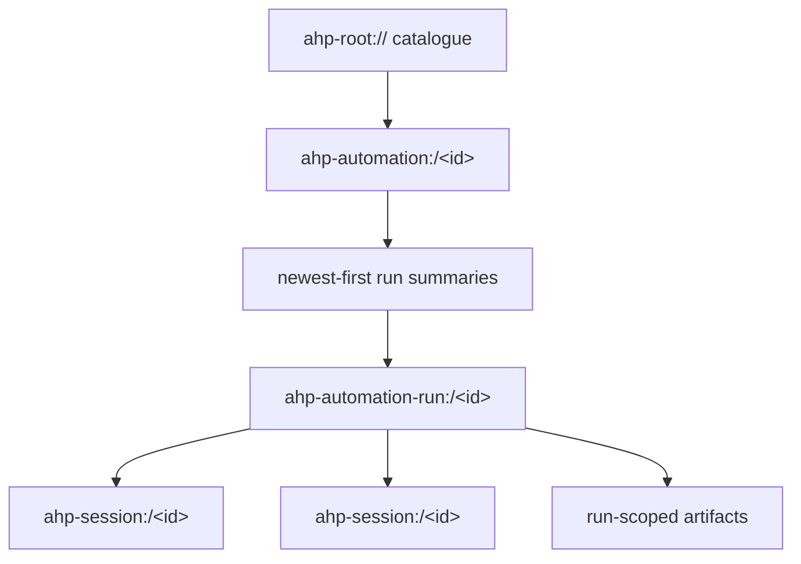
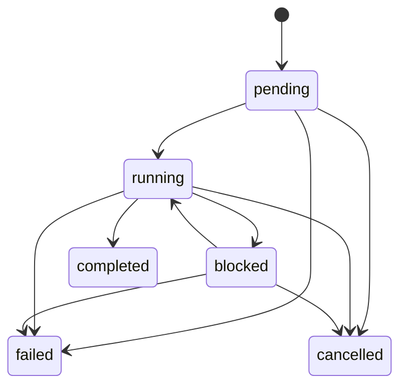

# Automations

Automations are durable, host-owned definitions that create fresh agent
sessions manually or in response to recurring schedules and external events.
They let multiple AHP clients share one catalogue, scheduler, execution claim,
and run history instead of each client maintaining a local copy.

## Key design points

- **The host is the single writable authority.** It persists definitions,
  evaluates triggers, claims occurrences, creates runs, and records history.
- **Definitions and executions have separate channels.** An
  `ahp-automation:` channel owns the reusable definition; each
  `ahp-automation-run:` channel owns one task-level execution.
- **Sessions remain ordinary AHP sessions.** A run may link one or more
  `ahp-session:` channels, which remain authoritative for transcripts, tool
  calls, confirmations, changesets, and per-session lifecycle.
- **Automatic execution never belongs to the client.** A client may render,
  edit, run, cancel, and migrate automations, but it does not run a fallback
  scheduler after an uncertain host response.
- **Capabilities and operations are distinct.** Initialize capabilities say
  what a host implementation supports. State-level `operations` say what is
  allowed for one automation or run at this moment.

## Negotiating support

A host advertises automation support in `InitializeResult.automations`:

```typescript
AutomationCapabilities {
  execution: {
    lifetime: 'hostLifetime' | 'managed'
  }
  create?: {}
  schedules?: {
    minIntervalMinutes?: number
  }
  runCancellation?: {}
  schedulePreview?: {}
  runHistoryLimit?: number
}
```

If `automations` is absent, the client treats the authority as having no
automation catalogue.

`create`, `runCancellation`, and `schedulePreview` are presence capabilities:
an empty object means the feature is supported, and absence means it is not.
The object shape leaves room for future feature-specific options without
changing capability detection.

`execution.lifetime` describes automatic-trigger availability:

| Lifetime | Guarantee |
| --- | --- |
| `hostLifetime` | Triggers are evaluated only while this host process is running. Missed occurrences follow the trigger's misfire policy. |
| `managed` | Triggers continue to be evaluated independently of connected clients and any particular interactive host process. |

Lifetime applies to one host authority. A client can connect to several
authorities at once—for example, local host-lifetime automations and managed
cloud automations—without combining their catalogues or execution ownership.

## Resource model



The resource layers answer different questions:

| Resource | Owns |
| --- | --- |
| `ahp-root://` | Lightweight automation catalogue and live catalogue notifications |
| `ahp-automation:` | Definition, revision, next schedule occurrence, retained run summaries, and permitted operations |
| `ahp-automation-run:` | Execution provenance, lifecycle, linked sessions, run-scoped artifacts, and cancellation |
| `ahp-session:` / `ahp-chat:` | Conversation, tools, confirmations, input requests, changesets, and session-specific state |

## Catalogue and subscriptions

Clients fetch the catalogue with `listAutomations`. Each
`AutomationSummary` contains enough information to render a list without
subscribing to every automation:

```typescript
AutomationSummary {
  resource: URI
  title: string
  enabled: boolean
  triggerCount: number
  nextRunAt?: string
  lastRun?: AutomationRunSummary
  revision: number
  operations: AutomationOperation[]
  createdAt: string
  modifiedAt: string
}
```

Root subscribers receive live catalogue changes:

| Notification | Meaning |
| --- | --- |
| `root/automationAdded` | A complete summary became visible. |
| `root/automationRemoved` | An automation URI left the catalogue. |
| `root/automationSummaryChanged` | A complete replacement summary is available. |

Root notifications are not replayed. After reconnect, clients call
`listAutomations` again and reconcile by resource URI.

Subscribing to an `ahp-automation:` URI returns the full
`AutomationState`, including the definition and retained run-history window.

## Definitions

An `AutomationDefinition` is the durable, editable part of an automation:

```typescript
AutomationDefinition {
  title: string
  message: Message
  session: AutomationSessionTemplate
  enabled: boolean
  triggers: AutomationTrigger[]
  _meta?: Record<string, unknown>
}
```

`message` is the initial user message sent to every newly created run session.
Its origin must be `user`. The definition does not carry credentials,
confirmation decisions, or durable permission grants.

### Session template

The session template selects the context used to create a fresh session for
each run:

```typescript
AutomationSessionTemplate {
  provider?: string
  model?: ModelSelection
  agent?: AgentSelection
  workingDirectories?: URI[]
  config?: Record<string, unknown>
}
```

Omitting `provider` uses the host's default provider. Omitting
`workingDirectories` creates a workspace-less session. The host revalidates
the provider, model, agent, directories, and configuration every time a run
starts because availability and policy may have changed since the definition
was saved.

Host-prepared execution details—such as materialized managed workspace
directories—belong in `AutomationState.runtime`, not in the editable
definition.

### Enabled state

`enabled` controls automatic triggers only. A disabled automation can still be
started manually when its state advertises the `run` operation. This allows a
user to pause scheduling without losing the definition or its ability to run
on demand.

## Triggers

An empty `triggers` list means manual-only. Automatic triggers are either
portable schedules or host-defined events.

Each trigger has an `id` that is unique and stable within its definition. Runs
created automatically record that id in `AutomationTriggeredRunCause`, so
clients can explain why the run exists even if they do not understand the
trigger's configuration.

### Scheduled triggers

A scheduled trigger contains a five-field AHP cron expression and an IANA time
zone:

```typescript
AutomationScheduleTrigger {
  id: string
  kind: 'schedule'
  schedule: {
    expression: string
    timeZone: string
  }
  misfirePolicy?: 'skip' | 'runOnce'
}
```

The expression has exactly five whitespace-separated fields:

```text
minute hour day-of-month month day-of-week
```

| Field | Allowed values |
| --- | --- |
| minute | `0`–`59` |
| hour | `0`–`23` |
| day of month | `1`–`31` |
| month | `1`–`12` or the case-insensitive names `JAN`–`DEC` |
| day of week | `0`–`7` or the case-insensitive names `SUN`–`SAT`; both `0` and `7` mean Sunday |

Each field supports:

- `*` for every value;
- one value, such as `9` or `MON`;
- an inclusive range, such as `1-5` or `MON-FRI`;
- a comma-separated list of values or ranges, such as `1,3,8-10`; and
- a positive step on `*` or a range, such as `*/15` or `1-30/2`.

AHP does not support a seconds field, a year field, macros such as `@daily`, or
Quartz extensions such as `?`, `L`, `W`, and `#`.

Minute, hour, and month must all match. If both day-of-month and day-of-week
are restricted (not `*`), the occurrence matches when **either** day field
matches, following Unix cron behavior.

Examples:

| Desired schedule | Expression |
| --- | --- |
| Every hour | `0 * * * *` |
| Every day at 09:30 | `30 9 * * *` |
| Every weekday at 09:30 | `30 9 * * MON-FRI` |
| Midnight on the 1st and 15th | `0 0 1,15 * *` |
| Every 15 minutes | `*/15 * * * *` |

The host evaluates the fields against local calendar time in `timeZone`. A
nonexistent local minute during a daylight-saving transition produces no
occurrence; a repeated local minute represents each matching instant. Clients
should use `previewAutomationSchedule`, when advertised, rather than
implementing independent time-zone evaluation. The host's preview and
`nextRunAt` projection are canonical.

When `AutomationCapabilities.schedules.minIntervalMinutes` is present, the
host rejects schedules that can produce consecutive occurrences more
frequently than that limit. Without it, the cron format's one-minute resolution
is the only interval restriction.

### Misfires

A misfire is a scheduled occurrence that happens while automatic execution is
unavailable, for example while a host-lifetime authority is stopped:

| Policy | Behavior |
| --- | --- |
| `skip` | Discard missed occurrences and wait for the next future occurrence. |
| `runOnce` | Start at most one catch-up run when execution becomes available, regardless of how many occurrences were missed. |

Omitting `misfirePolicy` is equivalent to `runOnce`. A catch-up run records
`cause.catchUp: true` and the original `scheduledFor` timestamp.

### Event triggers

Event triggers are defined by the host rather than standardized by AHP. A
GitHub-aware managed authority might expose events such as pull-request
creation; a local authority may expose no event triggers.

Clients discover event types with `listAutomationTriggerDefinitions`, passing
the prospective provider, working directories, and resolved session
configuration. The host returns:

```typescript
AutomationTriggerDefinition {
  type: string
  title: string
  description?: string
  events: {
    id: string
    title: string
    description?: string
  }[]
  configSchema?: ConfigSchema
}
```

The durable trigger stores the selected type, event ids, and schema-defined
configuration:

```typescript
AutomationEventTrigger {
  id: string
  kind: 'event'
  type: string
  events: string[]
  config?: Record<string, unknown>
}
```

Unknown configuration entries must survive client edits. Event provenance
recorded on a run must contain no secrets; it is descriptive context, not a
payload clients should replay.

## Creating and updating

| Command | Purpose |
| --- | --- |
| `createAutomation` | Persist a complete definition at a client-chosen `ahp-automation:` URI. |
| `updateAutomation` | Replace selected editable fields using an expected revision. |
| `disposeAutomation` | Permanently remove a definition when disposal is currently allowed. |

Definition revisions increase monotonically. `updateAutomation` includes the
revision the client observed:

```typescript
{
  channel: 'ahp-automation:/triage'
  expectedRevision: 7
  changes: {
    enabled: false
  }
}
```

The host rejects a stale revision. The client then reconciles the latest
`AutomationState` before deciding whether to reapply its change. Omitted patch
fields remain unchanged; supplied arrays and objects replace their fields in
full rather than merging recursively.

### Idempotent migration imports

`createAutomation.import` carries a stable source, batch, and item identity for
legacy migration. It may also carry the source scheduler's next unevaluated
occurrence for each schedule trigger:

```typescript
{
  source: 'legacy-client-store'
  batchId: 'migration-2026-08-12'
  itemId: 'automation-42'
  triggerNextRuns: [{
    triggerId: 'weekday-morning'
    nextRunAt: '2026-08-12T07:00:00Z'
  }]
}
```

Retrying an interrupted migration with the same identity resolves to the
already imported item rather than creating a duplicate. An imported definition
must be created disabled. The host persists supplied trigger occurrences while
the definition is disabled; after cutover, enabling it evaluates an overdue
occurrence according to that trigger's misfire policy.

Migration should move one definition to exactly one authority:

1. Create the host definition disabled.
2. Verify the imported definition.
3. Remove the legacy copy from scheduler-visible storage.
4. Enable the host definition.

Never leave both copies schedulable and never deduplicate definitions by
content; identical-looking automations may be intentional. The host must
durably claim a due occurrence together with its run record before starting
external execution, so restart cannot dispatch the same catch-up twice.

## Runs

`runAutomation` starts a manual run and returns its
`ahp-automation-run:` URI:

```typescript
{
  channel: 'ahp-automation:/triage'
  requestId: 'client-generated-idempotency-key'
}
```

`requestId` is durable. Retrying with the same automation and request id
returns the existing run URI, including after reconnect or an uncertain
response. The host persists the run record before creating sessions or sending
the first message.

### Run lifecycle



`completed`, `failed`, and `cancelled` are terminal. `failed.startedAt` and
`cancelled.startedAt` are optional because validation, workspace preparation,
or cancellation may finish before execution begins.

`blocked` is a coarse task-level summary:

- `userInput`
- `toolConfirmation`
- `authentication`
- `clientExecution`

The detailed prompt, confirmation, authentication request, or tool state lives
on a linked session channel.

### Linked sessions

A run's `sessions` list may contain one local attempt, several retries, or
parallel workers. `primarySession` tells clients which one to open first.

Every automation-created session records:

```typescript
origin: {
  kind: 'automation'
  automation: URI
  run: URI
}
```

This provenance survives persistence and allows navigation in both directions.
The run channel does not duplicate session transcript or tool state.

### Artifacts

`AutomationRunArtifact` represents output owned by the task as a whole rather
than one particular session. It extends `ContentRef`, so the client fetches
content through the normal resource APIs. Session-specific edits and outputs
remain on their session channels.

### Cancellation

Cancellation is available only when:

1. `InitializeResult.automations.runCancellation` is present; and
2. the run's `operations` contains `cancel`.

The client dispatches `automationRun/cancelRequested`. This action is
side-effect-only and does not optimistically change lifecycle. The host later
emits `automationRun/lifecycleChanged` with the authoritative result. The run
may become `cancelled`, or it may complete or fail before cancellation takes
effect.

## Run history and retention

`AutomationState.runs` is a newest-first, bounded window of
`AutomationRunSummary` values. If `runsNextCursor` is present, the client calls
`fetchAutomationRuns`; older summaries arrive through
`automation/runsLoaded` so every subscriber applies the same reducer update.

`AutomationCapabilities.runHistoryLimit` advertises the maximum number of
terminal summaries retained per automation. Active runs do not count toward
that limit. Once the host prunes a run, clients must not assume its
automation-run channel remains subscribable.

## Multiple clients and reconciliation

Several clients may subscribe to the same authority:

- the host sequences every definition and run action;
- revisions prevent lost updates;
- manual `requestId` values prevent duplicate runs after retry;
- one trigger occurrence is atomically associated with at most one run;
- root catalogue notifications keep live clients updated; and
- reconnecting clients re-list and re-subscribe instead of replaying local
  scheduling decisions.

The core invariant is:

> Once an automation belongs to an AHP authority, clients never schedule or
> execute a fallback copy.

This is what prevents duplicate runs across windows, devices, and
applications.

## Security

- Definitions contain no credentials or reusable confirmation decisions.
- The host revalidates provider, model, agent, workspace, and session
  configuration when each run starts.
- State-level operations are authoritative; clients do not infer permission
  from capabilities.
- Event provenance and `_meta` values must not contain secrets.
- Linked session channels use the ordinary AHP confirmation, authentication,
  and client-execution mechanisms.
