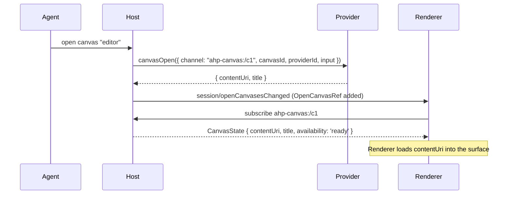
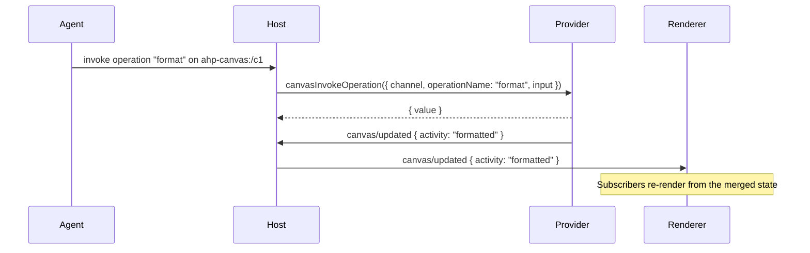
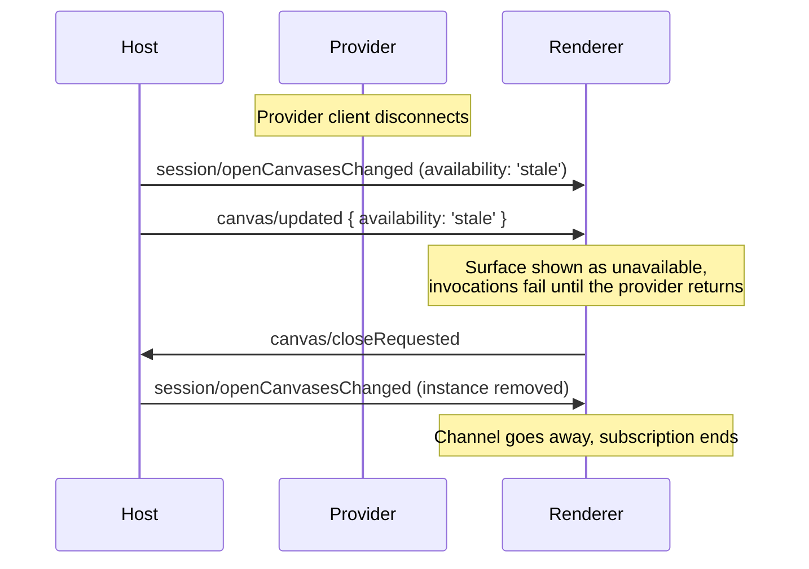

# Canvases

A **canvas** is a rich, interactive UI surface the agent can open next to a session — a document or spreadsheet editor, a data dashboard, a live web preview, a design surface. Where a chat turn is a stream of messages and tool calls, a canvas is a durable, stateful *view* the user works in directly while the agent keeps assisting.

Canvases and [MCP Apps](https://github.com/modelcontextprotocol/ext-apps) address the same need (an interactive UI surface an agent can open) from different angles: where an MCP App is a View embedded in a tool result, a canvas is an individually subscribable resource with its own channel, discovery surface, and lifecycle — the same "one channel per resource" model used by [terminals](/guide/terminals) and [changesets](/guide/changesets).

## Two roles a client plays

A client that declares the `canvas` capability can act in either or both of two roles:

- **Renderer** — it hosts the isolated surface and displays a canvas by loading its content address. Every capable client is a renderer.
- **Provider** — it *contributes* canvases (a VS Code extension exposing an "editor" canvas, say) and answers the open/invoke/close callbacks for them. A canvas can equally be provided by the host itself.

The provider owns behaviour; the renderer owns presentation. They are frequently different clients — one client provides a canvas, another renders it — which is exactly why canvas state is synchronised through AHP rather than kept in one process.

## Discovery

The session advertises two things once any client declares the capability:

- **A registry** (`SessionState.canvases`) of every canvas the agent *can* open. The host aggregates it from server-side declarations and the providers each client publishes on `SessionActiveClient.canvasProviders`.
- **An open catalogue** (`SessionState.openCanvases`) of instances that *are* open. Each entry carries the instance's `ahp-canvas:/<id>` channel URI, so a client can render an open canvas by subscribing to that one channel — it never has to subscribe to every instance to know what exists.

A registry entry is a `SessionCanvasDeclaration`. The host stamps each one with a provider `source`, so a later request can be routed to the right client (or resolved internally for a host-provided canvas):

```typescript
SessionCanvasDeclaration {
  providerId: string           // opaque namespace; keeps canvasId unique across providers
  canvasId: string             // provider-local id, unique within providerId
  title: string
  description: string
  inputSchema?: object         // JSON Schema for the open input
  operations?: SessionCanvasOperation[]
  source: CanvasProviderSource // { kind: 'server' } | { kind: 'client'; clientId }
}

SessionCanvasOperation {
  name: string                 // unique within the owning (providerId, canvasId)
  description?: string
  inputSchema?: object
}
```

A client contributes canvases with the lighter `ClientCanvasDeclaration`, published on `SessionActiveClient.canvasProviders`; the host derives the `providerId` and `source` as it folds the entry into the registry:

```typescript
ClientCanvasDeclaration {
  canvasId: string
  title: string
  description: string
  inputSchema?: object
  operations?: SessionCanvasOperation[]
}
```

Each open instance appears in the catalogue as an `OpenCanvasRef` — deliberately lightweight, just enough to render a list row or pick the right renderer without subscribing to the instance:

```typescript
OpenCanvasRef {
  channel: URI                     // the instance's ahp-canvas:/<id> channel — its sole identity
  canvasId: string                 // which declaration it was opened from
  title?: string                   // mirrored from CanvasState.title
  availability: CanvasAvailability // 'ready' | 'stale'
}
```

Both lists are published with full-replacement actions (`session/canvasesChanged`, `session/openCanvasesChanged`), matching how the tools catalogue is republished atomically.

## Canvas state

The defining idea: **a renderer renders from state, not from requests.** Subscribing to an instance's `ahp-canvas:/<id>` channel yields a `CanvasState`, and the renderer draws the surface from it — there is no imperative "draw this" message anywhere in the protocol.

```typescript
CanvasState {
  canvasId: string
  providerId: string
  input?: Record<string, unknown> // the open input, retained for resume/rebind
  title?: string
  activity?: string               // provider-defined, opaque to AHP
  contentUri?: URI                // renderer-targeted content address
  availability: CanvasAvailability // 'ready' | 'stale'
}
```

The renderer resolves `contentUri` per its URL policy:

- a directly-loadable `https:`, in-process, or `http://localhost` address is loaded straight into the surface; or
- any other address is resolved over the general `resourceRead` command — which keeps content flowing over the AHP transport itself, the escape hatch for relayed deployments where the renderer can't reach the host's network directly.

State changes flow through two canvas-scoped actions, broadcast to subscribers of the instance channel:

| Type | Client-dispatchable? | When |
| --- | --- | --- |
| `canvas/updated` | Yes | The provider changed the instance's `title` / `activity` / `contentUri` / `availability`. |
| `canvas/closeRequested` | Yes | The user asked to close the surface (e.g. hit ✕). |

`canvas/updated` is a **sparse merge**: each present field overwrites the corresponding `CanvasState` field, and an absent field preserves the current value. There is no clear-to-absent via this action — that three-state distinction can't survive JSON transport uniformly across languages — so a provider that needs to reset a field re-publishes it, and a full reset arrives as a fresh `CanvasState` snapshot on (re)subscribe. `canvas/closeRequested` is a pure signal with a no-op reducer; the host runs the close flow in response.

### Availability

A client-provided canvas goes `stale` rather than vanishing when its providing client disconnects: the entry is retained so the instance can be restored when the provider reconnects, and in-flight requests fail until then. `availability` surfaces on both the `OpenCanvasRef` (so a catalogue view can grey out the row) and the full `CanvasState`.

## Interaction

Interaction travels back to the provider through **declared operations.** A canvas can declare named operations (with input schemas) the agent may invoke; the host issues a `canvasInvokeOperation` request to the provider and returns its opaque result. Opening and closing are requests of the same family. All three address the instance's own `ahp-canvas:/<id>` channel — the host resolves that URI back to the provider and canvas id, the same way terminal and changeset operations target their channel URI. For a host-provided canvas the host resolves them internally and sends no request.

```typescript
canvasOpen(params: {
  channel: URI                     // the new instance's own channel URI, minted by the host
  canvasId: string
  providerId: string
  input?: Record<string, unknown>
}) → {
  contentUri?: URI
  title?: string
  activity?: string
}

canvasInvokeOperation(params: {
  channel: URI                     // the instance's channel URI
  operationName: string
  input?: Record<string, unknown>
}) → {
  value?: unknown                  // opaque, provider-defined
}

canvasClose(params: {
  channel: URI                     // the instance's channel URI
}) → null
```

A failed open or invoke rejects with `CanvasProviderError`, whose `data` carries the provider-defined `{ code, message }`.

Closing follows a signal-then-request pattern: the user hits ✕, the renderer dispatches `canvas/closeRequested`, and the host runs the close flow — resolving `canvasClose` against the provider and dropping the instance from `openCanvases`.

## Lifecycle

1. A client declares `ClientCapabilities.canvas` and publishes any `canvasProviders`. The host folds them into `SessionState.canvases`.
2. The agent opens a canvas. The host mints an instance channel, sends `canvasOpen` to the provider (or resolves it internally), and adds an `OpenCanvasRef` to `SessionState.openCanvases`.
3. A renderer subscribes to the instance's `ahp-canvas:/<id>` channel, receives the `CanvasState` snapshot, and loads its `contentUri`.
4. The provider pushes `canvas/updated` as the canvas evolves, and the agent invokes declared operations.
5. The user (or the agent) closes the canvas. The host resolves `canvasClose` and republishes `openCanvases` without the instance; subscribers see the channel go away.

## Flows

### Agent opens a client-provided canvas

The agent opens a canvas contributed by one client; another client renders it by subscribing to the new instance channel.



### Agent invokes an operation

The agent runs a declared operation; the provider does the work, returns an opaque value, and pushes new presentation state that every subscriber re-renders from.



### A provider disconnects

A client provider drops. The host marks its instances `stale` instead of removing them, so they can be restored on reconnect; if the user closes one first, the host drops it.



See the [Canvas Channel specification](/specification/canvas-channel) for the exact state shapes, action semantics, command signatures, and error codes.
