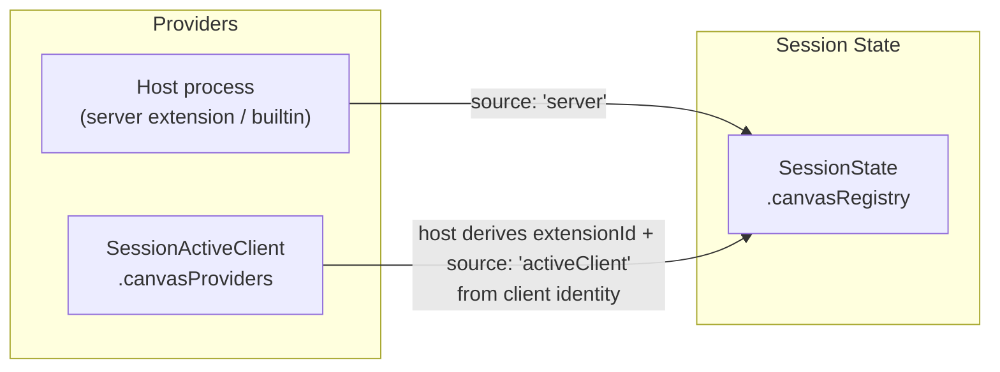
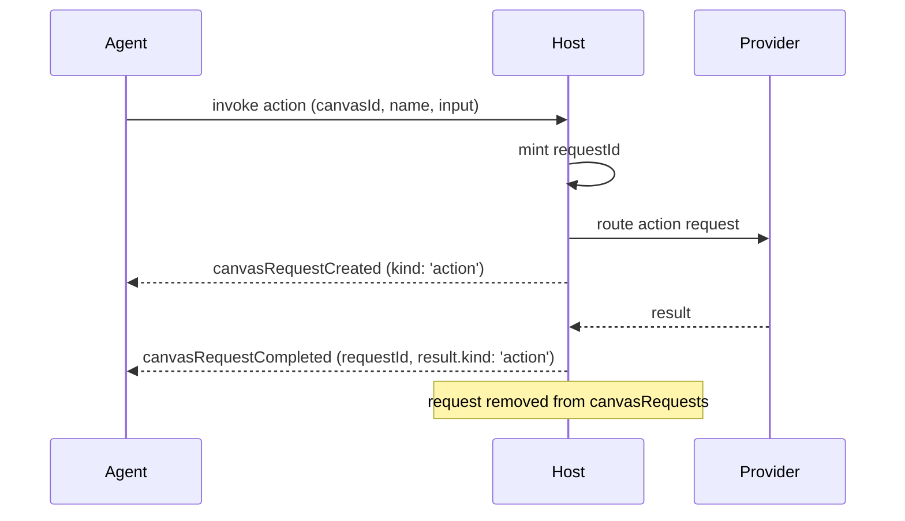

# Canvases

Canvases are declared, instanced, agent-openable UI surfaces. A **provider** — the agent host process or an active client — declares a canvas; the agent **opens an instance** of it; and the host tracks every open instance, plus the provider callbacks it is waiting on, as session state. Because the model lives entirely in `SessionState`, every subscriber sees the same picture and a reconnecting client can rebuild it from a snapshot.

Canvases are a **Plane-2** feature: they add session-state fields and `session/*` actions only. There are no new commands, notifications, or transport. Everything flows through the existing session action envelope.

The model has three layers:

- **Declarations** — what canvases exist (`SessionState.canvasRegistry`).
- **Instances** — what is open right now (`SessionState.openCanvases`).
- **Requests** — which provider callbacks are in flight (`SessionState.canvasRequests`).

## Providers and the registry

A canvas declaration is identified by `(extensionId, canvasId)` and tells the agent what it can open:

```typescript
SessionCanvasDeclaration {
  extensionId: string            // owning provider, stable across instances
  extensionName?: string
  canvasId: string               // provider-local id, unique within extensionId
  displayName: string
  description: string            // shown to the agent in canvas catalogs
  inputSchema?: { type: 'object'; properties?; required? }  // opaque to AHP
  actions?: SessionCanvasAction[]
  source: CanvasProviderKind     // 'server' | 'activeClient'
  clientId?: string              // set iff source === 'activeClient'
}
```

The host aggregates declarations from every active provider into `SessionState.canvasRegistry`. The registry is **full-replacement**: whenever it changes, the host republishes the entire array via `session/canvasRegistryChanged` (cf. `session/customizationsChanged`).

Declarations enter the registry from two places, mirroring how [customizations](/guide/customizations#sources) are sourced:



1. **Server-declared** — the host process contributes declarations with `source: 'server'`.
2. **Client-declared** — an active client contributes lighter `ClientCanvasDeclaration` entries via `SessionActiveClient.canvasProviders`. The host derives `extensionId`, `source: 'activeClient'`, and `clientId` from the client's identity when it folds the contribution into the registry. There is no separate "canvasProviders changed" action: a client re-publishes its whole `SessionActiveClient` entry via `session/activeClientSet`, exactly as it does for `tools` and `customizations`.

When an active client disconnects (or is removed via `session/activeClientRemoved`), the host removes its declarations from the registry.

## Opening an instance

The agent opens a canvas by minting a stable `instanceId` and asking the host to open `(extensionId, canvasId)` with optional input. The host records the live instance in `SessionState.openCanvases`:

```typescript
SessionOpenCanvas {
  instanceId: string             // caller-supplied, agent-minted
  canvasId: string
  extensionId: string
  extensionName?: string
  availability: CanvasInstanceAvailability  // 'ready' | 'stale' — host-derived
  input?: Record<string, unknown>           // retained for re-binding on recovery
  title?: string                            // provider-supplied
  status?: string                           // provider-supplied
  url?: string                              // for rendered canvases
  renderer?: { clientId: string }           // bound renderer, once a client accepts
}
```

Three actions maintain the open set:

- **`session/canvasInstanceOpened`** carries a full `SessionOpenCanvas` and **upserts** it by `instanceId` — appending a new instance or replacing an existing one.
- **`session/canvasInstanceUpdated`** carries `instanceId` plus the optional fields that changed (`title?`, `status?`, `url?`, `availability?`) and **merges** them onto the matching instance. Present fields overwrite; absent fields are preserved (the same overwrite-present / preserve-absent rule as `annotations/updated`). It is a no-op when no instance matches.
- **`session/canvasInstanceClosed`** carries `instanceId` and **removes** the instance from `openCanvases`. It also drops any in-flight `canvasRequests` for that instance, so a closed canvas leaves nothing dangling. It is a no-op when the instance is in neither list.

`availability` is **host-derived**: the host sets `stale` when the owning provider becomes unreachable (the entry is kept but not routable) and `ready` once it is live again.

## Requests and correlation

Some canvas operations are not instantaneous — opening an instance, invoking one of its actions, or closing it may require a round-trip to the provider. The host models each in-flight callback as an entry in `SessionState.canvasRequests`, just as the chat channel surfaces pending input requests in state. Keeping requests in state (rather than as bare RPC) means subscribers can see what is in flight and reconnect/replay stays correct.

```typescript
SessionCanvasRequest {
  requestId: string              // host-minted correlation id
  kind: CanvasRequestKind        // 'open' | 'action' | 'close'
  instanceId: string
  canvasId: string
  extensionId: string
  target: CanvasRequestTarget    // who the host routed it to
  actionName?: string            // when kind === 'action'
  input?: Record<string, unknown>
  deadlineMs?: number            // host gives up after this
}

CanvasRequestTarget {
  kind: CanvasProviderKind       // 'server' | 'activeClient'
  clientId?: string              // present iff kind === 'activeClient'
}
```

`target` records which provider direction owns the request. The host fulfils it either itself (`kind: 'server'`) or by routing to a specific active client (`kind: 'activeClient'`, with that client's `clientId`). The direction determines who may dispatch the matching completion — a reconnecting client can read `target.clientId` to tell whether a pending request is addressed to it.

Three actions drive the lifecycle:

- **`session/canvasRequestCreated`** carries a full `SessionCanvasRequest` and **upserts** it by `requestId`.
- **`session/canvasRequestCompleted`** carries `requestId` plus a `result?` (a `CanvasRequestResult`) or an `error?` (a `CanvasError`) and **removes** the request. It is a no-op when no request matches.
- **`session/canvasRequestCancelled`** carries `requestId` and a `reason` (`CanvasRequestCancelReason` — `timeout`, `providerDisconnected`, `instanceClosed`, or `hostShutdown`) and **removes** the request when the host abandons it.

`CanvasRequestResult` is a discriminated union keyed by `kind`, matching the originating request:

```typescript
type CanvasRequestResult =
  | { kind: 'open';   url?: string; title?: string; status?: string }
  | { kind: 'action'; value?: unknown }
  | { kind: 'close' }
```

A typical action invocation routed to a server-side provider:



## Closing from a client

`session/canvasInstanceClosed` is the authoritative removal, dispatched by the host. A client that is rendering a canvas (for example, the user closes its panel) asks the host to close it by dispatching **`session/canvasInstanceCloseRequested`** with the `instanceId`. This is a pure client-to-host signal: it does not mutate state. The host validates the request (the dispatching client SHOULD own the instance's `renderer` binding), drives the provider-facing close, and ultimately emits `session/canvasInstanceClosed`.

## Client rendering capability

Two `SessionActiveClient` fields describe a client's relationship to canvases, and they are independent:

- **`canvasProviders?: ClientCanvasDeclaration[]`** — canvases this client *declares* (folded into the registry, as above).
- **`canRenderCanvases?: boolean`** — whether this client can *render* canvases. A client can render canvases it did not declare (e.g. render a server-declared canvas), and a client can declare canvases without being a renderer.

When an instance has no specific `renderer` binding, any active client with `canRenderCanvases` MAY render it.

## Actions

| Action | Payload | Reducer behavior |
|---|---|---|
| `session/canvasRegistryChanged` | `canvases: SessionCanvasDeclaration[]` | Full replacement of `canvasRegistry`. |
| `session/canvasInstanceOpened` | `instance: SessionOpenCanvas` | Upsert into `openCanvases` by `instanceId`. |
| `session/canvasInstanceUpdated` | `instanceId`, `title?`, `status?`, `url?`, `availability?` | Merge present fields onto the matching instance. No-op when absent. |
| `session/canvasInstanceClosed` | `instanceId` | Remove the instance from `openCanvases` and drop its `canvasRequests`. No-op when absent. |
| `session/canvasInstanceCloseRequested` | `instanceId` | Client-dispatched signal; no state change. |
| `session/canvasRequestCreated` | `request: SessionCanvasRequest` | Upsert into `canvasRequests` by `requestId`. |
| `session/canvasRequestCompleted` | `requestId`, `result?`, `error?` | Remove the request. No-op when absent. Client-dispatched for active-client targets. |
| `session/canvasRequestCancelled` | `requestId`, `reason` | Remove the request when the host abandons it. |

`session/canvasInstanceCloseRequested` and `session/canvasRequestCompleted` are client-dispatchable; the rest are server-authored. See [Server Validation of Client Actions](/specification/session-channel#server-validation-of-client-actions) for the host's validation duties.
