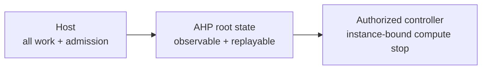

# Host Idle Lifecycle - Proposal Overview

> A conceptual walkthrough of the proposed host idle lifecycle, followed by a map of the protocol surface and its safety requirements. Like the [multi-chat](./multi-chat.md) and [multiroot-sessions](./multiroot-sessions.md) overviews, it explains **what** the feature gives you and **why** it exists before the wire shape.

> **Status: Proposal. Not implemented. Not agreed.** All new lifecycle fields, types, actions, and requirements below are proposals, not current AHP APIs or normative specification. Automatic, irreversible drain is the primary candidate, not an accepted design. Maintainers, reference-host owners, and security owners must agree on that choice before implementation.

---

## 1. The problem

An idle session does not prove that **the whole host is idle**. Another session or chat can still have an active turn, a background agent, shell work, a client-owned tool call, or queued work. Automatic triggers can also start work without a connected client.

Watching one conversation is therefore not enough to decide when to stop the host. The host needs to account for all work under its authority, then prevent new work from starting while an external controller acts on that decision.

**The feature in one sentence:** let an operator enable host-wide idle detection with a host-owned grace period and a replayable state that tells an authorized controller when that host instance is ready to stop.

---

## 2. The mental model

Three roles have separate responsibilities:

- **The operator owns the policy.** Idle detection is disabled by default. The operator decides whether to enable it and how long the grace period lasts.

- **The host owns the work boundary.** It accounts for all relevant work, measures the grace period, and controls admission: whether new application work can be accepted or started.

- **The external controller owns compute stop.** It observes the host's state, checks its authority and the current instance, and performs the platform's stop operation. AHP does not perform that operation.

Two states must not be confused. **Quiescent** means no relevant work or unresolved stop-safety obligation remains. **Drained** adds a closed admission fence: the instance cannot accept or start new application work.

> Quiescent means no work remains now. Drained means no new work can start on this instance.



---

## 3. Why this shape

**Host-wide state, not a session counter.** The TypeScript [`RootState`](https://github.com/microsoft/agent-host-protocol/blob/0d6d98392b06d1e698e20b538e99e8ed1e304935/types/channels-root/state.ts), [root actions](https://github.com/microsoft/agent-host-protocol/blob/0d6d98392b06d1e698e20b538e99e8ed1e304935/types/channels-root/actions.ts), and [root reducer](https://github.com/microsoft/agent-host-protocol/blob/0d6d98392b06d1e698e20b538e99e8ed1e304935/types/channels-root/reducer.ts) are authoritative. `RootState.activeSessions` counts non-disposed sessions, not busy sessions. A nonzero count can include idle retained sessions; a zero count does not exclude standalone work. The optional root terminal list is not a complete work ledger either.

**Support is separate from permission.** [`InitializeResult`](https://github.com/microsoft/agent-host-protocol/blob/0d6d98392b06d1e698e20b538e99e8ed1e304935/types/common/commands.ts) already has typed optional host capabilities such as `automations`. The proposed capability belongs there, not in `_meta`, `serverInfo`, or a per-agent capability. It describes implementation support, not permission to change policy or drain a host.

**State survives a lost connection.** The [root channel](../specification/root-channel.md), [action envelope](https://github.com/microsoft/agent-host-protocol/blob/0d6d98392b06d1e698e20b538e99e8ed1e304935/types/common/actions.ts), [subscriptions](../specification/subscriptions.md), and [connection lifecycle](../specification/lifecycle.md) already provide snapshots and ordered action replay. Separate protocol notifications are ephemeral and are not replayed. State plus an ordered action lets a controller recover the current lifecycle after a lost connection or an exhausted replay buffer. This follows the [state-first doctrine](../guide/doctrine.md).

**Automatic work is still host work.** Existing [automation definitions](https://github.com/microsoft/agent-host-protocol/blob/0d6d98392b06d1e698e20b538e99e8ed1e304935/types/channels-automation/state.ts) and [automation-run state](https://github.com/microsoft/agent-host-protocol/blob/0d6d98392b06d1e698e20b538e99e8ed1e304935/types/channels-automation-run/state.ts) remain authoritative. Scheduling belongs to the host, `pending` runs already exist, and `running` runs remain running while linked sessions await input or client-side work. Automation `enabled` controls automatic triggers, not manual runs. This proposal does not change those contracts.

Source links pin the public revision reviewed for this proposal.

---

## 4. Design decision: who closes admission?

| Candidate | Guarantee and tradeoff |
| --- | --- |
| **A. Operator-enabled automatic drain (primary candidate)** | The host waits for the full grace period, atomically rechecks quiescence and closes admission, then publishes `drained`. This is the simplest complete stop-ready guarantee because no controller round trip is needed to close admission. It can leave the host unavailable if the controller never stops it. |
| **B. Reversible observation plus authorized conditional drain** | The host reports quiescence after the full grace period but keeps admission open until an authorized drain request supplies the expected instance and observation epoch. The host atomically rechecks the current epoch and uninterrupted quiescence, closes admission, and only then returns success and publishes a durable drained result. Observation alone is never stop-ready. This avoids automatic loss of availability when no controller acts, but adds authorization, idempotency, lost-response, and request-race semantics. |

**Decision requested:** choose A or B with maintainers, reference-host owners, and security owners. A is illustrated below because its final state has an unambiguous meaning, not because it is accepted. B would need an agreed request form consistent with AHP's action-first conventions, an observation-epoch contract, duplicate-request behavior, and explicit failures for stale instances, stale epochs, new work, or lost authority. This document does not design that API.

**An idle notification is not enough.** A revocable idle event, including an `idleCancelled` notification, cannot close the distributed stop race. A controller can act on the earlier event before it receives the cancellation.

After either candidate has issued an actionable drained decision, the same instance must not reopen admission, even after a timeout or controller disconnect. Recovery requires stopping or replacing that instance, not revoking the decision while allowing new work.

---

## 5. Worked example: two sessions on one host

Consider an operator who enables candidate A with a five-minute grace period. Two sessions share the host, and one has a background tool still running.

| What happens | How the feature represents it |
| --- | --- |
| The first session finishes; the second is still working. | The host remains `available`. One idle session does not start the grace period. |
| The second session finishes, but its background tool is still running. | The host remains `available` until that work and its required cleanup finish. |
| All work and stop-safety obligations are complete. | The host enters `waiting` and starts the five-minute interval. |
| A new request arrives after four minutes. | Waiting is cancelled before the work proceeds. A new full interval starts only after the host is quiescent again. |
| The next five-minute interval completes without new work. | The host atomically rechecks quiescence, closes admission, and publishes `drained`. |
| The controller receives the state, possibly after reconnecting. | It uses the same instance and epoch to make one logical stop decision, subject to authorization and an instance-bound stop operation. |

The important boundary is **before `drained` becomes visible**. New work either wins admission and cancels waiting, or loses to drain and is rejected. It cannot start after the controller has received a stop-ready decision.

---

## 6. What this feature deliberately is *not*

- **It is not a session or connection timeout.** A quiet connection says nothing about other work. Normal chat clients need not act on this feature.

- **It is not a general lifecycle framework.** The proposed states describe one optional idle policy, not every stage of host startup, maintenance, or shutdown.

- **It is not a compute-control protocol.** Provider environment identifiers, registration heartbeat acknowledgements, transport-specific frames, sandbox APIs, and platform-specific wake or stop operations stay outside AHP.

- **It is not proof that a shared machine is safe to stop.** The host's decision covers its own work boundary. The controller needs separate evidence for other hosts and unrelated work.

---

## 7. Protocol surface (for reviewers)

The following surface illustrates **candidate A**, not an agreed API. The TypeScript excerpts add fields to existing interfaces; they do not replace their other members. New names are tentative. `phase` is the proposed lifecycle discriminant, with a `RootLifecycleStatus` enum and `RootLifecycleState` variants following the repository's state-union naming convention.

### 7.1 Type signatures

```ts
// Proposed additions to the existing interfaces.
interface InitializeResult {
  hostIdleLifecycle?: HostIdleLifecycleCapability;
}

interface HostIdleLifecycleCapability {}

interface RootState {
  lifecycle?: RootLifecycleState;
}

/** @nonexhaustive */
const enum RootLifecycleStatus {
  Disabled = 'disabled',
  Available = 'available',
  Waiting = 'waiting',
  Drained = 'drained',
}

interface RootLifecycleBaseState {
  serverInstanceId: string;
  at: string;
}

interface RootLifecycleDisabledState extends RootLifecycleBaseState {
  phase: RootLifecycleStatus.Disabled;
}

interface RootLifecycleAvailableState extends RootLifecycleBaseState {
  phase: RootLifecycleStatus.Available;
  gracePeriodMs: number;
}

interface RootLifecycleWaitingState extends RootLifecycleBaseState {
  phase: RootLifecycleStatus.Waiting;
  gracePeriodMs: number;
  idleSince: string;
}

interface RootLifecycleDrainedState extends RootLifecycleBaseState {
  phase: RootLifecycleStatus.Drained;
  reason: 'idle';
  gracePeriodMs: number;
  idleSince: string;
  idleEpoch: string;
}

type RootLifecycleState =
  | RootLifecycleDisabledState
  | RootLifecycleAvailableState
  | RootLifecycleWaitingState
  | RootLifecycleDrainedState;

// Proposed member of the existing ActionType enum.
const enum ActionType {
  RootLifecycleChanged = 'root/lifecycleChanged',
}

interface RootLifecycleChangedAction {
  type: ActionType.RootLifecycleChanged;
  lifecycle: RootLifecycleState;
}
```

### 7.2 Capability and state

Presence of `InitializeResult.hostIdleLifecycle` as `{}` means support for this proposed contract. It does not enable the policy. When support is advertised, root snapshots must include the lifecycle state, including `disabled` when the operator has not enabled it.

This candidate needs no client capability declaration: an ordinary client may ignore the optional state. Capability visibility and protocol-version compatibility still require agreement.

| Observation | Meaning |
| --- | --- |
| Capability absent | Unsupported on this connection; do not infer idle or stop readiness. |
| Lifecycle absent, malformed, or unknown | No usable stop-ready evidence, even if support was advertised. |
| `disabled` | Supported, but the idle policy is off. No idle timer or idle-triggered drain. |
| `available` | Policy enabled, but no verified grace interval is in progress. May be busy, starting, or unable to establish quiescence. Not a bootstrap-readiness claim. |
| `waiting` | Quiescence is established and the grace interval is in progress. Admission remains open; this is not permission to stop. |
| `drained` | The full grace period ended, all stop-safety conditions were rechecked, and admission is permanently closed for this instance. This is host-scoped stop-ready evidence, not authorization. |

`gracePeriodMs` is the effective operator-configured positive integer duration in milliseconds. The five-minute value below is illustrative, not a proposed default.

`idleSince` records the start of the uninterrupted interval that led to the state. `at` records the state transition time. Both are informational ISO 8601 wall-clock timestamps; neither is a deadline or a clock for computing elapsed grace. `serverInstanceId` and `idleEpoch` are opaque identifiers; the example uses invented UUIDs.

### 7.3 Ordered action and reducer

`root/lifecycleChanged` is proposed as **server-only**, with no `@clientDispatchable` annotation. It replaces `RootState.lifecycle` in full, following the existing [`automationRun/lifecycleChanged`](https://github.com/microsoft/agent-host-protocol/blob/0d6d98392b06d1e698e20b538e99e8ed1e304935/types/channels-automation-run/actions.ts) pattern.

The future root reducer effect would be `return { ...state, lifecycle: action.lifecycle };`. Replacing `waiting` with `available` clears the old `idleSince`; replacing it with `disabled` also clears the effective grace period. Other root fields remain unchanged. The reducer does not run timers, authorize requests, or close admission.

One representative final transition uses the existing `action` notification envelope. Server-originated actions have no client `origin` on the wire:

```json
{
  "jsonrpc": "2.0",
  "method": "action",
  "params": {
    "channel": "ahp-root://",
    "serverSeq": 42,
    "action": {
      "type": "root/lifecycleChanged",
      "lifecycle": {
        "phase": "drained",
        "reason": "idle",
        "serverInstanceId": "c2a420c3-35b9-4c97-a4d6-b79829d4e510",
        "idleEpoch": "74a9157a-bc08-4d29-82c7-10d394361b62",
        "idleSince": "2026-09-08T14:00:00.000Z",
        "at": "2026-09-08T14:05:00.000Z",
        "gracePeriodMs": 300000
      }
    }
  }
}
```

---

## 8. Proposed host requirements

The uppercase terms in this section state requirements of candidate A only. They do not modify the current specification.

### 8.1 Relevant activity and scope

The host MUST define and document an application-activity classification for each admission path and backend. Classification depends on effects and unresolved obligations, not simply on whether a JSON-RPC message arrived.

| Category | Required treatment |
| --- | --- |
| Queued or admitted application requests | Count from entry into an application admission path through completion, including dispatch queues, validation that can still lead to admission, and results or persistence obligations not yet settled. Do not wait for a session or turn to appear in public state. |
| Sessions and chats | Count active or resumable in-flight turns, queued messages, pending input or approval, background agents, retries, and other unfinished execution across all sessions and chats. Retained completed history and non-disposed session identity alone do not count. |
| Shell and client work | Count attached and standalone shell work, subprocesses, client-owned tool calls, and outstanding host-to-client operations. Disconnection, silence, or a cancellation request does not prove completion. |
| Application mutations and reads | Count requests that create, materialize, resume, or change application work, including resource operations and durable configuration changes. A read that starts a backend, resumes work, or creates a stop-sensitive obligation is not passive. |
| Observation and transport | Pings, acknowledgements, connection/reconnect bookkeeping, passive lifecycle observation, and observation-only subscriptions MUST NOT reset the interval. A subscription or handshake that also materializes or resumes application work MUST pass that work through admission and count it. |
| Startup and uncertainty | Bootstrap-readiness signals MUST NOT be treated as user activity. The interval cannot start until initialization, work recovery, and required observations are complete. Unknown work or a failed activity probe MUST prevent a quiescence claim. |

The host MUST account for all backends under its authority, even when work is hidden from the observing client's permissions or subscriptions. It MUST NOT infer quiescence from a public session count, a single chat, absent events, or a partial backend view. If a backend cannot report and fence its work reliably, the host MUST NOT claim `drained`.

Outstanding tool results, pending work, uncommitted data, required persistence, and cleanup that would make stopping unsafe MUST block quiescence. Accepted cancellation counts as settled only after execution has ended and required cleanup and result handling are complete. A completed public turn or terminal status alone does not prove those obligations are complete. Ordinary resident infrastructure can be excluded only where the host can prove it has no unfinished obligation and cannot start application work outside admission.

### 8.2 Grace period and final admission fence

1. **Wait the full interval.** The policy MUST be disabled by default and controlled by the operator. When enabled, the host MUST first establish complete quiescence, then enter `waiting` and measure the entire configured grace period with a monotonic clock. Time before readiness or an interval of unknown activity MUST NOT count.

2. **New work cancels waiting.** New relevant work MUST cancel the pending interval before that work can proceed. The host MUST return to `available` and, only after quiescence is established again, start a fresh full interval. Even short work between timer callbacks cancels the interval. Late callbacks from cancelled intervals MUST have no effect.

3. **Uncertainty blocks drain.** Loss of required observability or a failed probe during `waiting` MUST cancel the interval and prevent drain. The host MUST surface the failure through its operational diagnostics, not silently treat it as idle. After recovery, it MUST establish quiescence and wait a new full interval.

4. **Policy changes cancel waiting.** A policy change during `waiting` MUST cancel the interval. Disabling the policy enters `disabled`; changing the duration requires a fresh full interval under the new value. A wall-clock jump MUST NOT shorten the interval. If clock continuity or observations across suspension are uncertain, the host MUST start a new interval after recovery.

5. **Admission and drain share one decision.** At expiry, the host MUST atomically validate the current uninterrupted interval, enabled policy, complete quiescence, and stop-safety obligations against admission of new work. Every application admission path MUST participate, including automatic triggers and internal queues. If work wins this ordering, drain MUST fail and that work cancels the interval. If drain wins, the work MUST NOT be admitted or started. Untracked work between a last check and closing admission is forbidden.

6. **Close admission before publishing.** The host MUST close admission and commit the final lifecycle state in its authoritative action/snapshot path before it exposes `drained`. Required persistence MUST be complete before the decision is visible. Failure to complete this transition MUST NOT produce stop-ready evidence. The implementation may use any synchronization mechanism that preserves this invariant; internal generations and timer identifiers stay off the wire.

7. **One final transition, one epoch.** A successful final transition MUST allocate exactly one logical `idleEpoch`. Duplicate expiry callbacks MUST NOT create another epoch or final transition. Candidate A permits at most one such transition per server instance. Cancelled waiting intervals have no public epoch. Replay, snapshots, and repeated delivery MUST retain the same final epoch.

8. **Drained is irreversible for this instance.** After `drained`, the instance MUST NOT reopen admission, start queued work, or accept new application obligations. Requests that would do so MUST receive an explicit rejection, not a success-shaped response. Authorized passive root observation, replay, and liveness traffic may continue until shutdown without reopening admission. The state MUST NOT expire or be revoked because a controller is delayed, disconnected, or lost.

The host's grace period is the complete idle delay. The controller MUST NOT start a second idle grace timer or infer elapsed grace from `idleSince` and `at`. Actual stop remains subject to authorization and instance-bound safety checks below. Neither the timer nor its callback is a distributed stop authorization.

### 8.3 Scheduled and automatic work

The [automation catalogue](../specification/automation-channel.md) and [automation-run lifecycle](../specification/automation-run-channel.md) remain authoritative for automation behavior. Pending and running runs, claimed occurrences, catch-up evaluation, and trigger events awaiting a required decision MUST block quiescence. Schedule and event triggers MUST use the same final admission fence as manual `runAutomation` requests. Turning off automatic triggers is not sufficient to block manual admission.

Future scheduled work needs an explicit operator policy and maintainer agreement. A conservative policy keeps the host available while an enabled trigger depends on that instance remaining online. A different policy could permit stop only with durable trigger state and an agreed external wake or ownership-handoff mechanism. The latter is outside this proposal's wire shape and must not weaken single-host scheduling authority or create a client fallback scheduler.

Until such a policy is established, the host MUST NOT assume that a future `nextRunAt` permits drain. It MUST NOT silently discard accepted work or scheduled obligations to become idle. An occurrence that loses the admission race MUST follow the agreed durable scheduling policy without starting work on the drained instance; if the host cannot preserve that obligation safely, it cannot offer automatic drain with that trigger enabled. Existing `skip` and `runOnce` misfire policies concern missed occurrences, not permission to stop or ignore already pending runs.

---

## 9. Controller identity and authorization

### 9.1 Same process, same identity

The proposed `serverInstanceId` identifies one lifetime of the host's admission authority. Restart or replacement MUST use a new identifier; transport reconnection to the same running instance MUST NOT change it. A restarted host MUST NOT restore an old drained decision as a decision for the new instance. Identity is distinct from existing informational `serverInfo`.

The external controller MUST bind observed state to the current authorized host and compute target. It MUST deduplicate the stop decision by `(serverInstanceId, idleEpoch)`, including replay and fresh snapshots, and make retries idempotent. A root snapshot carries the same lifecycle object at its `fromSeq`; a replayed action carries the same object in server order. Neither delivery path creates a new decision.

### 9.2 Stop the observed instance, not its replacement

Before stopping compute, the controller MUST ensure that the actual stop operation is conditional on the expected current instance. A separate read followed by an unconditional stop is insufficient: restart can occur between them.

The controller's platform must provide an instance-bound stop precondition or equivalent exclusion of restart and replacement. If it cannot, automatic compute stop is unsafe and MUST NOT proceed. Delayed and duplicate decisions for an old instance must not stop a replacement.

Stable identifiers provide correlation, not authentication. `serverSeq` orders actions but is not a stop authorization token. A drained host does not prove that another host, unrelated process, or outstanding obligation on shared compute is safe to stop; the controller needs separate authority and evidence for those resources.

### 9.3 No new client privileges

A normal client MUST NOT gain policy-change or drain privileges by connecting, advertising support, or dispatching `root/lifecycleChanged`. Existing client-dispatchable `root/configChanged` does not grant access to operator lifecycle settings; an implementation must enforce that boundary for both individual changes and full replacement.

No new privileged client role, configuration key, credential, or grant is established here. Whether any privileged AHP configuration or conditional-drain surface is appropriate remains an explicit design question.

---

## 10. Acceptance criteria after agreement

Specification and reducer examples should demonstrate full lifecycle replacement, preservation of other root fields, and clearing of fields that belong only to the prior variant. Round-trip fixtures should cover the capability, each state, and the server-only action envelope. These fixtures cannot prove host admission atomicity; that requires an actual host and an independent controller.

| Area | Required implementation or integration evidence |
| --- | --- |
| Multiple sessions and chats | One becomes idle while a second remains busy; no waiting interval or drain starts. All relevant work must finish first. |
| Cancellation and rearm | Work before expiry cancels waiting; short work and stale callbacks cannot bypass a new full interval. Policy and duration changes have the same protection. |
| Background and client work | Background agents, attached/standalone shell work, queued messages, disconnected client tools, pending approvals, and unsettled persistence block drain. |
| Timer and readiness | A full monotonic grace period is required, including after recovery. Wall-clock jumps, pings, acknowledgements, passive subscriptions, and bootstrap signals cannot shorten or continually reset it. |
| Disabled or unsupported | No idle-triggered drain while disabled; absent, malformed, or unknown capability/state never causes a controller stop. |
| Expiry versus admission | Force both orderings between expiry and newly admitted work. Either work proceeds and drain fails, or drain succeeds and work is explicitly rejected. |
| Final-state invariants | Repeated expiry callbacks create one final epoch. No request, internal queue, backend, or automatic trigger starts work after `drained`. |
| Automations | Pending/running runs and due or catch-up occurrences block drain; future triggers use the agreed policy. Automatic and manual runs cannot bypass the fence. |
| Failures | Activity probes, incomplete backend visibility, persistence failures, and uncertain cancellation prevent stop-ready evidence and produce diagnostics. |
| Replay and snapshots | Disconnect before final delivery, replay it, and fall back to snapshots. The same final state and epoch cause one logical controller decision. |
| Restart and delayed controller | Same-instance reconnect preserves identity. Restart changes it. A delayed or duplicate stop cannot target the replacement, including a restart between observation and stop. |
| Lost controller and authorization | A never-executed stop leaves A drained, not reopened. Unprivileged lifecycle dispatch, configuration merge/replacement, and any future B drain request cannot gain authority. |

---

## 11. Open questions and next steps

The design still needs agreement on A versus B, the activity classification, future-trigger policy, authorization boundary, compatibility, and explicit admission-rejection behavior.

After agreement, add canonical types and action metadata, the root reducer, and lifecycle documentation. Update schema and client generators plus hand-maintained reducers, then add conformance fixtures and a user-visible changelog fragment. Validate a host prototype and an independent controller against the admission and restart races before claiming stop safety.

**This proposal is documentation only.** It changes no protocol types, generated artifacts, executable code, or normative specification pages, and needs no changelog fragment, release, or version bump.
