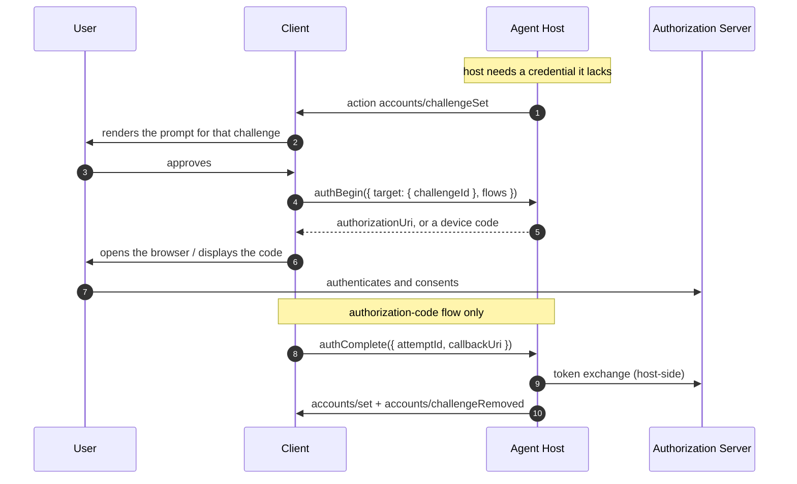
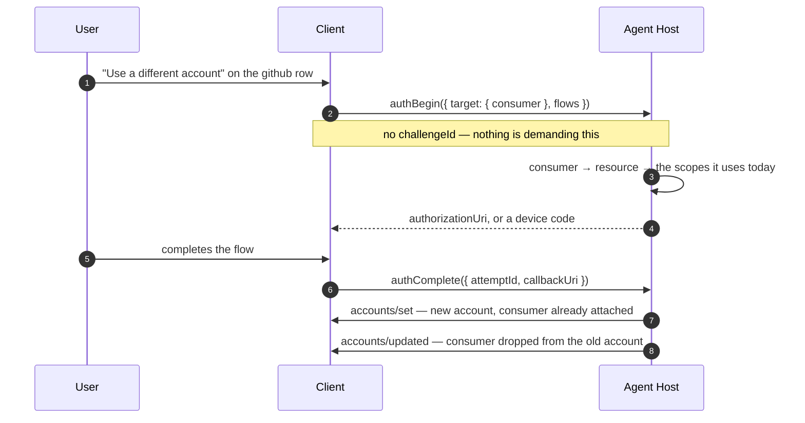
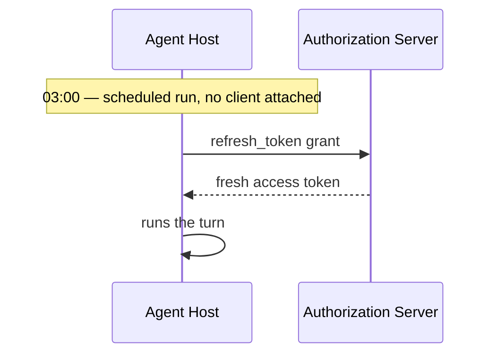
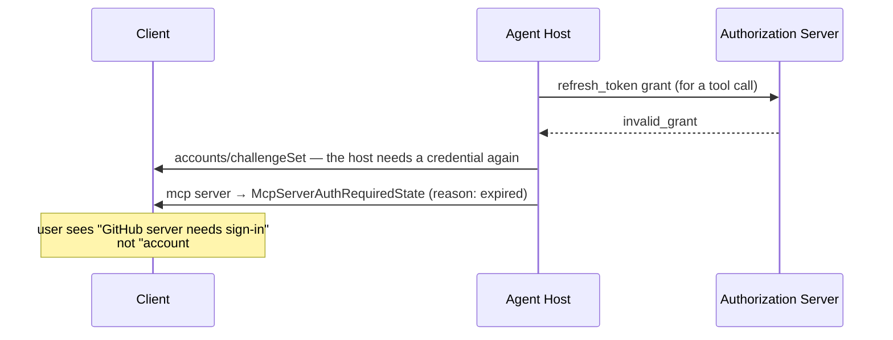

# Host-Owned Authentication — Feature Overview

> What this feature is, why it exists, and the `types/` changes it needs. Same
> shape as the [multi-chat](./multi-chat.md) and
> [multiroot-sessions](./multiroot-sessions.md) overviews: concepts first, wire
> format last.
>
> Replaces [#153](https://github.com/microsoft/agent-host-protocol/issues/153),
> [#221](https://github.com/microsoft/agent-host-protocol/issues/221), and the
> reason behind [#268](https://github.com/microsoft/agent-host-protocol/issues/268).

---

## 1. The problem

Today the **client fetches the tokens**. The host says what it needs —
[`AgentInfo.protectedResources`](/reference/root#agentinfo), a live
`McpServerAuthRequiredState`, or an `AuthRequired` (`-32007`) error — and the
client goes and gets a token, then hands it over with
[`authenticate`](/reference/common#authenticate). The
[Authentication](/specification/authentication) spec calls this per-connection
state, which is why auth is kept out of root state.

All of that assumes **a client is there and it can do OAuth**. That breaks in
three places:

- **Scheduled work.** Nobody is watching. If tokens only arrive from a client,
  the host can't call an LLM at 3am, can't start on a webhook, and can't retry
  after a restart.

- **Thin and headless clients.** A browser tab, a phone, a CLI over SSH, or a CI
  runner may not be able to run a loopback server, may have no browser nearby,
  and may have nowhere safe to keep a refresh token. Today those clients can't
  sign an agent in at all.

- **The same token, five times.** Per
  [#153](https://github.com/microsoft/agent-host-protocol/issues/153), five
  clients on one machine each push their own Copilot token. The host ends up
  holding five tokens for one account, with five expiry clocks. The isolation
  that's supposed to buy isn't real anyway — any connected client can already
  run tool calls.

The opposite case is real too. A sandboxed or throwaway host **should** be kept
at arm's length and handed only short-lived tokens. So this isn't "host-owned is
better." It's "AHP can only say one of the two, and it needs both."

**In one sentence:** let a host hold its own accounts, run sign-in, and refresh
on its own — while clients keep the option to hand tokens over when that's the
safer choice.

---

## 2. The mental model

Two modes. You negotiate one, and they never mix by accident.

- **Client-brokered (today, unchanged).** The client gets a token and pushes it
  with `authenticate`. The host uses a credential it never fetched. This stays
  the default. A sandboxed host gets nothing else.

- **Host-owned (new, opt-in).** The host holds the credential. It can refresh
  it, it survives disconnects and restarts, and it can work with no client
  attached.

The client's job changes in the second mode:

> The client stops being the **token holder** and becomes, at most, the user's
> **browser**.

When the host needs a human to approve something, it borrows a client's ability
to open a URL or show a code. Nothing secret travels to the client — not the
code exchange, not the access token, not the refresh token. The client carries
the envelope and can't open it.

What flips is **who talks to the authorization server**:

```
  CLIENT-BROKERED (today)              HOST-OWNED (new)

  ┌──────────────┐                     ┌──────────────┐
  │ auth  server │                     │ auth  server │
  └──────▲───────┘                     └──────▲───────┘
         │ OAuth                              │ OAuth
  ┌──────┴───────┐                     ┌──────┴───────┐
  │    client    │                     │  agent host  │
  └──────┬───────┘                     └──────▲───────┘
         │ authenticate({ token })            │ "open this" / "here's the callback"
  ┌──────▼───────┐                     ┌──────┴───────┐
  │  agent host  │                     │    client    │ ──opens──► browser
  └──────────────┘                     └──────────────┘

  client holds the credential          host holds the credential
  host cannot act alone                host can act with no client attached
```

And two things that used to be invisible become state you can read:

- **What the host needs** — already modelled (`protectedResources`,
  `McpServerAuthRequiredState`, `AuthRequired` errors).
- **What the host has** — new. A list of accounts on its own channel. A client
  can compare the two and offer sign-in *before* something fails.

---

## 3. Where this sits

This feature is **a window onto the host's credential state, plus a way to lend
it a browser**. It is not an authorization server, a secret store, or a token
format.

```
   ┌─────────────┐                          ┌──────────────────────────────┐
   │  UI client  │  ◄── feature layer ───►  │   Agent host                 │
   │             │   accounts, sign-in,     │   ── token acquisition       │
   │  browser /  │   revocation, status     │   ── storage & refresh   ◄─┐ │
   │  code display│                         │   ── upstream OAuth ───────┘ │
   └─────────────┘                          └──────────────────────────────┘
```

- **The host layer** is where credentials live: the PKCE verifier, the code
  exchange, the refresh loop, the keychain, and whether a credential may be
  saved at all. None of that is AHP's business.

- **The feature layer** (this proposal) is the small contract between them:
  *what accounts exist*, *start a sign-in*, *here's the callback*, *sign this
  one out*.

**This is about seeing and delegating, not storing.** AHP never sees a token in
this mode, and gives hosts nowhere to put one.

---

## 4. What you get

| Capability | What it enables |
| --- | --- |
| **Accounts channel** (`ahp-accounts://`) | One place showing what the host *has* (identities) and what it *needs* (challenges), so a client can ask before anything fails — not only after a `-32007`. |
| **Host-driven sign-in** (`authBegin` / `authComplete`) | The host runs the OAuth flow. The client only opens a URL or shows a code. |
| **Flows agreed up front** | The host advertises which flows it can drive. The client picks one it can handle for each sign-in, so it never gets handed a flow it can't run. |
| **Several accounts per resource** | Work *and* personal GitHub at the same time, with a binding saying which agent or MCP server uses which — instead of "last one in wins." |
| **Sign-out** (`accounts/removed`) | The host forgets the credential and, when it owns the grant, revokes it upstream. No field for a client to get wrong. |
| **Refresh with nobody watching** | The host holds the refresh token, so scheduled work keeps running after every client has gone away. |
| **One primitive for MCP OAuth** | The same `authBegin` / `attemptId` pair closes the correlation gap in [#221](https://github.com/microsoft/agent-host-protocol/issues/221). |

---

## 5. The flows a user actually goes through

Six flows cover the whole feature. Flows 1–3 differ only in *why* the host is
missing a credential. On the wire they're identical.

| # | What the user does | On the wire |
| --- | --- | --- |
| 1 | First run — signs in because nothing is signed in | `authBegin` → `authComplete` |
| 2 | Grants extra access when a tool call needs it | `authBegin` → `authComplete` |
| 3 | Signs in again after a session dies overnight | `authBegin` → `authComplete` |
| 4 | Points something at a *new* account while the old one still works | `authBegin` → `authComplete` |
| 5 | Points one MCP server at a specific account | `accounts/updated` |
| 6 | Signs out | `accounts/removed` |

### 5.1 Three collections, and what each is for

```
accounts     accounts the host holds, and what uses each one
challenges   credentials the host needs and doesn't have   ← flows 1, 2, 3
attempts     sign-ins under way, and how each one ended    ← flows 1–4
```

A **challenge** is a *need*. An **attempt** is a *try*. One need can outlive
several tries, so they're separate collections. Flow 1 over time:

| | `challenges` | `attempts` | The user sees |
| --- | --- | --- | --- |
| Host starts, no GitHub credential | `[github]` | — | "Sign in to GitHub" |
| User clicks; device code issued | `[github]` | `[#1 · ABCD-1234]` | "Enter ABCD-1234" |
| User wanders off; the code expires | `[github]` | — | "Sign in to GitHub" |
| User clicks again; new code | `[github]` | `[#2 · WXYZ-9876]` | "Enter WXYZ-9876" |
| User approves | — | — | "Signed in as tyler@personal" |

The challenge sat there the whole time while two attempts came and went. Merge
the two lists and row three has no good answer: either delete an entry you still
need, or mark it expired when it was the *code* that expired, not the need.

### 5.2 Flows 1–3: answering a challenge

The host posts a challenge whenever it needs a credential it doesn't have. It
finds out in three ways, and the user sees three different prompts — but the
wire path is one:

| Flow | How the host learns | Prompt |
| --- | --- | --- |
| 1 · first run | `AgentInfo.protectedResources` declares GitHub; no account holds it | "Sign in to GitHub" |
| 2 · step-up | a tool call 403s with `insufficient_scope` | "GitHub server needs additional access" |
| 3 · expiry | a refresh attempt returns `invalid_grant` | "Sign in to GitHub again" |



**Where `challengeId` comes from.** Step 2, and nowhere else. The host makes
`AuthChallenge.id` and posts it with `accounts/challengeSet`. Any client
subscribed to `ahp-accounts://` then has the whole challenge sitting in
`AccountsState.challenges`, and passes its `id` back at step 5. No lookup, no
second source — a client only ever echoes a value the host gave it. That's what
makes it safe for the challenge to carry full `ProtectedResourceMetadata` (§7).

**Nothing here replaces `AuthRequired` (`-32007`).** It stays exactly as it is,
along with `McpServerAuthRequiredState` and `ToolCallAuthRequiredState`. A
client that never subscribes to `ahp-accounts://` sees precisely what it sees
today, in the same places, and keeps brokering tokens with `authenticate` — that
is the whole point of the feature being additive.

What subscribing buys is the *earlier* and *wider* view: a need visible before
anything has failed (flow 1), deduplicated across sessions, and the
`challengeId` that lets the host run the flow instead of the client. A client
that wants none of that is unaffected, which is why
`McpAuthRequirement.challengeId` is optional — absent when the host has no
challenge published for that connection, and simply ignorable when it isn't.

Challenges cover *static* requirements too, not only failures. That's what makes
flow 1 work: on first run nothing has failed, the host just knows an agent needs
GitHub and holds nothing for it. If challenges only appeared after a failure, the
most common flow in the feature wouldn't have one, and every client would have to
compare `protectedResources` against `accounts` itself to know to show a button.

### 5.3 Flow 4: adding an account for something that already works

The only flow with **no challenge**. Nothing is blocked and nothing has failed —
the GitHub MCP server is running happily as `tyler@personal`, and the user wants
it to use `tyler@work` instead.

The client names the **consumer**, not a resource. It has the consumer already:
it is rendering "github → tyler@personal" from `HostAccount.consumers`. It could
not name the resource even if the shape asked for one, because a working MCP
server's state is `McpServerReadyState` — `{ kind: 'ready' }` and nothing else.
A resource only becomes visible once the server *breaks*, which is the case this
flow is not about.



Switching is therefore **one call and one atomic host operation**, not
add-then-bind. There is no window in which the new account exists bound to
nothing, and no second action a client could forget to send.

There's no challenge to name here, which is the whole reason `target` is one
thing or the other.

### 5.4 Flows 5 and 6: binding and signing out

Neither needs a command. Pointing an MCP server at an account is
`accounts/updated` carrying `consumers`; the host drops that consumer from
whichever account had it before. Signing out is `accounts/removed`, which takes
the account's bindings with it — all at once, because they live on the account.

### 5.5 Nobody watching



This is the case the feature exists for. Note what the protocol does here:
**nothing**. No field read, no action sent, no client asked. All AHP did was let
the user sign in once, however long ago.

Whether to ask for a refresh credential, how long tokens live, and when to renew
are host decisions — made by whoever stores the credential and knows if it runs
work overnight. If a refresh fails, the host posts a challenge and the user
handles it as flow 3.

### 5.6 A credential dies, and the account says nothing about it

The refresh credential behind `tyler@work` is revoked. Two things use it: a
GitHub MCP server and the Copilot agent.



The account entry doesn't change: no status, no error, no health field. The user
never asks *"how healthy is account #2."* They ask *"why did my GitHub server
stop working."* AHP answers that on the thing that broke, using words that
already exist (`Required` / `Expired` / `InsufficientScope`), plus a challenge
they can act on.

A status on the account would be a third copy of the same signal —
**derivable** while consumers report it, and **unknowable** when they don't,
since a host only finds out a credential is dead by trying to use it.

---

## 6. What this is *not*

- **Not a replacement for `authenticate`.** The push model is untouched and stays
  the baseline. [Doctrine](/guide/doctrine) names "a required model provider,
  model router, or **credential flow**" as an anti-goal, and a host that skips
  this capability is still fully conformant.

- **Not a rule that hosts must store long-lived credentials.** Throwaway and
  sandboxed hosts should keep being handed short-lived tokens by clients that
  chose to trust them. Nothing here forces a host to save anything.

- **Not a token vault.** AHP gains no way to read, write, export, or move a
  credential. No field in this proposal carries a token.

- **Not a client permission model.** "Which client may use the host's account" is
  a real question, and it belongs to
  [#259](https://github.com/microsoft/agent-host-protocol/issues/259) /
  [#266](https://github.com/microsoft/agent-host-protocol/issues/266), not here.
  In this proposal it's transport and policy: a host that doesn't trust a
  connection doesn't advertise the capability, and denies the subscription.

- **Not a policy for which account a session uses.** Sketched in §10 and kept small.

---

## 7. Why this shape

**`resource` names what's being asked for; `accountId` names who answers it.**
The [Authentication](/specification/authentication#why-keyed-by-resource) spec
says `resource` is a unique id for a protected resource, and reusing it "avoids
inventing a parallel ID scheme." That still holds for *challenges* — an
`AuthRequired` error, an `McpServerAuthRequiredState`, an
`AgentInfo.protectedResources` entry, an `authenticate` push, and an `authBegin`
call all name the same string.

But `resource` is **not** a unique key for a *credential*, and this proposal says
so where the spec is silent. A host can hold two GitHub accounts for one
`resource`, work and personal (§7.1). So both keys exist and mean different
things: `resource` answers "what am I being asked for," `accountId` answers
"which account satisfies it."

**Sign-ins get an `attemptId`.** Two calls with nothing linking them can't answer:
what if two clients start a sign-in for the same resource, what if the client dies
in between, what if the host has two live PKCE verifiers. It's also the exact
handle [#221](https://github.com/microsoft/agent-host-protocol/issues/221) asks
for, so one field closes two problems.

**Flows are agreed, not guessed.** The obvious alternative is to let the host try
every flow until one works. Rejected: each failed try can burn a real browser
window or a live device code, and "until one works" can't tell *flow unsupported*
from *user cancelled*. Once you can tell those apart, you can work out the overlap
up front anyway. So the host advertises its flows in
`InitializeResult.authentication`, the client names the ones it will drive in
`authBegin` and is told which got picked, and it can call again with a narrower
set. The client drives retries; the host never fires blind.

**Device code matters more than authorization code.** This feature exists for
remote hosts and absent clients. Authorization-code-with-loopback needs the client
to run an HTTP server *and* sit next to the browser. Device code needs "show a
string and a URL" — every client can do that, including as an
[`InputRequestResponsePart`](/guide/elicitation). No `redirectUri`, no listener,
no callback relay, and the polling stays host-side so the result just lands in
state. Device code is the baseline; authorization code is the optimization for
local rich clients.

**PKCE stays host-side, as a MUST.** The authorization code passes through the
client. That's only acceptable because the verifier doesn't, which makes the code
useless to anyone but the host. The rest of the security section follows from
saying that out loud instead of leaving it implied.

**Its own channel, not a `RootState` field.** The deciding question: should seeing
accounts be allowed separately from seeing root state? For a list of usernames,
emails, and org affiliations — yes. A root field shows the host's accounts to
everyone who finishes `initialize`. A channel makes `subscribe` refusable with
`PermissionDenied`, using machinery that already exists. It also keeps root state,
already the biggest surface in the protocol, from growing another list every
client pays for.

**Attempts live in state.** They have to for device code — the host polls, and the
client has to see the result. It also answers
[Doctrine's](/guide/doctrine#design-tests) "is the durable, user-visible result in
state rather than only in a notification?" And it makes multi-client coherent: one
client starts a sign-in, another displays it. The one thing that stays *out* of
state is the authorization-code `authorizationUri`, because it's single-use and
tied to one client's redirect URI.

**An account is an identity, not a credential.** One `HostAccount` carrying both
`resource` and token facts jams together two things with different lifetimes, and
it breaks both ways. Upward: one identity can span many resources — Entra issues
multi-resource refresh tokens, so signing in once would create a duplicate account
per resource. Downward: when something needs broader scopes on a resource you
already hold (AHP calls this `McpAuthRequiredReason.InsufficientScope`), you'd get
a *second* account for the same person.

The fix is to stop modelling credentials in the protocol at all. `HostAccount` is
an identity. Which tokens sit behind it, for which resources, with which scopes
and expiries, is the host's business. The upward case becomes one account with
several credentials the client never sees. The downward case changes nothing
observable, because scopes were never state.

`expiresAt` is the tell. Try keeping one account per identity and calling its
`scopes` "everything the host can do" — then say when it expires. Several tokens,
several expiries, no honest answer. Every attempt to fix that grew structure in
service of fields no client branches on.

**Two commands and seven actions.** AHP already has **27 client→server commands**,
so commands aren't exotic — the "prefer actions" rule is about *state changes*
(don't invent `sendMessage` when `session/turnStarted` can carry it), not
request/response in general. The line this proposal draws:

*Actions* for anything whose lasting result belongs in state — every account,
attempt, and binding change. That's why cancelling a sign-in is
`accounts/authAttemptRemoved` and signing out is `accounts/removed`. Neither needs
its own verb.

*Commands* for the two operations that must return data which must **not** enter
state. For `authComplete` that's **security, not taste**: client-dispatched
actions are echoed to every subscriber, so an action carrying `callbackUri` would
broadcast a live authorization code to every connected client. `authBegin` is the
milder version of the same thing — its single-use `authorizationUri` is tied to
one client's redirect URI.

Both have precedent. `authenticate` is already a credential-carrying command on
the root channel. `invokeChangesetOperation` is already a command that does
something and whose *results come back through actions* — exactly the `authBegin`
shape. And `completions` / `resolveSessionConfig` already return computed data
that isn't part of any channel's state.

### 7.1 Why multi-account has to land now, not later

The tempting reading of "one account per resource" is that it already handles the
obvious case: sign into a model provider with one GitHub account, and a GitHub
MCP server with another. If those two declare *different* `resource` strings
(`https://api.githubcopilot.com` vs `https://api.github.com`), it does.

**That is exactly what makes it dangerous** — whether the model holds depends on
an implementation detail of how a host names its resources. And one case cannot
be dodged by naming at all: **two GitHub MCP servers, one pointed at a work org
and one at personal.** Same `resource`, unambiguously two accounts.

The urgency is not aesthetic. Without an explicit binding, the only semantics
available is *"whichever account signed in last wins"* — which is precisely the
bug [#153](https://github.com/microsoft/agent-host-protocol/issues/153) was filed
about. Shipping the accounts channel without selection means shipping a
known-broken semantic and then breaking it again to fix it.

Three pieces are needed, and only three:

1. **N accounts per `resource`** — already satisfied; accounts are keyed by `id`.
2. **`authBegin` distinguishes "add another identity" from "act on this one."**
   Modelled as `accountId?` — its presence names the identity whose grant is
   being renewed or widened, its absence means add a new identity. "Act on an
   existing account, but unspecified which" is therefore inexpressible.
3. **A record of which consumers use an account.** Carried on the account
   itself as `consumers: AccountConsumer[]`, not as a separate binding
   collection keyed the other way. Two properties follow structurally: a
   reference to a non-existent account is unrepresentable, and removing an
   account drops its bindings with it. The remaining rule — a consumer must
   not appear on two accounts sharing a `resource` — is enforced by the host,
   which is the authority for sequencing anyway. Finding a *stable* key for the
   consumer is the hard part (§7.2).

Bindings live in accounts state rather than at each consumption site, because
that is what an account-management UI renders; deriving it by walking every
session's customizations is both expensive and racy. Per-session overrides and
`usedBy` rollups stay deferred (§10).

### 7.2 The consumer key

A binding has to survive a restart, so it needs an id for "this MCP server" that
means the same thing in every session. AHP has no such id today:
`CustomizationBase.id` is documented as *session-unique*, `uri` alone collides
for servers declared inline in one manifest, `range` shifts on edit, and `name`
alone has no uniqueness guarantee.

**This proposal keys on `(uri, name)`** — the manifest, plus the declaration's
name inside it. It needs no change to any existing type, so it can't stall on
someone else's decision. It does need one rule the spec doesn't state, so this
proposal adds it: a host **MUST NOT** publish two MCP-server customizations
sharing a `(uri, name)` in one session. In practice that already holds — an
`mcpServers` block is a map keyed by name.

Mostly this is a host implementation concern, and hosts already have to solve it
to keep grants across restarts. Two things are worth pinning in the spec rather
than leaving to each host:

- **URI comparison needs a normalization rule** — trailing slashes,
  percent-encoding, drive-letter case, symlinks. Without one, two hosts compute
  different keys for the same server and neither is wrong (§10).
- **Don't garbage-collect bindings whose consumer is absent.** A workspace that
  isn't open contributes no customizations, which is not the same as the server
  being deleted; collecting on absence would wipe bindings for every project a
  user hasn't opened lately.

The residual failure is a rename or move losing the binding. That fails **safe**
— no match, host default — and clients SHOULD render the binding
("*server* → *account*") so a wrong or missing one is visible rather than
silent. If `CustomizationBase` later gains a real `stableId` (§10), bindings
migrate by matching `(uri, name)` once and rewriting to the new key.

---

## 8. Protocol surface (for reviewers)

Everything here is **additive**: no existing field changes type, no existing
method changes shape, and a host or client that ignores the entire surface
behaves exactly as today.

### 8.1 Change table

| Symbol | File | Kind |
| --- | --- | --- |
| `InitializeResult.authentication?` | `common/commands.ts` | added (capability) |
| `AuthenticationCapability` + `AuthFlowSupport` | `common/commands.ts` | added (types) |
| `AuthFlowKind` | `common/state.ts` | added (enum) |
| `AuthFlowRequest` | `channels-accounts/commands.ts` | added (union; carries `redirectUri`) |
| `authBegin` / `authComplete` | `channels-accounts/commands.ts` | added (2 commands) |
| `AccountsState`, `HostAccount` (identity), `AuthChallenge` (need), `AuthAttemptState` (try) | `channels-accounts/state.ts` | added (state) |
| `AccountConsumer` (agent variant carries `resource`) + `HostAccount.consumers?` | `channels-accounts/state.ts` | added (multi-account) |
| `AuthAttemptStatus` + 5 `AuthAttempt*State` variants | `channels-accounts/state.ts` | added (lifecycle union) |
| `DeviceCodePrompt` | `channels-accounts/state.ts` | added (device-code payload) |
| `McpAuthRequiredReason` | `channels-session/state.ts` | reused (see §10 on the name) |
| `accounts/set` + `accounts/updated` + `accounts/removed` | `channels-accounts/actions.ts` | added (keyed collection) |
| `accounts/authAttemptSet` + `accounts/authAttemptRemoved` | `channels-accounts/actions.ts` | added (keyed collection) |
| `accounts/challengeSet` + `accounts/challengeRemoved` | `channels-accounts/actions.ts` | added (keyed collection, host-authored) |
| `accountsReducer` | `channels-accounts/reducer.ts` | added |
| `McpAuthRequirement.challengeId?` | `channels-session/state.ts` | added (closes #221) |
| `AuthFlowUnsupported` (`-32012`) + `AuthFlowUnsupportedErrorData` | `common/errors.ts` | added (error) |
| 7 `ActionType` entries + `ACTION_INTRODUCED_IN` | `common/actions.ts`, `version/registry.ts` | added |

> **On shape.** All three collections here (`accounts`, `challenges`,
> `attempts`) are keyed, so each uses the `Set` / `Updated` / `Removed`
> convention rather than a single full-replacement action — the
> `root/terminalsChanged` full-replacement style is a catalogue exception, not
> the convention. Each action needs a fixture per reducer branch (insert,
> replace, merge, remove, no-op) to hold `types/reducers.ts` at 100% branch
> coverage.

### 8.2 Type signatures

```ts
// ── Negotiation — common/commands.ts ─────────────────────────────────────
// One-sided: the host advertises, the client picks. No client capability (§9).
interface InitializeResult {
  // …existing…
  /** Present = this host owns credentials and accepts the auth commands. */
  authentication?: AuthenticationCapability;
}
interface AuthenticationCapability {
  /** The menu. The client picks from it in `AuthBeginParams.flows`. */
  flows: AuthFlowSupport[];
}

/**
 * An object rather than a bare `AuthFlowKind`, so a flow can later advertise
 * facts about itself — supported PKCE methods, a required redirect scheme, a
 * polling floor — without reshaping the capability.
 */
interface AuthFlowSupport {
  kind: AuthFlowKind;
}

// ── Flows — common/state.ts ──────────────────────────────────────────────
const enum AuthFlowKind {
  /** RFC 6749 §4.1 + RFC 7636 (PKCE). Client relays the callback URI. */
  AuthorizationCode = 'authorizationCode',
  /** RFC 8628. Client displays a code; the host polls. */
  DeviceCode = 'deviceCode',
  /** Nothing to do — the host already holds a usable account. */
  None = 'none',
}

// ── Accounts state — channels-accounts/state.ts ──────────────────────────
// channel: 'ahp-accounts://' (singleton, like 'ahp-root://')
interface AccountsState {
  /** What the host HAS. Never contains a token. Array, not map (§9). */
  accounts: HostAccount[];
  /** What the host NEEDS. A *need*, and it persists until satisfied (§5.2). */
  challenges?: AuthChallenge[];
  /**
   * Sign-ins, in flight and just-settled. A *try*, and it dies on its own
   * clock (§5.1).
   *
   * Named `attempts` rather than `pendingAuth` because a settled attempt
   * lands here too, briefly: a client learns the outcome by seeing the entry
   * reach `Completed` or `Failed` before the host removes it. A collection
   * called "pending" holding a completed entry would be a lie.
   */
  attempts?: AuthAttemptState[];
}

/**
 * Something the host can't do until it gets a credential.
 *
 * Host-authored — which is what makes it safe to carry full
 * `ProtectedResourceMetadata` here. Clients reference it by `id`, so
 * `authorization_servers` never comes from a client (§9).
 */
interface AuthChallenge {
  /** Host-minted. THIS is the `challengeId` used everywhere else — a client
   *  only echoes it back, never builds one (§5.2). Stable while the need is
   *  outstanding, so it survives any number of failed attempts. */
  id: string;
  /** RFC 9728 metadata for the resource that needs authorizing. */
  resource: ProtectedResourceMetadata;
  /** What this challenge demands, from a `WWW-Authenticate` header. MUST NOT
   *  be assumed a subset or superset of `resource.scopes_supported` (§8.6). */
  requiredScopes?: string[];
  /** Reuses the existing enum rather than minting a parallel one. The `Mcp`
   *  prefix becomes a misnomer once agents raise challenges too (§10). */
  reason?: McpAuthRequiredReason;
  /** Who is blocked, so a client can say why it's asking. Deduplicated: two
   *  sessions blocked on one server produce one challenge.
   *
   *  A challenge is for one resource, so an `agent` consumer listed here MUST
   *  carry that same `resource`. The repetition is deliberate: a consumer
   *  value is a complete key for a binding, and a key that is only complete in
   *  some contexts is worse than one that repeats a field. */
  consumers?: AccountConsumer[];
  /** Which account should satisfy it, when a binding already names one. */
  accountId?: string;
}

/**
 * An **identity** — who the host is signed in as, and what uses it.
 *
 * No `resource`: one identity can hold credentials for many. No credential
 * facts at all — no scopes, expiry, renewability or status. Both would
 * duplicate the identity, and neither is something a client branches on (§7).
 */
interface HostAccount {
  /** Stable, host-assigned. */
  id: string;
  /** The authorization server that authenticated the user. Identity comes from
   *  the issuer, not from any resource — hence its place here. */
  issuer?: string;
  /** Stable subject at that issuer, when known. */
  subject?: string;
  /**
   * What the user picks between. **Required**: an account list a client cannot
   * render is useless, and every other field here is optional or opaque, so
   * without this there is nothing to put in the UI.
   *
   * The host synthesizes one when the provider gives it nothing to work with
   * (an ambient credential whose subject it cannot resolve), because a
   * placeholder it chose beats a blank row the client has to invent.
   */
  label: string;
  /**
   * Whether `accounts/removed` does anything for this account.
   *
   * `false` for a credential the host did not mint and cannot forget — an
   * ambient one it rediscovers from its environment on every start, or one a
   * client pushed and still owns. Signing those out is not the host's to do,
   * so a client SHOULD NOT offer the affordance.
   *
   * This is deliberately *what a client can do*, not *where the credential
   * came from*. Provenance is host-internal and drives the host's own
   * revocation rules (§8.4); the only part of it a client can act on is this.
   */
  removable: boolean;
  /**
   * What uses this identity (§7.1). The only field a client may change.
   *
   * A consumer MUST NOT be bound to two identities serving the same
   * `resource`. The host enforces that while sequencing: binding a consumer
   * here makes the host drop it from whichever identity had it before.
   */
  consumers?: AccountConsumer[];
  _meta?: Record<string, unknown>;
}

// ── Multi-account: what uses an account — §7.1 ───────────────────────────
/**
 * A union, not a bare string, so "an id of unspecified kind" can't be said.
 *
 * A consumer value identifies *what uses a credential*, which for a
 * multi-resource agent is not the agent alone — see `resource` below.
 */
type AccountConsumer =
  | {
      /** Matches `AgentInfo.provider`. */
      provider: string;
      /**
       * Which resource this binding is for. **Required**, not optional: an
       * agent may declare several `protectedResources`, and hold a different
       * account for each, so `provider` alone identifies nothing — not in
       * `consumers`, not in a challenge, not in `authBegin`. An optional field
       * would make `{ agent, p }` and `{ agent, p, resource }` both legal while
       * meaning different things.
       *
       * **Opaque to clients.** It is the RFC 9728 resource identifier the agent
       * declared, and a client's only correct use of it is equality — matching
       * against `AgentInfo.protectedResources[].resource` to group or label
       * bindings. Clients SHOULD NOT parse it, derive an endpoint from it, or
       * display it raw; `resource_name` on the metadata is the display string.
       *
       * Always available, because every path by which an agent comes to use a
       * credential already names one, and `ProtectedResourceMetadata.resource`
       * is itself REQUIRED:
       *
       * - declared — `AgentInfo.protectedResources[].resource` (root channel)
       * - dynamic — `AuthRequiredErrorData.resources[].resource` (`-32007`)
       * - pushed — `AuthenticateParams.resource`
       *
       * So the client still only echoes host-published data.
       */
      resource: string;
    }
  /** NOT `CustomizationBase.id` (session-unique) and NOT `uri` alone (inline
   *  servers share one manifest uri). The pair survives file edits; `range`
   *  does not. See §7.2.
   *
   *  No `resource` here, and NOT because the key names one — `uri` is the
   *  containing manifest file, and an MCP server's endpoint is in any case not
   *  necessarily the OAuth resource identifier its metadata declares.
   *
   *  The reason is dependency. One `(uri, name)` is one server, and one server
   *  declares one Protected Resource Metadata document, so its resource is
   *  *functionally dependent* on the key — the host derives it. One at a time,
   *  though, not one forever: a server can later declare a different
   *  identifier, which is why a stored copy is a staleness hazard rather than
   *  merely redundant.
   *
   *  AHP already draws this line. Agent auth needs are plural everywhere they
   *  appear — `AgentInfo.protectedResources` and `AuthRequiredErrorData
   *  .resources` are both arrays — while `McpAuthRequirement.resource`, shared
   *  by `McpServerAuthRequiredState` and `ToolCallAuthRequiredState.auth`, is a
   *  single object. These variants mirror that, rather than inventing it. */
  | {
      kind: 'mcpServer';
      /**
       * The manifest that declares the server — **identity only, never
       * display.** `name` is what a client shows. This is here because `name`
       * alone is not unique: two workspaces can each declare a `github`
       * server, and binding one must not bind the other.
       */
      uri: URI;
      /** The declaration's name within that manifest. What a client renders. */
      name: string;
    };

/**
 * One sign-in, at whatever point it has reached. A lifecycle union per the
 * repo's naming rule: `*State` discriminated by a `*Status` enum.
 *
 * Discriminating on `status` is what makes the conditional fields honest —
 * `accountId` exists exactly when the attempt completed, `error` exactly when
 * it failed, and neither can be attached to a pending one.
 *
 * `flow` sub-discriminates only `Pending`, because that is the only status
 * where a flow still has anything to say. Once an attempt has settled, what a
 * device code used to be is no longer actionable.
 */
type AuthAttemptState =
  | AuthAttemptPendingState
  | AuthAttemptCompletedState
  | AuthAttemptFailedState
  | AuthAttemptCancelledState
  | AuthAttemptExpiredState;

interface AuthAttemptBase {
  /** Host-minted. Referenced elsewhere as `attemptId`. */
  id: string;
  /**
   * The RFC 9728 resource identifier being authorized. Typed `string` rather
   * than `URI` to match the rest of AHP's OAuth surface —
   * `ProtectedResourceMetadata.resource`, `AuthenticateParams.resource` and
   * the `auth/required` notification all use `string`.
   */
  resource: string;
  /** The need this try is answering. Absent for flow 4 (§5.3). */
  challengeId?: string;
}

/** Still running. The only status that carries flow-specific detail. */
type AuthAttemptPendingState =
  | AuthorizationCodePendingState
  | DeviceCodePendingState;

interface AuthorizationCodePendingState extends AuthAttemptBase {
  status: AuthAttemptStatus.Pending;
  flow: AuthFlowKind.AuthorizationCode;
  // Nothing to broadcast: the browser is already open on the client that
  // called `authBegin`, and the URI is bound to that client's `redirectUri`.
}

interface DeviceCodePendingState extends AuthAttemptBase {
  status: AuthAttemptStatus.Pending;
  flow: AuthFlowKind.DeviceCode;
  /** Required — showing this is the whole reason attempts are in state. */
  device: DeviceCodePrompt;
  /** RFC 8628 `expires_in` as an ISO 8601 timestamp
   *  (e.g. `"2025-03-10T18:42:03.123Z"`). Required: the code stops working,
   *  and a client showing it has to be able to say when. */
  expiresAt: string;
}

interface AuthAttemptCompletedState extends AuthAttemptBase {
  status: AuthAttemptStatus.Completed;
  /** Required here, and expressible nowhere else. */
  accountId: string;
}

interface AuthAttemptFailedState extends AuthAttemptBase {
  status: AuthAttemptStatus.Failed;
  /** Required here, and expressible nowhere else. */
  error: ErrorInfo;
}

/** The user backed out, or a client dispatched `accounts/authAttemptRemoved`. */
interface AuthAttemptCancelledState extends AuthAttemptBase {
  status: AuthAttemptStatus.Cancelled;
}

/** A device code aged out before the user finished with it (§5.1). */
interface AuthAttemptExpiredState extends AuthAttemptBase {
  status: AuthAttemptStatus.Expired;
}

const enum AuthAttemptStatus {
  Pending = 'pending',
  Completed = 'completed',
  Failed = 'failed',
  Cancelled = 'cancelled',
  Expired = 'expired',
}

interface DeviceCodePrompt {
  /** RFC 8628 `user_code`. */
  userCode: string;
  /** RFC 8628 `verification_uri`. */
  verificationUri: URI;
  /** RFC 8628 `verification_uri_complete` — pre-filled, when offered. */
  verificationUriComplete?: URI;
}

// ── Accounts actions — channels-accounts/actions.ts ──────────────────────
// `Set` carries the full entry, `Updated` the key plus changed fields,
// `Removed` only the key and no-ops when absent. Three collections.
//
// Keys are a bare `id`, not `accountId` / `challengeId` / `attemptId`: each
// action names exactly one entity and the action name already says which, so
// the prefix would be redundant. Matches `SessionCustomizationRemovedAction`
// and `ChatPendingMessageRemovedAction`. The prefixed form is for actions that
// carry several ids at once (as `AnnotationsUpdatedAction` carries
// `annotationId` alongside `turnId`), and for cross-references from another
// type — which is why `AuthAttemptBase.challengeId` and `accountId` keep it.

interface AccountSetAction {          // keyed by HostAccount.id
  type: ActionType.AccountSet;        // 'accounts/set'
  account: HostAccount;               // host-authored
}
interface AccountUpdatedAction {
  type: ActionType.AccountUpdated;    // 'accounts/updated'
  id: string;
  /** The only field a client may change, so binding is one action — the host
   *  reconciles by dropping the consumer from whoever held it before. */
  consumers?: AccountConsumer[];
}
interface AccountRemovedAction {
  type: ActionType.AccountRemoved;    // 'accounts/removed' — signing out
  /** Key only. Whether the host also revokes upstream is host behaviour, not
   *  a client flag (§8.4). A no-op against an account that is not
   *  `removable`. */
  id: string;
}

interface ChallengeSetAction {        // keyed by AuthChallenge.id
  type: ActionType.ChallengeSet;      // 'accounts/challengeSet'
  challenge: AuthChallenge;           // host-authored
}
interface ChallengeRemovedAction {
  type: ActionType.ChallengeRemoved;  // 'accounts/challengeRemoved' — satisfied
  id: string;
}

interface AuthAttemptSetAction {      // keyed by AuthAttemptState.id
  type: ActionType.AuthAttemptSet;    // 'accounts/authAttemptSet'
  attempt: AuthAttemptState;
}
interface AuthAttemptRemovedAction {
  type: ActionType.AuthAttemptRemoved; // 'accounts/authAttemptRemoved'
  id: string;                          // cancelling a sign-in
}

// ── Commands — channels-accounts/commands.ts ─────────────────────────────
// Only two. Both return data that must NOT enter state (§7).
interface AuthBeginParams extends BaseParams {
  channel: 'ahp-accounts://';
  /**
   * What to authorize. One or the other, never both — a challenge already
   * names its resource, so carrying both would let them disagree.
   *
   * - `challengeId` — a published challenge (flows 1–3).
   * - `consumer` — nothing is demanding it; the user wants another account for
   *   something that already works (flow 4).
   *
   * Both name something already visible in `AccountsState`, and a client
   * passes back the entry it read rather than assembling one. Neither carries
   * a resource or a scope list: `AccountConsumer` is already specific enough to
   * resolve both (§8.6). A bare `resource` branch was rejected because a
   * working MCP server exposes no resource to the client at all —
   * `McpServerReadyState` is `{ kind }` and nothing else, so the client could
   * not fill it in for the one case that needs it.
   *
   * Echoing is a guarantee, not a convention: the host MUST reject a value it
   * did not publish with `InvalidParams` (`-32602`) — see §8.4.
   */
  target: { challengeId: string } | { consumer: AccountConsumer };
  /**
   * Flows the client will drive for THIS attempt, most-preferred first.
   *
   * Each entry carries what its own flow needs, so there is no field that is
   * "required when some other field says so" — offering the authorization-code
   * flow without a `redirectUri` is not expressible, and supplying one without
   * offering that flow is not either.
   */
  flows: AuthFlowRequest[];
  /**
   * Act on an EXISTING account — re-authorizing after expiry, or consenting to
   * more. Absent means "add a new one" (flow 4). An optional id rather than an
   * `intent` enum, so "an existing account, unspecified which" can't be said.
   * Defaults to a challenge's own `accountId` when it has one.
   */
  accountId?: string;
}

/**
 * What a client offers to drive. Mirrors `AuthFlowSupport` but carries the
 * per-flow inputs the host needs from the caller. `None` is a result, never a
 * request — a client cannot ask for "no interaction".
 */
type AuthFlowRequest =
  | {
      kind: AuthFlowKind.AuthorizationCode;
      /** Where the browser lands. MUST be a loopback URI per RFC 8252 §7.3
       *  unless host policy says otherwise, and the host validates it (§8.4). */
      redirectUri: URI;
    }
  | { kind: AuthFlowKind.DeviceCode };

type AuthBeginResult =
  | { flow: AuthFlowKind.AuthorizationCode; attemptId: string;
      /** Open in a browser. NOT mirrored into state — single-use and bound to
       *  this client's `redirectUri`. */
      authorizationUri: URI; expiresAt?: string }
  | { flow: AuthFlowKind.DeviceCode; attemptId: string;
      /** Also mirrored into `attempts`, so late-joining and headless-side
       *  clients can show it; returned here so the caller needn't race its own
       *  subscription. */
      device: DeviceCodePrompt; expiresAt: string }
  | { flow: AuthFlowKind.None; accountId: string };

/**
 * MUST be a command, not an action. Client-dispatched actions are echoed to
 * every subscriber, so an action carrying `callbackUri` would broadcast a live
 * authorization code to all connected clients.
 */
interface AuthCompleteParams extends BaseParams {
  channel: 'ahp-accounts://';
  attemptId: string;
  /** The full URI the browser hit, query string intact. */
  callbackUri: URI;
}
interface AuthCompleteResult { accountId: string; }

// ── MCP correlation — channels-session/state.ts ──────────────────────────
interface McpAuthRequirement {
  // …existing: reason, oauthClient, resource, requiredScopes, description…
  /** Foreign key into `AccountsState.challenges`, NOT a second source. Lets a
   *  client already rendering this session jump straight to the right
   *  challenge instead of scanning for a matching consumer (§5.2). */
  challengeId?: string;
}

// ── Error — common/errors.ts ─────────────────────────────────────────────
const ErrorCodes = {
  // …existing…
  AuthFlowUnsupported: -32012,
} as const;
interface AuthFlowUnsupportedErrorData {
  /** Flows the host can drive for this resource. */
  supportedFlows: AuthFlowKind[];
}
```

### 8.3 Versioning & gating

- Purely additive, so it rides the next **MINOR** (`0.9.0`, or `0.8.0` if it
  lands before that release is cut). No breaking window needed.
- The seven actions each carry an `ACTION_INTRODUCED_IN` entry. Five are
  host-authored (`accounts/set`, both `challenge*` actions, both
  `authAttempt*` actions); `accounts/updated` and `accounts/removed` are
  `@clientDispatchable`. The two commands and the `ahp-accounts://` channel are
  gated by `InitializeResult.authentication` plus the `initialize` version handshake —
  a one-sided advertisement, with no matching client capability.
- A host MUST NOT advertise `InitializeResult.authentication` to a connection it is
  unwilling to let spend its credentials, and MAY reject
  `subscribe('ahp-accounts://')` with `PermissionDenied` (`-32009`) even when it
  does.
- Every remove action is idempotent and a no-op against an already-settled
  target, per the keyed-collection convention. Because client-dispatched actions
  are notifications with no response, a rejected mutation surfaces as the host
  simply not echoing it — the standard write-ahead reconciliation model rather
  than an RPC rejection. (Upstream revocation failing is *not* such a case: the
  account is removed either way, which is why §8.4 makes it invisible.)

### 8.4 Security requirements

These are normative and belong in
[`docs/specification/authentication.md`](/specification/authentication), not
just here:

1. **The PKCE verifier MUST NOT leave the host.** The host generates
   `code_verifier` and `state`, and performs the token exchange itself. The
   authorization code transits the client by construction; this is what makes
   that acceptable.
2. **The host MUST validate `target` against its own published state.** Reject
   with `InvalidParams` (`-32602`) a `challengeId` the host did not publish, a
   `consumer` it does not recognize, or an `agent` consumer naming a `resource`
   that agent does not declare. This is the rule that keeps "the client only
   echoes host-published values" a guarantee rather than a convention — without
   it, a caller could name an arbitrary consumer or resource and steer which
   credential the host goes and gets.
3. **The host MUST validate the `redirectUri`** on an `AuthFlowRequest` before
   using it — loopback per RFC 8252 §7.3 (`http://127.0.0.1:<port>/…` or
   `http://[::1]`) is the recommended default. An unvalidated client-supplied
   redirect lets a malicious client aim the code at itself.
4. **The host MUST validate `state`** on the callback and MUST reject a
   `authComplete` whose `callbackUri` state does not match its attempt.
5. **`attemptId` is single-use.** The host MUST reject a second `authComplete`
   for a settled attempt, and SHOULD expire pending attempts.
6. **No state or result field carries a token** — access, refresh, or ID. This
   mirrors the discipline `McpAuthRequirement` already documents ("Deliberately
   carries no token"). Hosts MUST NOT stash one in `HostAccount._meta`.
7. **`authComplete` MUST be a command, never an action.** Actions dispatched by a
   client are sequenced and echoed to every subscriber; carrying `callbackUri` in
   one would broadcast a live authorization code across all connected clients.
8. **On removal, the host SHOULD revoke upstream — scoped by `origin`.** This
   is host behaviour, not protocol surface: the host already has everything it
   needs to discover the endpoint, so no field, command, or capability is added.
   The discovery chain is entirely standards-based:

   ```
   grant.resource
     → ProtectedResourceMetadata.authorization_servers[]   (RFC 9728, already in AHP)
     → authorization server metadata                        (RFC 8414)
     → revocation_endpoint                                  (RFC 7009)
   ```

   The rule is scoped by how the host came to hold the credential, which it
   knows without publishing it — not every credential is the host's to
   invalidate:

   - **The host ran the flow itself** and owns the grant. It **SHOULD** revoke
     when the authorization server advertises a `revocation_endpoint`, and MUST
     forget locally regardless of whether that call succeeds. `removable: true`.
   - **An ambient credential** read from the host's environment. The host did
     not mint it, other software may depend on it, and it will rediscover it on
     the next start, so it **MUST NOT** revoke and MUST NOT pretend to have
     forgotten it. `removable: false`.
   - **A credential a client pushed** via `authenticate`. It belongs to that
     client, so the host **MUST NOT** revoke it. `removable: false`.

   Provenance stays host-internal on purpose. A client cannot act on *where* a
   credential came from — only on whether signing out will do anything, which
   is exactly what `HostAccount.removable` says.

   Revocation failure is invisible to the protocol on purpose: the account is
   removed either way, and the observable state is identical. Clients SHOULD
   therefore say "signed out" rather than promising or denying upstream
   revocation.
9. **Binding does not widen access.** An `accounts/updated` only selects among
   accounts the host already holds; it MUST NOT be a path to using a credential
   the requesting connection could not otherwise cause to be used.
10. **Consumers bound to one account share its accumulated scopes.** Because
   satisfying a step-up MUST NOT reduce existing access (§8.6), an account's
   grant for a resource only grows — and every consumer bound to that account
   uses the same credential. A step-up driven by one consumer therefore widens
   what the others could do. This is inherent to a host holding one credential
   per identity per resource, which is the feature, not a defect in it: the
   alternative is a credential partitioned per consumer, which reintroduces
   exactly the per-scope-set duplication that keeping `HostAccount` an identity
   was meant to remove (§7.1). A host MAY partition internally; the protocol
   neither requires nor forbids it, and the partitioning is not observable.
   Clients SHOULD therefore describe binding as "let this server use this
   account," never as "grant this server only these permissions."

### 8.5 Precedent for the two commands

AHP already defines **27 client→server commands**, so adding two is a normal
protocol extension rather than a new category. The relevant question is not
*"may we add a command?"* but *"does this belong in the command half or the
action half?"* — and there is existing precedent for each property these two
rely on:

| Precedent | What it establishes |
| --- | --- |
| `authenticate` | A credential-bearing command already exists, on the root channel, in this exact domain. |
| `invokeChangesetOperation` | An imperative, side-effecting command whose **durable results flow back through the action stream** while the invocation stays a request — the `authBegin` shape exactly. |
| `completions`, `resolveSessionConfig` | Request/response returning computed data that is **not** part of any channel's state — the `authorizationUri` case. |
| `resourceRequest` | A permission-elevation round trip initiated by one side and answered by the other. |
| `createSession`, `createTerminal`, `createResourceWatch` | Creating a thing is a command even though the thing's subsequent state lives on a channel. |

The `prefer actions` rule is about **not inventing RPC for state mutations** —
the canonical example being `session/turnStarted` rather than a `sendMessage`
command. It is not a prohibition on request/response.

---

### 8.6 How the host works out scopes

`authBegin` carries no `scopes`, so the host works them out from what it already
holds. The chain isn't new — it's the one `McpAuthRequirement.requiredScopes`
already documents, *"parsed from the `WWW-Authenticate` header (or
`scopes_supported` fallback)"*:

| Target | Host uses |
| --- | --- |
| `{ challengeId }` (flows 1–3) | that challenge's `requiredScopes`, falling back to its `resource.scopes_supported` |
| `{ consumer }` (flow 4) | the scopes that consumer is using **right now**, on whichever resource it uses |

Both branches are host-side: the metadata came from the host's own
`AgentInfo.protectedResources`, the challenge from a 403 the host received, and
the current scopes from the credential the host is already spending. A
client-supplied `scopes` would be a second copy of one of them.

The second row is the useful one. "What should a second account for the GitHub
MCP server be able to do?" has an exact answer — *whatever the first one does* —
and only the host can give it, because only the host knows what it has been
sending. Guessing from `scopes_supported` would ask for the resource's entire
catalogue instead.

It also bounds the feature honestly. A consumer that has never authorized has no
current scopes, so there is nothing to copy — but such a consumer has a
*challenge*, which is the other branch. Flow 4 is for adding an account to
something that already works.

The fallback is a fallback, not an equivalent. `requiredScopes` is documented as
**not** assumable to be a subset or superset of `scopes_supported`, so for an
`InsufficientScope` step-up the declared scopes may not cover what's now being
demanded. That's when `challengeId` earns its keep: without it the host would have
to request the union of every *pending* requirement on the resource, over-asking
for consent the user never chose to give.

#### Scopes accumulate, so a step-up must carry forward

A resource isn't authorized once. An MCP server may authorize with an initial set
and demand more later when a particular tool runs — the GitHub MCP server does
exactly this. The host has to reconcile the two, because it holds the credential.

What it MUST NOT do is ask for the new scope alone. Providers differ — some
accumulate on the authorization, some issue a token for precisely what was asked
and drop the rest, some want an explicit incremental-authorization parameter — so
asking for just `admin:org` can return a credential that has *lost* `repo`,
breaking every consumer that worked a moment earlier. Since the mechanism is
provider-specific, the rule is an outcome:

> **Satisfying a challenge MUST NOT reduce the access an account already held for
> that resource.** A host gets there however its provider requires: carrying
> granted scopes in the request, setting an incremental-authorization parameter,
> or relying on a provider that accumulates.

This is a *different* union from the one rejected above, and the difference is
consent:

| Union over | Verdict | Why |
| --- | --- | --- |
| already-granted **+** this challenge's `requiredScopes` | **REQUIRED** | the user consented to the first already, and is consenting to the second now |
| this challenge **+** other pending challenges | **forbidden** | the user would be consenting to demands they never chose to satisfy |

Only the host can compute either side, since it knows what's currently granted and
the client doesn't (§7). That settles the client-supplied `scopes`
question: honoured as-is it downgrades the credential, and unioned with what the
host holds it does nothing.

Two consequences. Scope growth for an `(account, resource)` pair **only ever goes up** — nothing
here prunes it. And that grant is
**shared by every consumer bound to the account**, so a step-up driven by one
widens the credential the others use (§8.4).

---

## 9. Decisions already made

What was chosen, what was rejected, why. Section refs point at the longer
argument.

- **Two modes, not one.** Host-owned auth is opt-in and additive; `authenticate`
  is untouched. Rejected replacing the push model — it contradicts the doctrine
  anti-goal on required credential flows and breaks the sandboxed-host case in
  [#153](https://github.com/microsoft/agent-host-protocol/issues/153).

- **Keep `AgentInfo.protectedResources`.** [#153](https://github.com/microsoft/agent-host-protocol/issues/153) floated
  dropping it for `-32007`-only discovery. With an accounts channel it earns its
  place: `protectedResources` is what the host *needs*, `accounts` is what it
  *has*, and a client comparing the two can offer sign-in before anything fails.

- **`resource` keys the challenge, `accountId` keys the credential** (§7).
  `resource` correlates challenges across every existing surface, but it isn't
  unique per credential — one host can hold work and personal GitHub for one
  resource.

- **The account owns its consumers; no separate binding list** (§7.1). A
  `bindings` list keyed by consumer allows a binding naming a deleted account, and
  makes every removal need a second cleanup action. Putting `consumers` on
  `HostAccount` makes that unrepresentable and removal atomic. The trade: "one
  consumer on two accounts sharing a resource" becomes expressible, and the host
  enforces it — the safer of the two to police, since the host sequences every
  change anyway.

- **Accounts are an array, not a map.** Every keyed collection in AHP — `chats`,
  `customizations`, `activeClients`, `files`, `annotations`, `agents`,
  `terminals` — is an array, and the `Set`/`Updated`/`Removed` convention is
  written for arrays. A map would be the only one of its kind.

- **`HostAccount` is an identity and nothing else** (§7). Carrying `resource`
  duplicates the identity once per resource; carrying token facts duplicates it
  again per scope set. Either way the same person shows up two or three times in
  one list.

- **Credentials aren't modelled at all** (§7). An in-between design gave each
  identity `grants: AccountGrant[]`, one per resource, with `scopes`,
  `expiresAt`, `renewable` and `status`. Every field failed the doctrine test
  *can a minimal client ignore this?* What was left was a nested keyed collection
  with its own actions and fixtures, carrying fields nothing branches on.

- **No account status field.** The failure a user cares about is "this thing I use
  stopped working," and that already appears where they meet it —
  `McpServerAuthRequiredState` (`Required` / `Expired` / `InsufficientScope`),
  `ToolCallAuthRequiredState`, `-32007`. An account status would be a second copy:
  derivable while consumers report, unknowable when they don't, since a host only
  finds out by trying. A four-value enum was worse — providers return
  `invalid_grant` for expired, revoked and password-changed alike.

- **`authBegin` carries no `scopes`** (§8.6). Only the host can work out the right
  set, because the right set is *what it already holds* plus *what's being asked
  for now* — and the client doesn't know the first half.

- **`target` names a challenge or a consumer, never a bare resource** (§5.3).
  Rejected a `{ resource: string }` branch. It reads fine until you try the case
  it exists for — switching a working MCP server to a different account — and
  find the client cannot fill it in: `McpServerReadyState` is `{ kind }` and
  nothing else, so a server only reveals its resource once it *breaks*. Naming
  the consumer instead means both branches point at something already in
  `AccountsState`, the host resolves resource and scopes itself, and switching
  becomes one atomic operation rather than add-then-bind. A consumer spanning
  multi-resource agent is disambiguated by `AccountConsumer` itself, not by a
  qualifier on the command (below).

- **Flow descriptors are objects, and each carries what it needs.**
  `AuthenticationCapability.flows` is `AuthFlowSupport[]` rather than
  `AuthFlowKind[]`, so a flow can later advertise facts about itself — PKCE
  methods, a required redirect scheme, a polling floor — without reshaping the
  capability. On the request side `AuthFlowRequest` carries `redirectUri` inside
  the authorization-code variant, which removes the last "required when another
  field says so" from the surface: offering that flow without a redirect URI is
  not expressible, and supplying one without offering the flow is not either.

- **`AuthAttemptState` is discriminated by status, not by flow.** The conditional
  fields are status-conditional — `accountId` exists exactly when an attempt
  completed, `error` exactly when it failed — so status is the axis that makes
  them honest, and it matches the repo's `*State` / `*Status` lifecycle naming.
  Flow sub-discriminates only `Pending`, because once an attempt has settled
  what its device code used to be is no longer actionable. The collection is
  named `attempts`, not `pendingAuth`, since a settled attempt lands there
  briefly on its way out.

- **`HostAccount.removable` instead of an `origin` enum.** Rejected publishing
  how the host came to hold a credential. Provenance is host-internal and a
  client cannot act on it; the only part it can act on is whether signing out
  will do anything, which is one boolean. The host still reasons from
  provenance for its own revocation rules (§8.4) — it just doesn't put it on the
  wire.

- **`HostAccount.label` is required.** An account list a client cannot render is
  useless, and every other field is optional or opaque. Where a provider gives
  the host nothing to work with, a placeholder the host chose beats a blank row
  the client has to invent.

- **The host advertises flows; the client doesn't declare them** (§7).
  `InitializeResult.authentication.flows` is the menu; the client names what it will
  drive per attempt in `AuthBeginParams.flows`, which is where the decision
  actually matters. A `ClientCapabilities` declaration would be the same set
  twice, free to drift. Also rejected: walking every flow until one works, which
  burns real browser windows and can't tell *unsupported* from *cancelled*.

- **Multi-account now, not later** (§7.1). Without an explicit binding the only
  semantics available is "last signed-in wins" — the exact bug
  [#153](https://github.com/microsoft/agent-host-protocol/issues/153) reports. Deferring means shipping a known-broken
  semantic and then breaking it again to fix it. Kept minimal: N accounts per
  resource, add-vs-reauth on `authBegin`, and a consumer→account binding.

- **Consumers use a discriminated union, not a bare id** (§7.1).
  `{ kind: 'agent' | 'mcpServer' }` rather than a string that's sometimes one and
  sometimes the other.

- **The agent variant carries a required `resource`; the MCP one doesn't.** One
  Copilot can hold a GitHub account and an Entra account at once, so
  `{ agent, copilot }` alone is ambiguous — and not only in `authBegin`. It is
  equally ambiguous in `HostAccount.consumers`, where a client would render
  "Copilot" on two accounts with nothing to distinguish them, and in
  `AuthChallenge.consumers`. Putting the qualifier on the command would have
  fixed one of the three. Putting it on the consumer fixes all three and removes
  the qualifier, because the consumer value is then specific on its own — so a
  client passes back the entry it read instead of assembling one. MCP servers
  need no such field, for a reason worth stating precisely: it is *not* that the
  key names a resource. `uri` is the containing manifest file, and a server's
  endpoint need not equal the resource identifier its metadata declares. It is
  that one `(uri, name)` is one server declaring one metadata document, so the
  resource is **functionally dependent** on the key — derivable by the host. One
  at a time, not one forever: a server can later declare a different identifier,
  which makes a stored copy a staleness hazard rather than merely redundant.

  The asymmetry is not invented here. AHP already models an agent's auth needs
  as plural in both places it describes them —
  `AgentInfo.protectedResources: ProtectedResourceMetadata[]` and
  `AuthRequiredErrorData.resources: ProtectedResourceMetadata[]` — while
  `McpAuthRequirement.resource` is a single object, shared by
  `McpServerAuthRequiredState` and `ToolCallAuthRequiredState.auth`. These
  variants follow the shape the protocol already uses.

  Required rather than optional, because optional would make
  `{ agent, copilot }` and `{ agent, copilot, resource }` both legal while
  meaning different things — the invalid state the repo's type rules say to make
  unrepresentable. It is always fillable: every route by which an agent comes to
  use a credential already names a resource (declared, `-32007`, or pushed), and
  `ProtectedResourceMetadata.resource` is itself REQUIRED. The cost is one
  deliberate repetition inside `AuthChallenge.consumers`, where it MUST equal
  the challenge's own resource.

- **The MCP consumer key is `(uri, name)`** (§7.2). `CustomizationBase.id` is
  session-unique and `uri` alone collides for inline declarations, so neither
  works alone. Accepted because it needs no change to a shared type and migrates
  cleanly if a `stableId` lands later. Mostly a host implementation concern; the
  two parts that belong in the spec are a URI normalization rule and a
  don't-collect-on-absence rule.

- **Device code before authorization code** (§7). Device code is the baseline
  every client can manage; authorization code is the local-rich-client
  optimization.

- **Upstream revocation is host behaviour, not wire surface** (§8.4). Rejected a
  `revokeRemote` flag — it bends the "remove actions carry only the key" rule and
  asks clients to decide something they have no basis for — and rejected leaving
  it unspecified. A **SHOULD** scoped by how the host got the credential gives
  predictable behaviour with zero new wire fields, since the host can already
  find `revocation_endpoint` via RFC 9728 → 8414 → 7009. Failure stays
  invisible: the account is gone either way.

- **Sign-out and cancel are actions, not commands** (§7). Both change a keyed
  collection and return nothing the caller can't read back from state, so they're
  `accounts/removed` and `accounts/authAttemptRemoved`. `authBegin` and
  `authComplete` stay commands because each returns data that must not enter
  state — and for `authComplete` that's a hard security requirement.

- **`Set`/`Updated`/`Removed`, not full replacement.** `accounts`, `challenges`
  and `attempts` are all keyed collections. The `root/terminalsChanged`
  full-replacement style is a catalogue exception, not the convention.

- **Attempts in state, authorization URI not** (§7). Device codes are
  broadcastable and belong in state; the authorization URI is tied to one client's
  redirect URI and stays in the `authBegin` result.

- **Its own channel, not a root-state field** (§7). Seeing accounts should be
  refusable separately from seeing root state.

- **Pushed tokens MAY appear as accounts.** A host that also accepts
  `authenticate` MAY surface them so a client sees one picture. They are
  `removable: false`, because the credential belongs to the client that pushed
  it. The host MUST NOT expose the token.

- **Offline access is host policy, not a field** (§5.5). Rejected three times over
  — as an `offlineAccess` request, a `renewable` fact, and a host capability flag.
  Everything that decides it is host-side: whether the host can store a refresh
  credential safely, whether it's sandboxed (in which case it should refuse one
  regardless of what a client asks), and whether it runs unattended work at all.
  The user's control is already in the right place — asking for offline access
  changes the consent screen.

- **Challenges are state on the accounts channel** (§5.2). Rejected scraping
  `challengeId` out of `McpServerCustomization.state` and `toolCall.auth`, where
  it's missing entirely for agent-level `-32007`. A host-authored list makes the
  channel self-sufficient, and entries are **deduplicated** — two sessions blocked
  on one MCP server produce one challenge, which per-session state can't express.

- **A challenge carries `ProtectedResourceMetadata`; `authBegin` doesn't.** The
  metadata is the right vocabulary, but only host → client. It carries
  `authorization_servers`, so accepting a client-supplied copy would let a caller
  choose where the host sends the user to log in. On a host-authored challenge,
  clients get the full metadata and reference it by `id`.

- **Challenges and attempts are separate collections** (§5.1). Different lifetimes — a
  need persists, a device code dies in minutes — and a cancelled attempt leaves
  the need standing. Also many-to-many: one sign-in can clear several challenges,
  and flow 4 is an attempt with no challenge at all. Linked by
  `AuthAttemptState.challengeId`.

- **Challenges cover static requirements, not just failures** (§5.2). Flow 1
  decides it: on first run nothing has failed. Otherwise the most common flow in
  the feature would have no challenge behind it, and every client would have to
  compare `protectedResources` against `accounts` itself.

- **Device codes in state are acceptable exposure.** A leaked code doesn't help
  whoever reads it — if the user approves, the credential goes to the **host** —
  and any client able to read it could have called `authBegin` itself. The
  sensitive content here is the account list, protected by the channel being
  separately refusable.

- **In-flight work on sign-out.** The host SHOULD fail turns that depend on a
  removed account with `AuthRequired` (`-32007`) and raise
  `SessionStatus.InputNeeded`, rather than letting them hang.

---

## 10. Open questions

- **Whether a client ever needs to override the revocation default.** §8.4 makes
  revocation host behaviour. The plausible gap: signing out on a shared machine
  while wanting the grant alive elsewhere — an opt-*out* (`keepUpstream`), not the
  opt-in this proposal rejected. Deferred; adding a field later is additive.

- **Whether `CustomizationBase` should gain a `stableId`.** Not a blocker — §7.2
  migrates by rewriting keys once. Worth raising anyway, since any cross-session
  preference will want it, and it would retire the rename-and-move failure
  §7.2 accepts.

- **Whether `McpAuthRequiredReason` should be renamed.** §8.2 reuses it rather
  than minting a twin, but the `Mcp` prefix stops being accurate once agents raise
  challenges. A rename plus a deprecated alias is a breaking-window chore, not a
  design question. Adding members later is separately risky
  ([#366](https://github.com/microsoft/agent-host-protocol/issues/366)).

- **A normalization rule for URI comparison.** Needed before `(uri, name)` is
  interoperable — trailing slashes, percent-encoding, drive-letter case. Small,
  but it has to be pinned somewhere.

- **Enforcing "one consumer per resource" across accounts.** Nothing structurally
  stops the same consumer appearing on two accounts sharing a `resource`. The host
  enforces it while sequencing; whether that deserves stronger protocol treatment
  is open.

- **Per-session account selection.** A standing binding (§7.1) covers the common
  case. The minimal answer is an optional per-resource account map on
  `CreateSessionParams`; the fuller one interacts with per-chat config
  ([#335](https://github.com/microsoft/agent-host-protocol/issues/335)).

- **Surfacing host-default bindings.** `consumers` covers what a user explicitly
  bound, so a client can warn "signing out breaks these 3 servers." It doesn't
  cover consumers falling back to a host default.

- **Relationship to [#268](https://github.com/microsoft/agent-host-protocol/issues/268) (sealed tokens).** Host-owned auth
  takes the token off the wire entirely, which is arguably a better answer to
  relay exposure than encrypting it. #268 still matters for the push model, but
  the two should be reconciled rather than designed in parallel.

- **Flows beyond OAuth.** Nothing here is OAuth-specific except the two flow
  kinds. SAML, mTLS, or a host-native credential helper could be added as further
  `AuthFlowKind` values without reshaping anything.

- **Consent UX.** "Client A caused the host's account to be spent" is left to the
  host. It becomes a protocol question once [#259](https://github.com/microsoft/agent-host-protocol/issues/259) /
  [#266](https://github.com/microsoft/agent-host-protocol/issues/266) give clients verifiable identities.

- **Whether `attempts` needs per-attempt subscription.** If attempts get richer
  (progress, multi-step), a per-attempt channel may beat a state array. Not needed
  for two flows.

---

## 11. One-slide summary

- **Before:** the client fetches the tokens. No client, no token, no agent.
- **After:** a host MAY hold its own. One channel shows what it *has* (accounts,
  and what uses each) and what it *needs* (open challenges). Two commands
  (`authBegin` / `authComplete`) answer a need, or point something at a new
  account. Seven actions
  carry everything else. Six user flows in total (§5).
- **Why:** scheduled work, thin and remote clients, and the same token held five
  times — none of which the push model can express.
- **How it stays safe:** opt-in and additive. The PKCE verifier never leaves the
  host, so the code passing through the client is useless to it. `authComplete` is
  a command precisely so that code is never broadcast. No token appears in any
  state or result field. A sandboxed host simply doesn't advertise it.
- **What it isn't:** not a replacement for `authenticate`, not a token vault, not
  a client identity model, not a rule that hosts must store credentials.
- **What it doesn't model, on purpose:** tokens, scopes, expiry, renewability,
  account health. Those are host business, and a user meets failure on the thing
  that broke, not on an account's status field.
- **Bonus:** `attemptId` + `challengeId` closes [#221](https://github.com/microsoft/agent-host-protocol/issues/221), and the
  accounts list answers [#153](https://github.com/microsoft/agent-host-protocol/issues/153).
