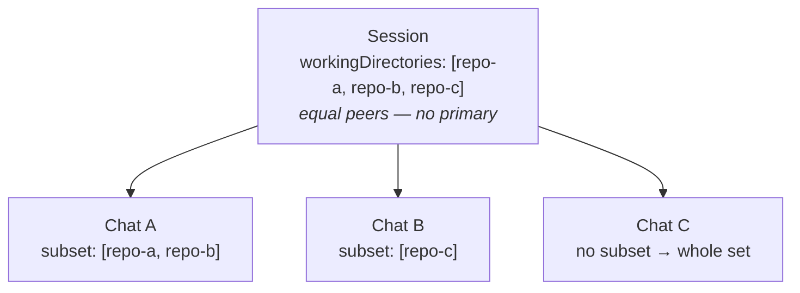
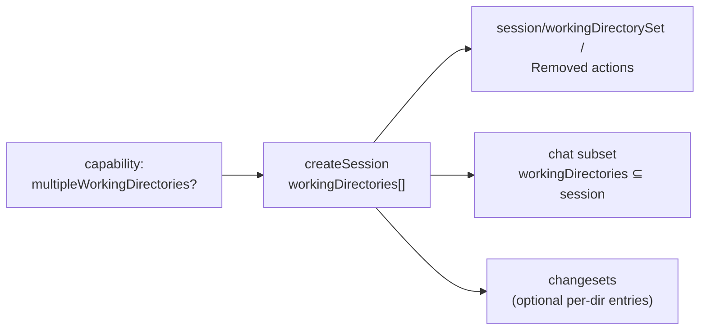
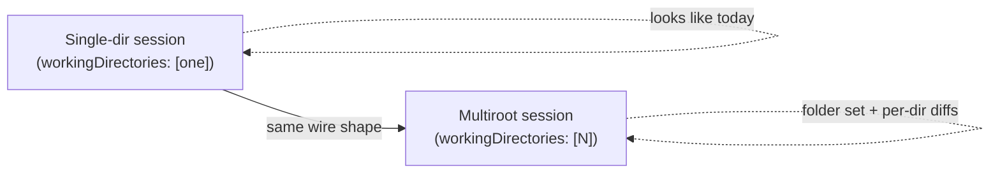

# Multiroot Sessions — Feature Overview

> A conceptual walkthrough of the multiroot-sessions feature for presentations
> and design discussion, plus a concise map of the concrete protocol surface so
> reviewers can connect the framing to the actual `types/` changes. Like the
> [multi-chat overview](./multi-chat.md), it explains **what** the capability is
> and **why** it exists before it gets to the wire shape.

---

## 1. The problem

An agent session today is scoped to **a single working directory**. The session
`workingDirectory` is the one root the agent has tool access to — the folder it
reads, edits, runs commands in, and diffs.

That model is increasingly at odds with real tasks. Work routinely spans **more
than one directory at a time**:

- A change to a service *and* the shared library it depends on, in sibling
  repositories.
- A monorepo task that touches two packages that a user keeps as separate
  checkouts.
- A migration that edits a source repo and its generated-client repo together.
- A VS Code **multi-root workspace** (`.code-workspace`) whose folders are, to
  the user, one project.

When a session can only ever see one directory, the user is forced to either
flatten everything under one root that doesn't match how they actually work, or
run **disconnected sessions** per folder that lose their shared context (the same
task, the same conversation, the same configuration).

**The feature in one sentence:** let a single session grant its agent tool
access to *multiple working directories* — equal peers, no privileged
"primary" — so that cross-directory work can be represented and driven as one
coherent whole.

---

## 2. The mental model

Three roles, nested:

- **A session owns a *set* of working directories.** They are **equal peers** —
  there is no "primary" and no "additional." The session is the boundary of what
  the agent may touch: every directory in the set is fair game, nothing outside
  it is.

- **A chat operates in a *subset* of the session's directories.** A single
  thread of work usually focuses on part of the session. A chat may pin itself to
  one directory (or a few); when it pins nothing, it sees the session's whole
  set.

- **Changes are not locked to a directory.** A changeset (e.g. "last turn") may
  span several working directories. Clients that want a per-directory view group
  a changeset's files themselves against the session's directory list; a host
  MAY additionally expose dedicated per-directory changesets as extra catalogue
  entries.

> One session, many equal directories. Each chat narrows to a subset. Changes
> can span directories; grouping is optional.



A helpful analogy: the session is a **VS Code multi-root workspace**, its
directories are the **workspace folders**, and a chat is a **task** that may care
about only some of those folders.

---

## 3. Where this feature lives in the stack

As with multi-chat, this feature is a **window** onto what the harness does — not
the mechanism itself.

```
   ┌─────────────┐                         ┌──────────────────────────────┐
   │  UI client  │   ◄── feature layer ──► │   Agent harness              │
   │ (the app a  │  directory set, per-    │   ── grants the agent tool   │
   │  user sees) │  chat subset, per-dir   │      access to N directories │
   └─────────────┘  changesets             │   ── roots the process /     │
                                           │      applies path grants     │
                                           └──────────────────────────────┘
```

- **The harness layer** is where directory access actually takes effect: rooting
  the agent process, applying filesystem path grants, isolating worktrees. How a
  backend enforces "the agent may touch these three folders" is its own business.

- **The feature/interoperability layer** (where this feature lives) lets a UI
  *declare and observe* that set — pick the directories at session creation,
  add/remove them later, narrow a chat to a subset, and render changes grouped by
  directory.

**The feature is about representation and control, not access enforcement.** It
gives clients a vocabulary for "this session works across these folders"; the
harness decides how that is realized.

---

## 4. What the feature gives you

At the feature level, multiroot sessions introduce a small, additive set of
capabilities:

1. **A capability gate.** An agent advertises whether it supports more than one
   working directory. Clients check it before offering any multiroot affordance;
   agents that don't support it behave exactly as today.

2. **A session directory set.** A session is created with a *list* of working
   directories, all equal peers. A single-directory session is just the list of
   length one.

3. **Add / remove after start.** Directories can be granted or revoked while the
   session runs. Removal is modelled as "reconfigure to this reduced set" — there
   is no fragile single-remove primitive underneath.

4. **A per-chat subset.** Each chat may narrow to a subset of the session's
   directories (every entry must be one of the session's). A chat that narrows
   nothing operates against the whole set.

5. **Optional per-directory change views.** Changesets are cross-cutting (a
   per-turn changeset spans every directory the agent touched). A client that
   wants a per-directory view groups a changeset's files itself against the
   session's directory list; a host MAY also expose dedicated per-directory
   changesets as extra catalogue entries. Nothing forces a one-directory scope.



---

## 5. Worked example: a cross-repo change

A user asks an agent to update an API and the client library that consumes it,
kept as two separate checkouts.

| What the user / harness does | How the feature represents it |
| --- | --- |
| User starts a task over `api/` and `client/` | A session with `workingDirectories: [api, client]`. |
| Agent edits both repos | The agent has tool access to both directories, equal peers. |
| User opens a focused thread on just the client | A chat pinned to `workingDirectories: [client]`. |
| Agent later needs the shared `protos/` repo too | dispatch `session/workingDirectorySet(protos)` → set becomes `[api, client, protos]`. |
| User reviews the diff | The session's changeset lists every changed file across the dirs; the client groups them by directory for display if it wants. |
| The `protos/` work turns out unnecessary | dispatch `session/workingDirectoryRemoved(protos)` → set reconfigures back to `[api, client]`. |

The session stays one coherent conversation and one shared configuration
throughout — no juggling three disconnected sessions.

---

## 6. What this feature deliberately is *not*

- **It is not a permissions / sandboxing model.** The directory set says *which
  folders the session works across*, not a fine-grained ACL of what the agent may
  read vs. write. Enforcement and least-privilege policy stay a harness concern.

- **It is not per-file or per-glob scoping.** The unit is a working directory (a
  root), not arbitrary path patterns within it.

- **No mandatory primary.** All directories are peers by default. A backend that
  *must* pin its first directory (a fixed process root) advertises
  `immutablePrimary` on the capability; clients then keep index `0` fixed. A
  backend whose cwd-bearing directory can move instead advertises
  `primaryReplacement`, protecting index `0` from generic removal while allowing
  its URI to change atomically. The protocol has no other notion of a "main"
  directory.

- **It is not multi-root *chats as sub-sessions*.** A chat narrowing to a subset
  is still one thread under one session's trust and identity. Independent agents
  with their own lifecycle remain the separate, future sub-session concept.

These omissions keep the feature small and composable. Richer path policy,
per-tool scoping, or workspace-level config are natural *future* axes that can
layer on without breaking this shape.

---

## 7. Why this shape

- **Equal peers, no primary.** The user's mental model ("these folders are my
  project") has no privileged root. Encoding a primary would create a confusing
  "what's the relationship between primary and secondary?" question with no good
  answer — so the model refuses it.

- **Session owns, chat subsets.** The broadest scope lives where it is shared
  (the session); a chat only ever *narrows*, never widens. This keeps the
  invariant simple: a chat's directories are always ⊆ the session's.

- **Changesets stay cross-cutting.** A changeset isn't tied to one directory —
  a per-turn diff can span several — so no directory field is forced onto it.
  Per-directory presentation is optional: the client groups a changeset's files
  against the known directory list, or the host advertises extra per-directory
  catalogue entries. Both reuse existing shapes; neither needs arrays-of-arrays.

- **Additive and capability-gated.** Every new field is optional; the commands
  are gated behind a capability plus a version handshake. A single-directory
  harness is untouched; a multiroot harness simply lights up more directories.



---

## 8. Protocol surface (for reviewers)

The concrete, additive changes that back the framing above — a reviewer's map of
the `types/` surface. Full prose detail lives in the
[State Model](/guide/state-model#multiroot-sessions) and
[Changesets](/guide/changesets) guides. Target spec version: **0.7.0**.

Everything here is **additive and optional** — no field is required, no existing
field changes type, and old clients that ignore the new surface behave exactly
as today.

### 8.1 Change table

| Symbol | File | Kind |
| --- | --- | --- |
| `AgentCapabilities.multipleWorkingDirectories?` | `channels-root/state.ts` | added (capability) |
| `MultipleWorkingDirectoriesCapability` (`immutablePrimary?`) | `channels-root/state.ts` | added (type) |
| `CreateSessionParams.workingDirectories?` | `channels-session/commands.ts` | added |
| `SessionMetadata.workingDirectories?` (→ `SessionState`, `SessionSummary`) | `channels-session/state.ts` | added |
| `session/workingDirectorySet` / `session/workingDirectoryRemoved` actions | `channels-session/actions.ts` | added (action) |
| `ChatState.workingDirectories?` / `ChatSummary.workingDirectories?` | `channels-chat/state.ts` | added |
| `CreateChatParams.workingDirectories?` | `channels-chat/commands.ts` | added |
| `chat/workingDirectorySet` / `chat/workingDirectoryRemoved` actions | `channels-chat/actions.ts` | added (action) |
| 4 `ActionType` entries + `ACTION_INTRODUCED_IN` (`0.7.0`) | `common/actions.ts`, `version/registry.ts` | added |

> **Revised after review.** The directory-mutation surface started as four
> **commands** (`add/removeWorkspaceFolder`, `add/removeChatWorkspaceFolder`
> with request/result types). Per review, it is now four **state actions**
> following the keyed-collection convention — the set lives in state, so clients
> mutate it by dispatching actions and observe the result on
> `workingDirectories`. The deprecated singular `workingDirectory` fields were
> **hard-removed** (a breaking change → 0.7.0), not kept as a shorthand. An
> earlier revision also added a `Changeset.workingDirectory` field to group
> changes per directory; that was **dropped** — a changeset can span
> directories (e.g. a per-turn diff), so a single-directory scalar is the wrong
> model. Per-directory presentation is instead handled by optional client-side
> grouping or extra per-directory catalogue entries (see §6/§7).

### 8.2 Type signatures

```ts
// ── Capability — channels-root/state.ts ──────────────────────────────────
interface AgentCapabilities {
  // …existing…
  /** Presence ({}) = the agent supports >1 working directory per session. */
  multipleWorkingDirectories?: MultipleWorkingDirectoriesCapability;
}
interface MultipleWorkingDirectoriesCapability {
  /** First directory is a fixed process root; clients MUST NOT remove/reorder it. */
  immutablePrimary?: boolean;
  /** Protected primary slot can be atomically replaced; cannot be true with immutablePrimary: true. */
  primaryReplacement?: boolean;
}

// ── Session create — channels-session/commands.ts ────────────────────────
interface CreateSessionParams extends BaseParams {
  // …existing…
  /** The session's working directories; a capability may protect index 0. */
  workingDirectories?: URI[];
}

// ── Session state — channels-session/state.ts (→ SessionState/SessionSummary)
interface SessionMetadata {
  // …existing…
  workingDirectories?: URI[];
}

// ── Session runtime mutation — channels-session/actions.ts ────────────────
// channel = session URI. Gated by multipleWorkingDirectories. @clientDispatchable.
interface SessionWorkingDirectorySetAction {
  type: ActionType.SessionWorkingDirectorySet;     // 'session/workingDirectorySet'
  directory: URI;                                   // appended; no-op if present
}
interface SessionWorkingDirectoryRemovedAction {
  type: ActionType.SessionWorkingDirectoryRemoved; // 'session/workingDirectoryRemoved'
  directory: URI;                                   // removed; no-op if absent
}
interface SessionWorkingDirectoryReplacedAction {
  type: ActionType.SessionWorkingDirectoryReplaced; // 'session/workingDirectoryReplaced'
  directory: URI;                                   // existing entry to replace
  replacement: URI;                                 // replacement URI at the same position
}

// ── Chat — channels-chat/state.ts, commands.ts & actions.ts ──────────────
interface ChatState /* and ChatSummary */ {
  // …existing…
  /** The chat's subset — every entry MUST be one of the session's dirs. */
  workingDirectories?: URI[];
}
interface CreateChatParams extends BaseParams {
  // …existing…
  workingDirectories?: URI[]; // subset ⊆ session; absent → whole session set
}
// channel = chat URI. Gated by multipleWorkingDirectories. @clientDispatchable.
interface ChatWorkingDirectorySetAction {
  type: ActionType.ChatWorkingDirectorySet;     // 'chat/workingDirectorySet'
  directory: URI;                                // MUST be in the session set
}
interface ChatWorkingDirectoryRemovedAction {
  type: ActionType.ChatWorkingDirectoryRemoved; // 'chat/workingDirectoryRemoved'
  directory: URI;
}

// ── Changes — channels-changeset/state.ts ────────────────────────────────
// No changes. A changeset can span working directories, so it carries no
// directory field. Per-directory views are optional: clients group a
// changeset's files against the session's workingDirectories, or a host
// advertises extra per-directory catalogue entries.
```

### 8.3 Versioning & gating

- `PROTOCOL_VERSION` is **`0.7.0`** — a MINOR bump because the feature is
  breaking (it removes the singular `workingDirectory` fields that shipped in the
  released `0.6.0`), and pre-1.0 breaking changes land in a MINOR.
  `SUPPORTED_PROTOCOL_VERSIONS` = `[0.7.0, 0.6.0, 0.5.2, 0.5.1]`.
- The directory mutations are **state actions**. The original four carry
  `ACTION_INTRODUCED_IN` entries at `0.7.0`; the session-only atomic replacement
  carries one at `0.8.0`. All are `@clientDispatchable`.
  Everything else — the capability and the create-time / state fields — is gated
  by the `multipleWorkingDirectories` capability plus the `initialize` version
  handshake.
- Removal actions are idempotent and modelled as
  *reconfigure-to-the-reduced-set*; a host MAY decline to apply a removal (e.g.
  an `immutablePrimary` directory), leaving the set unchanged.

---

## 9. Design decisions & resolved questions

- **No mandatory primary.** *Resolved:* the set is equal peers. Rejected a
  "primary + additional" split because it re-introduces the confusion the user
  called out ("what's the relation between primary and secondary?"). Backends
  that genuinely pin a fixed process root opt in via
  `MultipleWorkingDirectoriesCapability.immutablePrimary` (index `0` fixed).

- **Hard-remove the singular `workingDirectory`.** *Resolved (per review):*
  removing these fields is a breaking change, so the feature targets a MINOR
  bump (`0.7.0`); the deprecated singular fields on
  `CreateSessionParams` / `SessionMetadata` / `ChatState` / `ChatSummary` are
  removed outright rather than kept as a shorthand. (Originally planned to ride
  `0.6.0`'s breaking window, but `0.6.0` shipped without this feature.)

- **Directory mutations are state actions, not commands.** *Resolved (per
  review):* `workingDirectories` is a keyed collection, so it follows the
  established `*/workingDirectorySet` + `*/workingDirectoryRemoved` action
  convention (session and chat) with pure reducers, rather than
  request/response commands. The set lives in state; clients observe the result
  there.

- **Chat narrows to a subset (not exactly one).** *Resolved:* an earlier draft
  made a chat operate in exactly one directory; this was widened to "a subset ⊆
  the session's set," with absent meaning the whole set. Gated by the same
  capability.

- **No directory field on changesets.** *Resolved (per review):* an earlier
  revision put a `Changeset.workingDirectory` scalar on the changeset and made
  a multiroot host MUST group by directory. Dropped — a changeset can span
  directories (a per-turn diff touches several), so a single-directory scalar
  can't model the common case, and reviewers noted matching a file to a
  directory is a simple client-side operation against the known directory list
  (not a VCS-boundary problem). Per-directory presentation is therefore
  optional: clients group a changeset's files themselves, and a host MAY expose
  extra per-directory catalogue entries (already possible — the `changesets`
  list is unbounded). A machine-readable per-directory association (e.g. a
  `{workingDirectory}` template variable) is deferred to a follow-up if needed.

- **Removal semantics.** *Resolved:* no single-remove primitive is assumed; the
  `*/workingDirectoryRemoved` action reduces to the reduced set, so it is
  idempotent and safe to retry. A host MAY decline (e.g. an immutable primary).

- **Replaceable primary.** *Resolved:* a backend that must move its cwd-bearing
  first directory advertises `primaryReplacement`; it MUST NOT also set
  `immutablePrimary: true`. `session/workingDirectoryReplaced` is a session-only,
  client-dispatchable compare-and-swap action for any directory. The host
  validates `primaryReplacement` when the target is index `0` and applies the
  backend side effect before broadcasting it; reducers replace only when the
  expected URI is present and remove any other occurrence of the replacement
  URI.

---

## 10. Open questions / future axes

- **Config-resolution context.** `resolveSessionConfig` /
  `sessionConfigCompletions` still take a *singular* `workingDirectory` as the
  context for resolving config (e.g. listing git branches for a worktree picker).
  Whether — and how — to make config resolution multiroot-aware is left as a
  follow-up.

- **Per-directory rollups on the lightweight summary.** `ChangesSummary` is a
  single aggregate today. If session-list UIs want per-repo badges without
  subscribing, a `byDirectory` rollup could be added later — deferred to keep the
  summary lightweight.

- **Richer path policy.** Per-tool scoping, read-vs-write per directory, or
  glob-level rules are deliberately out of scope and can layer on top.

---

## 11. One-slide summary

- **Before:** a session is scoped to one `workingDirectory`.
- **After:** a session owns a **set of equal-peer directories**; a **chat** works
  in a **subset**; **changesets can span directories** (grouping is optional).
- **Why:** cross-directory / multi-repo / multi-root-workspace tasks are one
  coherent piece of work, not N disconnected sessions.
- **How it stays safe:** capability-gated, additive fields; directory mutations
  are idempotent client-dispatchable actions; removal is reconfigure-to-reduced-set.
- **What it is not:** not a permission model, not per-file scoping, not a
  mandatory primary, not sub-sessions — those are separate/future axes.
