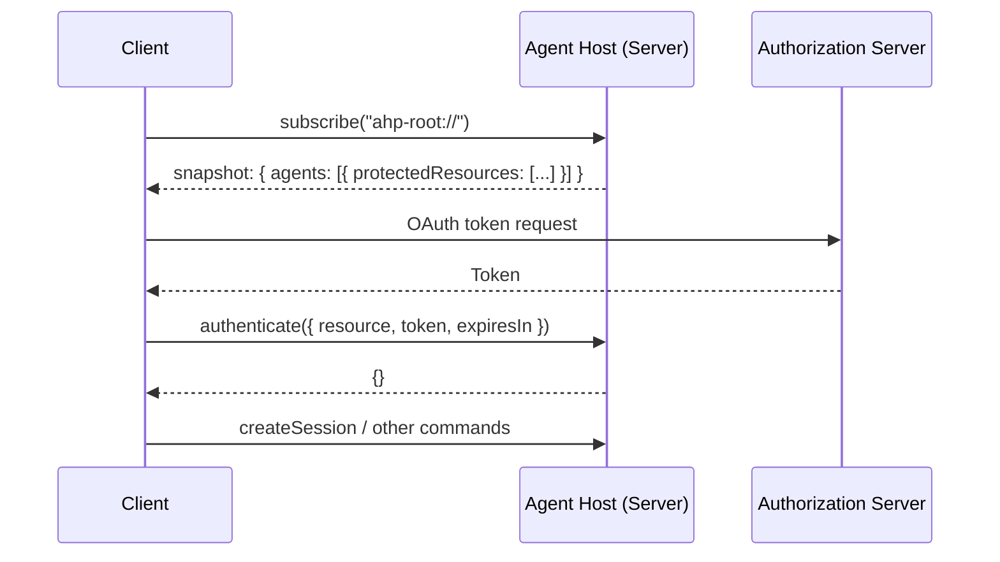

# Authentication

AHP uses [RFC 9728](https://datatracker.ietf.org/doc/html/rfc9728) (OAuth 2.0 Protected Resource Metadata) semantics for authentication discovery, and [RFC 6750](https://datatracker.ietf.org/doc/html/rfc6750) (Bearer Token Usage) semantics for token delivery. Communication is JSON-RPC, not HTTP, but the vocabulary and flow mirror the HTTP standards.

## Overview

Each agent declares the **protected resources** it requires authentication for via the `protectedResources` field on [`AgentInfo`](/reference/root#agentinfo) in root state. Clients discover these requirements by subscribing to `ahp-root://`, obtain tokens from the declared authorization servers using standard OAuth 2.0 flows, and push them to the server via the [`authenticate`](/reference/common#authenticate) command.



## Discovery

Authentication requirements are declared **per-agent** on [`AgentInfo.protectedResources`](/reference/root#agentinfo). Each entry is an [`ProtectedResourceMetadata`](/reference/common#protectedresourcemetadata) object following the [RFC 9728](https://datatracker.ietf.org/doc/html/rfc9728) shape:

```json
{
  "agents": [
    {
      "provider": "copilot",
      "displayName": "GitHub Copilot",
      "description": "AI pair programmer",
      "models": [...],
      "protectedResources": [
        {
          "resource": "https://api.github.com",
          "resource_name": "GitHub Copilot",
          "authorization_servers": ["https://github.com/login/oauth"],
          "scopes_supported": ["read:user", "user:email"]
        }
      ]
    }
  ]
}
```

Clients receive this metadata automatically via the root state snapshot (when subscribing to `ahp-root://`) and via `root/agentsChanged` actions when the agent list changes.

An agent with no `protectedResources` (or an empty array) does not require authentication.

### Required vs. optional authentication

Each protected resource entry has a `required` field (defaults to `true`) that controls whether the agent can be used without a token:

- **`required: true`** (default) — the agent cannot function without authentication. The server SHOULD return `AuthRequired` (`-32007`) if the client attempts to use the agent unauthenticated.
- **`required: false`** — the agent works without authentication but MAY offer enhanced capabilities (e.g. higher rate limits, personalized results) when a token is provided.

Clients SHOULD treat an absent `required` field the same as `true`.

```json
{
  "protectedResources": [
    {
      "resource": "https://api.example.com",
      "resource_name": "Example API",
      "authorization_servers": ["https://login.example.com"],
      "required": false
    }
  ]
}
```

Clients MAY use the `required` field to decide whether to prompt users for authentication up front or defer it until the user explicitly requests a feature that benefits from auth.

### Why per-agent metadata?

Different agents MAY require authentication with different providers. For example, one agent might require a GitHub token while another requires an Azure AD token. Declaring requirements per-agent rather than server-wide allows:

- A single server to host agents from different providers with different auth requirements
- Clients to selectively authenticate only for agents they intend to use
- Auth requirements to change as agents are added or removed

## Token Delivery

Clients push Bearer tokens to the server using the [`authenticate`](/reference/common#authenticate) command. The `resource` field MUST match a `resource` value the server has itself advertised — either statically via the agent's `protectedResources` metadata, or dynamically via a live MCP authentication challenge (`McpServerAuthRequiredState.resource` or, for a single blocked tool call, `ToolCallAuthRequiredState.auth.resource` — see [MCP Servers](/guide/mcp#authentication)):

```jsonc
// Client → Server
{
  "jsonrpc": "2.0",
  "id": 3,
  "method": "authenticate",
  "params": {
    "channel": "ahp-root://",
    "resource": "https://api.github.com",
    "token": "gho_xxxxxxxxxxxx",
    "expiresIn": 3540,
    "scopes": ["read:user", "user:email"]
  }
}

// Server → Client (success)
{
  "jsonrpc": "2.0",
  "id": 3,
  "result": {}
}
```

`expiresIn` is optional and corresponds to the `expires_in` field in an OAuth 2.0 token response, as defined by [RFC 6749 section 5.1](https://datatracker.ietf.org/doc/html/rfc6749#section-5.1). It is the access token's remaining lifetime in seconds when the client sends the `authenticate` request. When supplied, it MUST be a positive integer.

If the client retained the original token response, it MUST subtract elapsed time from the original `expires_in` value before forwarding it. The client MUST omit `expiresIn` when the authorization server did not supply an expiry or the expiry is otherwise unknown. In the connection-isolated baseline, an empty `token` revokes authentication for the resource; `expiresIn` is irrelevant and SHOULD be omitted in that request. Shared identified credentials use [account-scoped revocation](#account-scoped-revocation), not empty-token delivery.

`scopes` is optional and lets the client tell the server which OAuth scopes the pushed token actually grants — useful when resolving a `requiredScopes` challenge (from a live `McpServerAuthRequiredState` or `ToolCallAuthRequiredState.auth`) without the server needing to decode an opaque token.

If the token is invalid or the resource is unrecognized, the server MUST return a JSON-RPC error (e.g. `AuthRequired` `-32007` or `InvalidParams` `-32602`).

### Why keyed by `resource`?

The RFC 9728 `resource` field is already a unique identifier for the protected resource. Using it directly as the correlation key between discovery and token delivery avoids inventing a parallel ID scheme. Clients match tokens to resources using standard OAuth 2.0 semantics.

## Error Handling

### `AuthRequired` Error Code

When a command fails because the client has not authenticated for a required protected resource, the server SHOULD return error code `-32007` (`AuthRequired`). This error MAY be returned from **any** command — not just `authenticate`.

The `data` field of the JSON-RPC error MUST be an `AuthRequiredErrorData` object (`{ resources: ProtectedResourceMetadata[] }`) describing the resources that require authentication. This allows clients to handle authentication programmatically:

```jsonc
// Client → Server
{
  "jsonrpc": "2.0",
  "id": 5,
  "method": "createSession",
  "params": { "channel": "ahp-session:/<uuid>", "provider": "copilot" }
}

// Server → Client (auth required)
{
  "jsonrpc": "2.0",
  "id": 5,
  "error": {
    "code": -32007,
    "message": "Authentication required for GitHub Copilot",
    "data": {
      "resources": [
        {
          "resource": "https://api.github.com",
          "resource_name": "GitHub Copilot",
          "authorization_servers": ["https://github.com/login/oauth"],
          "scopes_supported": ["read:user", "user:email"]
        }
      ]
    }
  }
}
```

Clients receiving an `AuthRequired` error SHOULD:

1. Parse the `data` field to discover the required resources
2. Obtain tokens from the declared authorization servers
3. Push tokens via `authenticate`
4. Retry the original command

## Auth Expiry Notification

The server MAY send an [`auth/required`](/reference/common#authrequired) notification when a previously valid token expires or is revoked, or when new authentication requirements appear:

```json
{
  "jsonrpc": "2.0",
  "method": "auth/required",
  "params": {
    "channel": "ahp-root://",
    "resource": {
      "resource": "https://api.github.com",
      "resource_name": "GitHub Copilot",
      "authorization_servers": ["https://github.com/login/oauth"],
      "scopes_supported": ["read:user", "user:email"]
    },
    "reason": "expired"
  }
}
```

The `resource` field carries the complete [`ProtectedResourceMetadata`](/reference/common#protectedresourcemetadata) object for the resource that requires authentication. The `reason` field indicates why authentication is required:

| Value | Description |
|---|---|
| `required` | The client has not yet authenticated for the resource |
| `expired` | A previously valid token has expired or been revoked; the client must acquire or renew the credential |

When `reason` is `expired`, the client MUST acquire a new credential or renew the existing credential before calling `authenticate` again. It MUST NOT blindly replay the challenged token.

Like all protocol notifications, `auth/required` is ephemeral and is **not** replayed on reconnection. Clients SHOULD re-check authentication requirements after reconnecting.

## Account-scoped revocation

### Capability and account identity

A host MAY advertise `InitializeResult.accountRevocation: {}`. This single
presence capability means it understands both `AuthenticateParams.account` and
the client-to-host `auth/revoked` notification. Clients MUST check it before
relying on account-scoped revocation. When it is absent, clients MUST NOT
substitute an empty-token resource-wide clear or vendor-private metadata.

An identified `authenticate` request includes
[`AuthenticationAccount`](/reference/common#authenticationaccount):

| Field | Meaning |
| --- | --- |
| `authority` | Canonical authorization-server identifier, consistent with the resource's advertised authorization servers. |
| `id` | Stable account id within that authority, comparable across brokers and token rotations. |

Both fields MUST be nonempty. The host compares resource, authority, and id
exactly; a display label, client-local session id, or token hash is not an
identity. Pairwise subjects require a trusted provider mapping. The descriptor
does not grant permissions or prove token ownership: the host MUST validate the
association using its trusted provider context and reject a mismatch without
installing the token.

Clients MUST supply the same account identity on every rotation or refresh.
Identified token delivery MUST use a nonempty token and retains the existing
empty success result. No account registration RPC or host-issued id is needed.

The existing baseline remains connection-scoped. A host sharing identified
credentials across connections MUST NOT mix unidentified legacy token pushes
or empty-token clears into the same authentication context. It may retain
genuinely isolated baseline contexts; if it cannot isolate them, it MUST
reject incompatible requests rather than allow them to overwrite shared
credentials. An old host ignoring `account` does not implement this contract.

### Client-to-host notification

[`auth/revoked`](/reference/common#authrevoked) carries no JSON-RPC request id:

```json
{
  "jsonrpc": "2.0",
  "method": "auth/revoked",
  "params": {
    "channel": "ahp-root://",
    "resource": "https://api.example.test",
    "account": {
      "authority": "https://login.example.test",
      "id": "account-a"
    }
  }
}
```

The client reports withdrawal of its credentials for that account and resource.
This does not revoke an upstream OAuth grant. A host receiving an authorized
notification MUST:

1. Order it with `authenticate` and provider delivery/replay for the resource.
2. Remove every matching token/scope variant and replayable copy, not just the
   last token the notifying client sent. Earlier pending deliveries MUST NOT
   reinstall the withdrawn credentials after that boundary.
3. Clear a currently selected credential **only if its account matches**. If
   B replaced A, withdrawing A MUST preserve B's credentials and work. An absent
   match is a no-op, never an unconditional clear.
4. Promptly prevent further affected credential use and stop affected active
   work, without waiting for token expiry or idle. Independently authorized work
   MUST NOT be cancelled merely because it shares a parent chat. Resulting turn
   cancellation or failure MUST be reflected through existing state actions.

There is no scope filter on the notification. Its resource is the exact
identifier used for token delivery. To withdraw an account from several
contributed resources, the client sends one notification per resource.

When the host owns a credential derivation, it MUST invalidate known dependent
access and in-flight exchanges when their source is withdrawn. Withdrawing a
derived credential MUST NOT revoke its source. A client that performs an
exchange outside the host is responsible for notifying withdrawal of the
derived credentials too; the host MUST NOT guess lineage from display names
or matching human identities.

The host MUST enforce its existing authorization policy on withdrawals. Invalid
or unauthorized notifications cannot clear credentials and MUST be surfaced
through existing diagnostics. JSON-RPC notifications receive no error response.
If provider cleanup fails, the host MUST keep affected access blocked, surface
the failure through existing errors/diagnostics, and never fall back to clearing
another account. Clients MUST NOT interpret successful transmission as a host
cleanup acknowledgement.

### Subsequent authentication and reconnection

The host chooses an order for concurrent operations. A later `authenticate`
MAY authorize the account again; this addition does not create a permanent
revocation barrier, account tombstones, or an admission lifecycle. These wire
fields alone cannot distinguish intentional sign-in from a stale client push.

Clients MUST cancel stale token acquisition/forwarding on withdrawal, evict
matching token replay caches, and consult their current authentication provider
before forwarding credentials after reconnect. AHP does not durably replay this
notification. If the account remains withdrawn, the client MUST reissue
applicable withdrawals before token delivery after reconnect. Historical
withdrawals superseded by a newer local sign-in MUST NOT be blindly replayed.
Disconnected clients cannot claim that host sign-out has been confirmed.

## Design Decisions

### Why RFC 9728 instead of a custom type?

Using the standard OAuth 2.0 Protected Resource Metadata format means:

- Clients can resolve tokens using the same code path as other OAuth-based protocols (e.g. MCP)
- Dynamic auth providers (for enterprise IdPs) work without hardcoded knowledge of specific providers
- The `authorization_servers` field enables automatic provider matching in runtimes that support it

### Why `authenticate` instead of including tokens in `initialize`?

- Tokens are supplied per protected resource, rather than as one connection-wide credential
- Clients may authenticate for multiple resources independently
- Tokens can be refreshed or rotated without re-initializing the connection
- Not all clients need to authenticate (some agents may not require auth)

### Why `expiresIn` instead of `expiresAt`?

`expiresIn` follows the OAuth token endpoint's existing `expires_in` vocabulary and reports the lifetime relative to the `authenticate` request. A relative lifetime does not require the client and host clocks to be synchronized.

### Why not store auth status in root state?

Root state is global and visible to all subscribed clients. In the baseline flow described here, authentication status is per-connection: each client authenticates independently for each protected resource. It is therefore kept in commands and notifications rather than the shared state tree.

### What about credentials shared across clients?

For shared client-supplied credentials, [account-scoped revocation](#account-scoped-revocation)
adds identity to token delivery and a notification of withdrawal. The host owns
the matching and ordering decision; a stale client cache does not authorize a
resource-wide clear. No auth status or account catalogue is added to root state.
See the [proposal rationale](../proposals/client-brokered-revocation.md) for scope
and explicit replay limitations.
