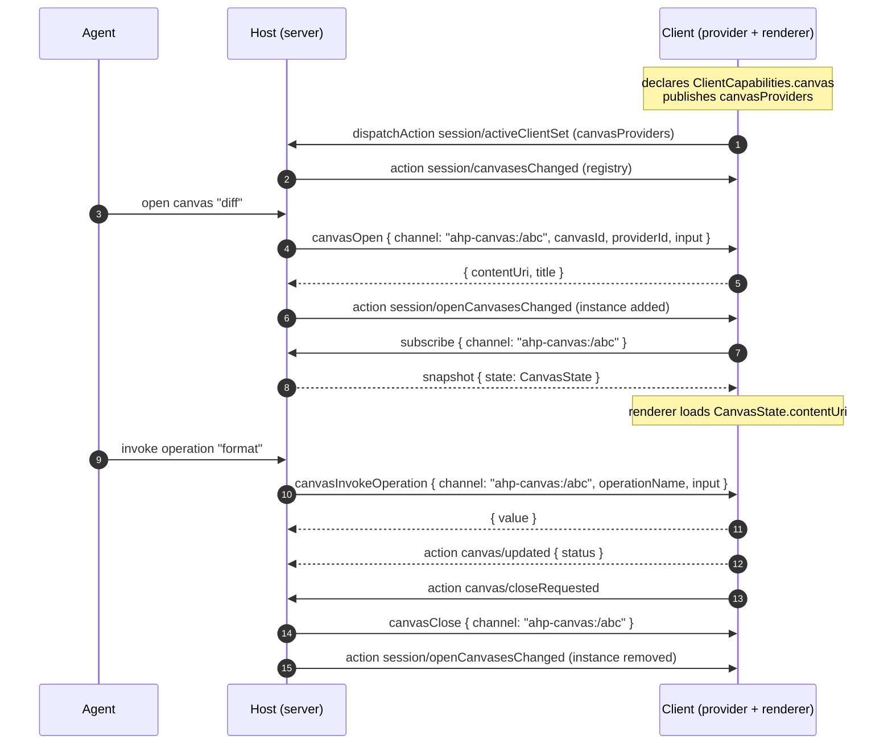

# Canvas Channel

A canvas is a rich, interactive UI surface the agent can open alongside a session — a document editor, a diff view, a live preview, a spreadsheet, a browser pane. Each open canvas is a first-class subscribable resource with its own `ahp-canvas:/<id>` channel, mirroring the "one channel per resource" convention used by terminals, changesets, and resource watches.

Rendering is **state-driven**: a client renders a canvas by reading its [`CanvasState.contentUri`](#state) and resolving that address per the renderer's URL policy. The host never sends a "render this" request — it publishes state, and the renderer reacts. Interaction flows back to whichever peer *provides* the canvas through a small server ↔ client request family (`canvasOpen` / `canvasInvokeOperation` / `canvasClose`).

## Capability

The canvas surface is entirely opt-in. A client advertises it during the handshake:

```typescript
ClientCapabilities {
  canvas?: {}   // presence = "I can render canvases and host canvas providers"
}
```

A client that declares `canvas` can both **render** an opaque canvas URL in an isolated surface and **provide** canvases — answering `canvasOpen` / `canvasInvokeOperation` / `canvasClose` requests for the providers it publishes. Hosts SHOULD only populate [`SessionState.canvases`](#discovery) / [`SessionState.openCanvases`](#discovery) and only route canvas requests to a client that declared the capability. Clients that omit it see no canvas surface at all.

## Discovery

Two session-state fields expose the canvas surface. Both use full-replacement semantics and are populated only while at least one connected client has declared the capability:

```typescript
SessionState {
  canvases?: SessionCanvasDeclaration[]   // what the agent can open
  openCanvases?: OpenCanvasRef[]          // what is open right now
}
```

- **`canvases`** is the aggregated registry of every canvas the agent may open, replaced wholesale via the `session/canvasesChanged` action. It is the union of server-side declarations and the providers each connected client publishes.
- **`openCanvases`** is the lightweight catalogue of currently-open instances, replaced wholesale via `session/openCanvasesChanged`. Each entry carries the instance's channel URI so a subscriber can render it without subscribing to every instance.

A client contributes providers by publishing them on its active-client entry:

```typescript
SessionActiveClient {
  canvasProviders?: ClientCanvasDeclaration[]
}
```

The host folds each `ClientCanvasDeclaration` into `canvases`, filling in the owning `providerId` and setting `source` to the client variant so it knows where to route later requests.

### Declarations

```typescript
// One entry in the aggregated SessionState.canvases registry.
SessionCanvasDeclaration {
  providerId: string            // owning provider id (opaque to AHP)
  canvasId: string              // provider-local id, unique within providerId
  title: string
  description: string
  inputSchema?: object          // JSON Schema for the open input (opaque to AHP)
  operations?: SessionCanvasOperation[]
  source: CanvasProviderSource  // where it came from — for routing and cleanup
}

// The lighter shape a client publishes; the host derives providerId + source.
ClientCanvasDeclaration {
  canvasId: string
  title: string
  description: string
  inputSchema?: object
  operations?: SessionCanvasOperation[]
}

// One named operation a canvas exposes to the agent.
SessionCanvasOperation {
  name: string                  // unique within the owning (providerId, canvasId)
  description?: string
  inputSchema?: object
}
```

`providerId` is an opaque namespace string AHP does not interpret; it is carried so a provider-local `canvasId` stays unique when several providers each declare a canvas of the same id.

`CanvasProviderSource` is a discriminated union over `CanvasProviderKind` recording who owns the callbacks for a canvas:

```typescript
CanvasServerProviderSource { kind: 'server' }              // the host provides it
CanvasClientProviderSource { kind: 'client', clientId }    // a connected client provides it
```

### Open-instance catalogue

Each open instance is summarised by an `OpenCanvasRef`. The instance is identified solely by its channel URI; the other identity field (`providerId`) lives on the full [`CanvasState`](#state):

```typescript
OpenCanvasRef {
  channel: URI                  // ahp-canvas:/<id> — subscribe for full CanvasState
  canvasId: string              // for picking the right native renderer
  title?: string                // mirrored from CanvasState.title
  availability: CanvasAvailability
}
```

## URI

```
ahp-canvas:/<id>
```

The id is **server-assigned**. The host allocates a fresh channel URI when it opens an instance and surfaces it on `OpenCanvasRef.channel`; callers MUST treat the URI as opaque.

## State

Subscribing to an instance's channel yields the authoritative, mutable per-instance view:

```typescript
CanvasState {
  canvasId: string              // provider-local id this instance was opened from
  providerId: string            // owning provider id (opaque to AHP)
  input?: object                // the open input, retained for resume/rebind
  title?: string
  status?: string               // provider-defined, opaque to AHP
  contentUri?: URI              // renderer-targeted content address (see Rendering)
  availability: CanvasAvailability
}

CanvasAvailability = 'ready' | 'stale'   // 'stale' = provider currently unavailable
```

The instance's provider `source` — server-side or a specific client — is not
repeated here; it lives on the matching [`SessionCanvasDeclaration`](#declarations)
in `SessionState.canvases`, keyed by `(providerId, canvasId)`.

## Rendering and content

A renderer displays a canvas by dispatching on the scheme of `CanvasState.contentUri`:

- A **directly-loadable** address — `https:`, an in-process scheme, or `http://localhost` — is loaded straight into the isolated surface, subject to the renderer's own URL policy.
- A **content-reference** address is resolved over the general [`resourceRead`](/reference/common#resourceread) command rather than dialed directly. This keeps content flowing entirely over the AHP transport, so a relayed or brokered deployment — where the host is reachable only over AHP and cannot be dialed directly — can still serve every byte, with no port or direct connection required. Sub-resources the loaded document references (stylesheets, images) are fetched the same way.

The canvas content itself is opaque to AHP — the protocol carries only the address and, when resolved over `resourceRead`, the returned bytes.

## Actions

Two actions travel on the per-instance channel. Because the channel URI already scopes them to a single instance through the action envelope, neither repeats any instance identifier.

| Action | Client-dispatchable | Reducer effect |
|---|:---:|---|
| `canvas/updated` | Yes | Sparse-merges `title` / `status` / `contentUri` / `availability` into `CanvasState`. |
| `canvas/closeRequested` | Yes | No-op — signals the host to run the close flow. |

`canvas/updated` is dispatched by the server for a server-side provider, or by the client that provides an instance to push its own presentation changes — the same client-dispatchable pattern as `terminal/titleChanged`, and the only way a client-side provider updates the structured `CanvasState` (and the `OpenCanvasRef` fields mirrored from it) that other subscribers render. The host stays the authoritative reducer: it SHOULD reject an update from a client that is not the instance's resolved provider, then applies the merge and re-broadcasts.

It uses **sparse-merge** semantics: each present field overwrites the corresponding `CanvasState` field, and an absent field preserves the current value. There is no clear-to-absent through this action — a provider that needs to reset a field re-publishes it, and a full reset arrives as a fresh `CanvasState` snapshot on (re)subscribe.

`canvas/closeRequested` is a pure signal with a no-op reducer, mirroring how `terminal/input` is a side-effect-only client action — it never bloats channel state. It is a client → host signal (the user hit ✕); the host responds by resolving `canvasClose` against the provider and dropping the instance from `openCanvases`.

## Provider request family

When the agent opens, drives, or closes a canvas whose provider is a client, the host issues a request to that client. For a server-side provider the host resolves the operation host-internally and emits no request. Following the `resource*` precedent, all three methods are registered in the server → client command map and mirrored in the client → server map for symmetry; a client normally never initiates them, and a receiver SHOULD reject a request whose target is not one of its declared providers.



### Commands

| Method | Channel | Direction | Purpose |
|---|---|---|---|
| `canvasOpen` | `ahp-canvas:/<id>` | Client ↔ Server | Open an instance against its provider. Names the new instance's channel and returns the initial `contentUri` / `title` / `status`. |
| `canvasInvokeOperation` | `ahp-canvas:/<id>` | Client ↔ Server | Invoke a declared operation on an open instance. Returns an opaque provider value. |
| `canvasClose` | `ahp-canvas:/<id>` | Client ↔ Server | Close an instance against its provider, as part of the close flow. |

All three operations travel on the instance's own `ahp-canvas:/<id>` channel — `canvasOpen` names the new instance's channel, and invoke/close address the existing one — mirroring how terminal and changeset operations target their own channel URI. The host resolves that URI back to the owning provider, so invoke and close carry no other identifiers. Content the renderer needs is resolved separately over the general [`resourceRead`](/reference/common#resourceread) command, so the canvas family carries no content-fetch method of its own.

### Actions

| Action | Direction |
|---|---|
| `canvas/updated` | client → host (a client-side provider) **or** host → client |
| `canvas/closeRequested` | client → host |

## Errors

| Code | Name | When |
|---|---|---|
| `-32012` | `CanvasProviderError` | A `canvasOpen` / `canvasInvokeOperation` / `canvasClose` request failed. The `data` field MUST be a `CanvasProviderErrorData` carrying the provider-defined `{ code, message }` — for example `canvas_action_no_handler` when the provider declared the canvas but has no handler for the operation, or `canvas_provider_unavailable` when the provider is disconnected. |
