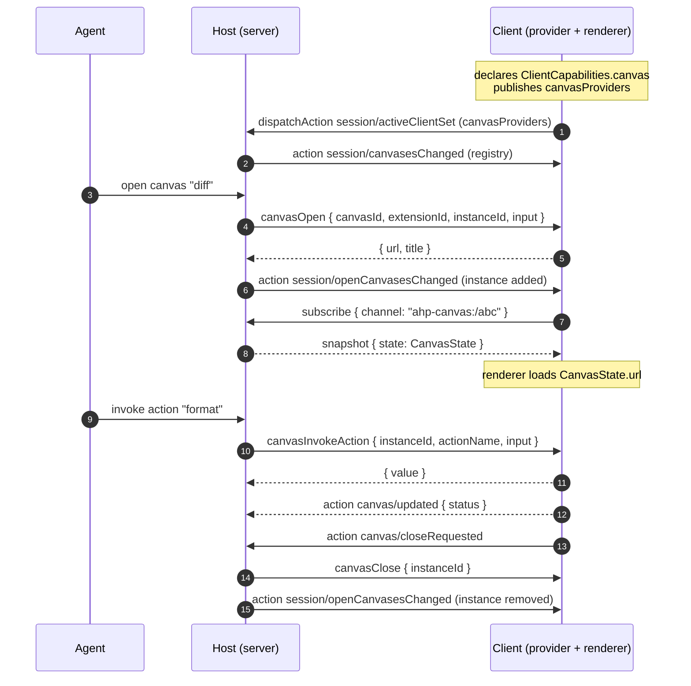

# Canvas Channel

A canvas is a rich, interactive UI surface the agent can open alongside a session — a document editor, a diff view, a live preview, a spreadsheet, a browser pane. Each open canvas is a first-class subscribable resource with its own `ahp-canvas:/<id>` channel, mirroring the "one channel per resource" convention used by terminals, changesets, and resource watches.

Rendering is **state-driven**: a client renders a canvas by reading its [`CanvasState.url`](#state) and resolving that address per the renderer's URL policy. The host never sends a "render this" request — it publishes state, and the renderer reacts. Interaction flows back to whichever peer *provides* the canvas through a small server ↔ client request family (`canvasOpen` / `canvasInvokeAction` / `canvasClose`) and an opaque `canvas/message` bridge.

## Capability

The canvas surface is entirely opt-in. A client advertises it during the handshake:

```typescript
ClientCapabilities {
  canvas?: {}   // presence = "I can render canvases and host canvas providers"
}
```

A client that declares `canvas` can both **render** an opaque canvas URL in an isolated surface and **provide** canvases — answering `canvasOpen` / `canvasInvokeAction` / `canvasClose` requests for the providers it publishes. Hosts SHOULD only populate [`SessionState.canvases`](#discovery) / [`SessionState.openCanvases`](#discovery) and only route canvas requests to a client that declared the capability. Clients that omit it see no canvas surface at all.

## Discovery

Two session-state fields expose the canvas surface. Both use full-replacement semantics and are populated only while at least one connected client has declared the capability:

```typescript
SessionState {
  canvases?: SessionCanvasDeclaration[]   // what the agent can open
  openCanvases?: OpenCanvasRef[]          // what is open right now
}
```

- **`canvases`** is the aggregated registry of every canvas the agent may open, replaced wholesale via the `session/canvasesChanged` action. It is the union of server-side declarations and the providers each connected client publishes.
- **`openCanvases`** is the lightweight catalogue of currently-open instances, replaced wholesale via `session/openCanvasesChanged`. Each entry carries the instance's channel URI so a subscriber can render it without subscribing to every instance.

A client contributes providers by publishing them on its active-client entry:

```typescript
SessionActiveClient {
  canvasProviders?: ClientCanvasDeclaration[]
}
```

The host folds each `ClientCanvasDeclaration` into `canvases`, filling in the owning `extensionId` and setting `source` to the client variant so it knows where to route later requests.

### Declarations

```typescript
// One entry in the aggregated SessionState.canvases registry.
SessionCanvasDeclaration {
  extensionId: string           // owning provider id
  extensionName?: string
  canvasId: string              // provider-local id, unique within extensionId
  displayName: string
  description: string
  inputSchema?: object          // JSON Schema for the open input (opaque to AHP)
  actions?: SessionCanvasAction[]
  source: CanvasProviderSource  // where it came from — for routing and cleanup
}

// The lighter shape a client publishes; the host derives extensionId + source.
ClientCanvasDeclaration {
  canvasId: string
  displayName: string
  description: string
  inputSchema?: object
  actions?: SessionCanvasAction[]
}

// One named action a canvas exposes to the agent.
SessionCanvasAction {
  name: string                  // unique within the owning (extensionId, canvasId)
  description?: string
  inputSchema?: object
}
```

`CanvasProviderSource` is a discriminated union over `CanvasProviderKind` recording who owns the callbacks for a canvas:

```typescript
CanvasServerProviderSource { kind: 'server' }              // the host provides it
CanvasClientProviderSource { kind: 'client', clientId }    // a connected client provides it
```

### Open-instance catalogue

Each open instance is summarised by an `OpenCanvasRef`, which carries the `ahp-canvas:/<id>` URI to subscribe to:

```typescript
OpenCanvasRef {
  instanceId: string
  channel: URI                  // ahp-canvas:/<id> — subscribe for full CanvasState
  canvasId: string
  extensionId: string
  extensionName?: string
  title?: string                // mirrored from CanvasState.title
  availability: CanvasAvailability
}
```

## URI

```
ahp-canvas:/<id>
```

The id is **server-assigned**. The host allocates a fresh channel URI when it opens an instance and surfaces it on `OpenCanvasRef.channel`; callers MUST treat the URI as opaque.

## State

Subscribing to an instance's channel yields the authoritative, mutable per-instance view:

```typescript
CanvasState {
  instanceId: string            // server-assigned handle, unique within the session
  canvasId: string              // provider-local id this instance was opened from
  extensionId: string           // owning provider id
  extensionName?: string
  displayName?: string
  input?: object                // the open input, retained for resume/rebind
  title?: string
  status?: string               // provider-defined, opaque to AHP
  url?: string                  // renderer-targeted content address (see Rendering)
  availability: CanvasAvailability
  provider: CanvasProviderSource // which provider owns this instance's callbacks
}

CanvasAvailability = 'ready' | 'stale'   // 'stale' = provider currently unavailable
```

## Rendering and content

A renderer displays a canvas by dispatching on the scheme of `CanvasState.url`:

- A **directly-loadable** address — `https:`, an in-process scheme, or `http://localhost` — is loaded straight into the isolated surface, subject to the renderer's own URL policy.
- An `ahp-canvas-content:/<instanceId>/<path>` address is **channel-served**: in a relayed deployment the renderer cannot dial the host directly, so it resolves the bytes over the instance's existing channel with [`canvasReadResource`](#commands) instead of loading a network URL. The `<instanceId>` segment names which canvas channel to read from. Sub-resources the loaded document references (stylesheets, images) are fetched the same way.

The canvas content itself is opaque to AHP — the protocol carries only the address and, when channel-served, the resolved bytes.

## Actions

Three actions travel on the per-instance channel. Because the channel is scoped to a single instance by the action envelope, none of them carry an `instanceId`.

| Action | Client-dispatchable | Reducer effect |
|---|:---:|---|
| `canvas/updated` | Yes | Sparse-merges `title` / `status` / `url` / `availability` into `CanvasState`. |
| `canvas/closeRequested` | Yes | No-op — signals the host to run the close flow. |
| `canvas/message` | Yes | No-op — opaque View ↔ provider message bridge. |

`canvas/updated` is dispatched by the server for a server-side provider, or by the client that provides an instance to push its own presentation changes — the same client-dispatchable pattern as `terminal/titleChanged`, and the only way a client-side provider updates the structured `CanvasState` (and the `OpenCanvasRef` fields mirrored from it) that other subscribers render. The host stays the authoritative reducer: it SHOULD reject an update from a client that is not the instance's resolved provider, then applies the merge and re-broadcasts.

It uses **sparse-merge** semantics: each present field overwrites the corresponding `CanvasState` field, and an absent field preserves the current value. There is no clear-to-absent through this action — a provider that needs to reset a field re-publishes it, and a full reset arrives as a fresh `CanvasState` snapshot on (re)subscribe.

`canvas/closeRequested` and `canvas/message` are pure signals with no-op reducers, mirroring how `terminal/input` is a side-effect-only client action — they never bloat channel state. `canvas/closeRequested` is a client → host signal (the user hit ✕); the host responds by resolving `canvasClose` against the provider and dropping the instance from `openCanvases`. `canvas/message` is bidirectional: a client dispatches it to carry a View → provider message, and the host emits it to carry a provider → View message. A View → provider message is routed to the instance's single resolved provider — relayed to that client when the provider and renderer are different clients, or handled host-internally for a server-side provider. Targeting a particular renderer for a provider → View message when an instance has more than one renderer is not yet specified; it depends on the still-open render-targeting question and is out of scope here.

## Provider request family

When the agent opens, drives, or closes a canvas whose provider is a client, the host issues a request to that client. For a server-side provider the host resolves the operation host-internally and emits no request. Following the `resource*` precedent, all three methods are registered in the server → client command map and mirrored in the client → server map for symmetry; a client normally never initiates them, and a receiver SHOULD reject a request whose target is not one of its declared providers.



### Commands

| Method | Channel | Direction | Purpose |
|---|---|---|---|
| `canvasOpen` | `ahp-session:/<uuid>` | Client ↔ Server | Open an instance against its provider. Returns the initial `url` / `title` / `status`. |
| `canvasInvokeAction` | `ahp-session:/<uuid>` | Client ↔ Server | Invoke a declared action on an open instance. Returns an opaque provider value. |
| `canvasClose` | `ahp-session:/<uuid>` | Client ↔ Server | Close an instance against its provider, as part of the close flow. |
| `canvasReadResource` | `ahp-canvas:/<id>` | Client → Server | Resolve an `ahp-canvas-content:` address over the instance's channel. Returns `contents: CanvasResourceContent[]`. |

`canvasReadResource` is modeled on MCP's `resources/read`; each `CanvasResourceContent` carries the resolved `uri`, an optional `mimeType`, and exactly one of `text` (UTF-8) or `blob` (base64).

The channel split within the family is deliberate: the three provider operations are session-scoped RPCs and travel on the session channel (`ahp-session:/<uuid>`), while `canvasReadResource` resolves content bytes and so targets the instance's own channel (`ahp-canvas:/<id>`).

### Actions

| Action | Direction |
|---|---|
| `canvas/updated` | client → host (a client-side provider) **or** host → client |
| `canvas/closeRequested` | client → host |
| `canvas/message` | client → host **or** host → client |

## Errors

| Code | Name | When |
|---|---|---|
| `-32012` | `CanvasProviderError` | A `canvasOpen` / `canvasInvokeAction` / `canvasClose` request failed. The `data` field MUST be a `CanvasProviderErrorData` carrying the provider-defined `{ code, message }` — for example `canvas_action_no_handler` when the provider declared the canvas but has no handler for the action, or `canvas_provider_unavailable` when the provider is disconnected. |
| `-32008` | `NotFound` | A `canvasReadResource` content URI does not resolve. |
