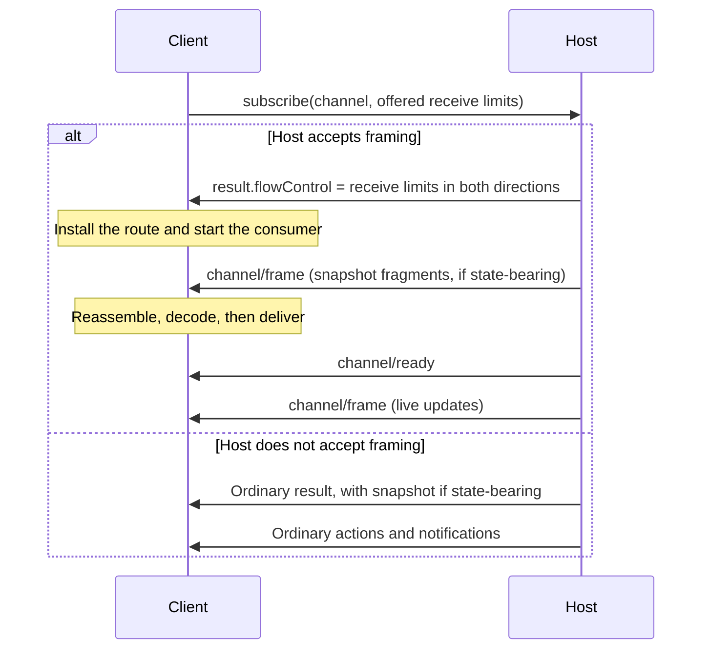
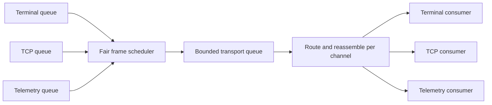
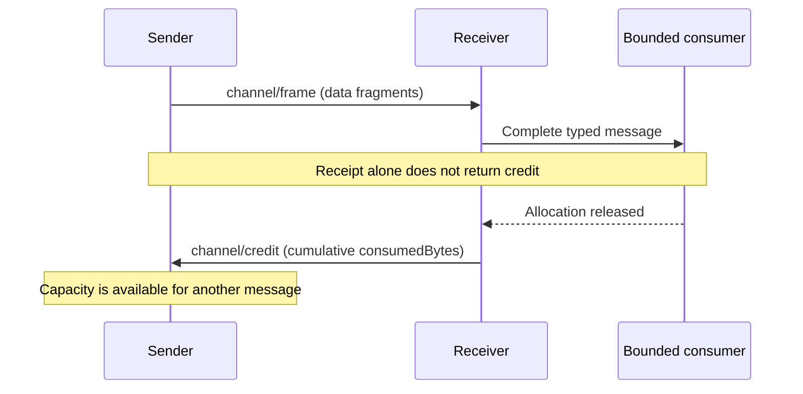
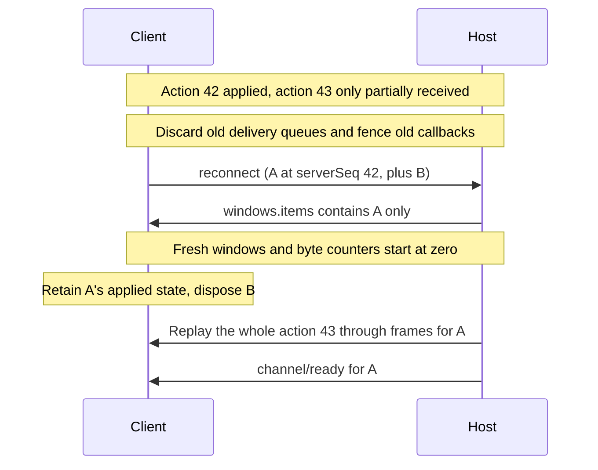

# Channels & Subscriptions

AHP organises all push-based communication into **channels**. A channel is a URI-identified resource that a client subscribes to in order to receive updates. Channels MAY have state (root, automation catalogues, sessions, terminals, changesets) or be stateless (future: logging, MCP relay, LSP relay). The subscription mechanism — `subscribe`, `unsubscribe`, and per-channel notifications — is uniform across channel types.

## Every message carries `channel`

The channel concept is woven into every wire message. **Every command and every notification has a top-level `channel: URI` field on its params.** This invariant lets servers, clients, and intermediate proxies dispatch any incoming message by inspecting `(method, params.channel)` without per-method knowledge of the rest of the payload.

| Direction | Methods | `channel` value |
|---|---|---|
| Client → Server commands (channel-scoped) | `subscribe`, `createSession`, `disposeSession`, `createTerminal`, `disposeTerminal`, `fetchTurns`, `completions`, `invokeChangesetOperation`, `runAutomation`, and `fetchAutomationRuns` | The owning channel's URI (e.g. `ahp-session:/<uuid>` or `ahp-automations://`). |
| Client → Server commands (connection-level) | `initialize`, `ping`, `reconnect`, `listSessions`, `authenticate`, `resolveSessionConfig`, `sessionConfigCompletions`, `resourceRead`, `resourceWrite`, `resourceList`, `resourceCopy`, `resourceDelete`, `resourceMove`, `resourceResolve`, `resourceMkdir`, `resourceRequest`, `createResourceWatch` | Literal `'ahp-root://'`. |
| Server → Client commands (bidirectional `resource*` family) | The same nine `resource*` request methods plus `createResourceWatch` may also be initiated by the server. Used for host-driven per-session filesystem providers and for fetching client-published URIs (e.g. `virtual://my-client/...` plugins). | Literal `'ahp-root://'`. |
| Client → Server | `dispatchAction` | The channel the action targets. |
| Client → Server | `unsubscribe` | The channel being unsubscribed. |
| Server → Client | `action` | The channel that owns the action envelope. |
| Server → Client protocol notifications | `root/sessionAdded`, `root/sessionRemoved`, `root/sessionSummaryChanged`, `auth/required`, `otlp/exportLogs`, `otlp/exportTraces`, `otlp/exportMetrics` | The channel the notification scopes to (the root channel for `root/*`; the channel the auth requirement targets for `auth/required`; the host-defined `ahp-otlp:` channel URI for `otlp/*`). |

The constraint is encoded in the TypeScript types: every entry in `CommandMap` and the notification maps has params assignable to `BaseParams` (or, for notifications, structurally `{ channel: URI }`). The compile-time check in `types/version/message-checks.ts` fails if any new method omits the field.

The rest of this page details the URI scheme and the lifecycle of a subscription. The mechanics of action delivery and protocol notifications are described under each channel page ([Root](/specification/root-channel), [Automation Catalogue](/specification/automation-channel), [Session](/specification/session-channel), [Terminal](/specification/terminal-channel)).

## URI Scheme

| URI | State type | Description |
|---|---|---|
| `ahp-root://` | `RootState` | Global state (agents, terminals, host config). Always present. |
| `ahp-automations://` | `AutomationState` | Full state for every visible automation. Present when `InitializeResult.automations` is advertised. |
| `ahp-session:/<uuid>` | `SessionState` | Per-session state (metadata plus the `chats` catalog). The session's provider is carried on `SessionSummary.provider`, not in the URI scheme. |
| `ahp-chat:/<cid>` | `ChatState` | Per-chat conversation state (turns, streaming, tool calls, pending messages, input requests, changeset catalogue). A session starts with a default chat; multi-chat hosts add more via `createChat`. See [Chat Channel](/specification/chat-channel). |
| `ahp-canvas:/<id>` | `CanvasState` | Experimental per-canvas live presentation state. Subscribe to the resource advertised in `ChatState.canvases`; the id is host-defined. See [Canvas Channel](/reference/canvas). |
| `ahp-terminal:/<id>` | `TerminalState` | Per-terminal state. Server-defined id. |
| `ahp-tcp:/<id>` | _stateless, non-resumable_ | Experimental client-owned forwarding stream created by `createTcpConnection`, then subscribed normally. See [TCP Forwarding](./tcp-channel.md). |
| `ahp-changeset:/<id>` | `ChangesetState` | Per-changeset state. URI is obtained by expanding a `Changeset.uriTemplate` advertised on a session or chat; the id is server-defined. |
| `ahp-otlp:` _(authority/path host-defined)_ | _stateless_ | OpenTelemetry signal channels (logs, traces, metrics). Concrete URIs are advertised on `InitializeResult.telemetry`; clients MUST treat them as opaque. See [Telemetry Channel](/specification/telemetry-channel). |
| `ahp-resource-watch:/<id>` | `ResourceWatchState` | Per-watch channel returned by `createResourceWatch`. Delivers `resourceWatch/changed` actions for file/directory changes under the watched URI. The id is receiver-assigned. |

Future channel types (LSP relay, MCP relay, …) introduce their own URI schemes. Clients MUST NOT subscribe to a scheme they do not understand.

## Subscribe (Request)

`subscribe` is a JSON-RPC **request**. The result includes a snapshot for state-bearing channels and omits it for stateless ones.

```jsonc
// Client → Server
{
  "jsonrpc": "2.0",
  "id": 1,
  "method": "subscribe",
  "params": {
    "channel": "ahp-session:/<uuid>",
    "delivery": { "maxLatencyMs": 100 }
  }
}

// Server → Client (state-bearing channel)
{
  "jsonrpc": "2.0",
  "id": 1,
  "result": {
    "snapshot": {
      "resource": "ahp-session:/<uuid>",
      "state": {
        "provider": "copilot",
        "title": "New Session",
        "status": 1,
        "lifecycle": "creating",
        "chats": [],
        "activeClients": []
      },
      "fromSeq": 5
    }
  }
}

// Server → Client (stateless channel)
{
  "jsonrpc": "2.0",
  "id": 1,
  "result": {}
}
```

After subscribing, the client receives all messages scoped to that channel — both action envelopes (for state channels) and any channel-specific notifications.

### Delivery preferences

Clients MAY include `delivery.maxLatencyMs` on `subscribe` to request an upper
bound, in milliseconds, on intentional server-side buffering for that
subscription. Servers MAY use that budget to coalesce high-frequency updates
while preserving the same reduced state a client would observe from immediate
delivery. A value of `0` requests immediate delivery with no intentional
coalescing. Omitting `delivery` uses the server's default delivery behavior.

### Snapshot views

Clients MAY include `view` on `subscribe` to ask the server to shape the
returned snapshot. View preferences are advisory and additive: a server that
does not understand a requested view ignores it and returns its default
snapshot, and clients MUST tolerate receiving more state than requested.

For chat channels, `view.turns` asks the server to expose approximately that
many most-recent completed turns in the snapshot. The value is advisory: the
server MAY return more or fewer turns than requested. If `view.turns` is
omitted, the server MUST return all retained turns. If older retained turns
remain available, the returned `ChatState` includes `turnsNextCursor`; the
client can pass that cursor to `fetchTurns` to ask the host to page older turns
into the same reduced state.

## Unsubscribe (Notification)

`unsubscribe` is a fire-and-forget client → server notification. Like every wire message, its params carry the channel URI being released.

```json
{
  "jsonrpc": "2.0",
  "method": "unsubscribe",
  "params": { "channel": "ahp-session:/<uuid>" }
}
```

After unsubscribing, the client stops receiving messages for that channel.

## Action Delivery (`action`)

State channels deliver mutations via the `action` server notification. The params are an `ActionEnvelope` — flat, with `channel` identifying the channel and a single `action` payload:

```json
{
  "jsonrpc": "2.0",
  "method": "action",
  "params": {
    "channel": "ahp-chat:/<cid>",
    "action": { "type": "chat/delta", "turnId": "t1", "partId": "p1", "content": "Hello" },
    "serverSeq": 6,
    "origin": { "clientId": "client-1", "clientSeq": 1 }
  }
}
```

- Root actions go to all clients subscribed to `ahp-root://`.
- Session actions go to all clients subscribed to that session's URI.
- Chat actions go to all clients subscribed to that chat's URI.
- Terminal actions go to all clients subscribed to that terminal's URI.

Action payloads (the inner `action` object) carry only fields intrinsic to the action — the channel comes from the envelope. Individual actions do NOT carry a `session: URI` or `terminal: URI` field of their own.

The client → server dispatch path uses a different method, `dispatchAction`, with params `{ channel, clientSeq, action }`:

```json
{
  "jsonrpc": "2.0",
  "method": "dispatchAction",
  "params": {
    "channel": "ahp-chat:/<cid>",
    "clientSeq": 1,
    "action": { "type": "chat/turnStarted", "turnId": "t1", "message": { "text": "Hi", "origin": { "kind": "user" } } }
  }
}
```

See [Actions](/guide/actions) for the full list of client-dispatchable actions.

## Initial Subscriptions

During the handshake, clients MAY include `initialSubscriptions` in `initialize` to subscribe to channels in the same round-trip:

```json
{
  "jsonrpc": "2.0",
  "id": 1,
  "method": "initialize",
  "params": {
    "channel": "ahp-root://",
    "protocolVersions": ["0.3.0"],
    "clientId": "client-abc",
    "initialSubscriptions": ["ahp-root://", "ahp-session:/<prev-session>"]
  }
}
```

The server includes a snapshot for each state-bearing channel in the `initialize` response.

## Protocol Notifications

Beyond `action`, the server pushes per-channel **protocol notifications** for ephemeral events. Each one is its own top-level JSON-RPC method (e.g. `root/sessionAdded`, `auth/required`) — there is no `notification` wrapper.

```json
{
  "jsonrpc": "2.0",
  "method": "root/sessionAdded",
  "params": {
    "channel": "ahp-root://",
    "summary": { "resource": "ahp-session:/<uuid>", "title": "New Session", ... }
  }
}
```

For partial updates to an existing session's summary, the server broadcasts `root/sessionSummaryChanged`:

```json
{
  "jsonrpc": "2.0",
  "method": "root/sessionSummaryChanged",
  "params": {
    "channel": "ahp-root://",
    "session": "ahp-session:/<uuid>",
    "changes": { "title": "Refactor auth middleware", "status": 8 }
  }
}
```

Protocol notifications go only to clients subscribed to the channel they target.
On ordinary subscriptions, they are not stored in state and are not replayed
on reconnection. Experimental windowed delivery separates channel recovery from
this ordinary delivery contract.

## Stateless Channels

A channel MAY be stateless — i.e. carry no `Snapshot`. Ordinary subscribing
returns an empty result `{}`, and subsequent traffic flows via channel-specific
methods rather than `action` envelopes. The subscription/unsubscription mechanism
is identical to state channels. Ordinary stateless subscriptions are not replayed
across reconnection — clients re-subscribe and resume from the live edge.

## Experimental windowed delivery

<StabilityIndex level="1.0" />

This optional contract separates delivery backpressure from reduced channel
state. It does not change ordinary subscriptions. Negotiation happens on
`subscribe` itself, without an initialize capability. Generated wire models alone
do not implement window negotiation, scheduling, or connection-local delivery queues.

### Negotiation and bootstrap

Clients offer receive limits with `SubscribeParams.flowControl`:

```json
{
  "channel": "ahp-terminal:/t1",
  "flowControl": {
    "receive": {
      "windowBytes": 262144,
      "maximumFrameBytes": 16384,
      "maximumMessageBytes": 4194304
    }
  }
}
```

The host accepts by returning `SubscribeResult.flowControl`, containing only
`clientReceive` and `hostReceive` limits. If it does not support framing, or
declines the offer, it omits the field and uses ordinary delivery. Neither peer
may send frames without that explicit acceptance. The host MAY lower, never
raise, client receive limits. Both directions' counters begin at zero.
Delivery belongs to this subscriber; credit from one terminal viewer cannot
release another viewer's allocation. Slow viewers need an independent overflow
or snapshot-recovery policy rather than stalling every viewer or the shared PTY.



Windowed results MUST omit inline `snapshot`. The small acceptance response
installs the route and consumer **before** bootstrap traffic. The channel URI
already comes from the request; it does not need another delivery identity in
the result. A snapshot is a
typed `channel/snapshot` logical notification carried through bounded frames;
its `snapshot.resource` MUST match the subscribed channel. Replay uses the same
path as live messages, including payload-bearing action echoes.
`channel/ready` follows complete bootstrap messages, before live traffic.
Consumers MUST run during bootstrap, not wait for ready before exposing their
reader. Process ready through the same ordered subscription route, after those
messages, rather than delivering it through an independent callback.

### Frames, credit, and scheduling

`channel/frame` carries `channel`, a string `data` fragment, and optional `final`.
The string is serialized JSON for an existing
typed notification, not a second base64 encoding. The inner and outer channel
MUST match. Reassemble before typed decoding or reducer application.

One data message is active per direction/subscription. Only `final: true`
completes it. Fragments MUST be nonempty and MUST NOT split surrogate pairs.
The reliable ordered transport supplies fragment order, so frames do not need
message IDs or fragment offsets.

**Every byte limit and counter uses UTF-16-encoded text**, regardless of the
transport's actual encoding. In JavaScript the size is `text.length * 2`; an
ASCII character uses two bytes and a surrogate pair uses four. Other languages
MUST count UTF-16 code units, not Unicode scalar values or UTF-8 bytes.

Window credit and `maximumMessageBytes` measure the logical serialized message
before outer escaping. `maximumFrameBytes` measures the fully serialized outer
JSON-RPC frame, including its envelope and escaping, **also in UTF-16 bytes**.
For example, backslashes inserted by the outer JSON serialization count toward
the frame limit. There is no switch to another byte encoding for frame limits.

Reserve data bytes before enqueueing fragments. A sender
may start a data message only when outstanding bytes are below `windowBytes`;
one started message may finish beyond the target. The hard
`maximumMessageBytes` limit keeps outstanding data strictly below
`windowBytes + maximumMessageBytes`. Receivers MUST budget for that overshoot,
decoding overhead, and aggregate allocations across subscriptions. Hosts MUST
fairly schedule small frames and bound the underlying transport queue.



The scheduler interleaves small fragments; it does not send one entire large
logical message before serving another channel.

`channel/credit.consumedBytes` is a cumulative complete-data-message boundary.
Return credit only when a bounded consumer releases its
allocation, not when JSON arrives or an action echo is accepted. State reduction
normally releases an action allocation; a byte-stream adapter releases it when
its downstream buffer releases the payload. Rejected actions also release their
allocations without becoming application-success acknowledgments. Shared release
receipts can support an adapter's `drain()`.



Duplicate/older credit is harmless. Positions beyond sent data, inside a message,
or inconsistent with connection-local sent-message boundaries are protocol errors. The sender
already knows its encoded message lengths; it can recognize boundaries from the
cumulative byte count without a parallel message sequence. Credit
counts delivery payload, not TCP decoded-byte offsets.

Credit, ready, reset, and liveness controls bypass data credit but MUST have
separate size/rate/queue limits. They MUST NOT be framed recursively.
All framed logical messages use the same data-credit accounting; there is no
frame-level exemption flag. Channel-specific lifecycle exemptions are outside
this revision. Reset aborts incomplete delivery and terminates the subscription.
A hard limit violation
MUST fail explicitly, never silently truncate, drop fragments, or continue a
loss-sensitive stream.

### Reconnect from action checkpoints

Flow control is connection-local; resource recovery still uses existing action
sequence numbers and snapshots. Consumers do not need to retain byte positions
across transports.

`reconnect.windows.items` identifies each requested windowed channel and its
optional `lastAppliedServerSeq`. Every item MUST identify a URI also listed in
`subscriptions`; entries MUST be unique. Action replay requires the last
`serverSeq` **safely applied to that channel's retained state**, not merely
received, parsed, or queued. Advance the checkpoint together with successful
application so reconnect never treats an unapplied action as complete.
Omit it for snapshot or live-edge recovery. Non-resumable channels such as
TCP forwarding MUST NOT be requested here.

```json
{
  "windows": {
    "items": [
      { "channel": "ahp-chat:/c1", "lastAppliedServerSeq": 42 },
      { "channel": "ahp-otlp:/logs" }
    ]
  }
}
```

The per-channel checkpoint lets one channel resume independently of another
channel that has made more progress. The connection-wide `lastSeenServerSeq`
continues to govern ordinary subscriptions, not these windowed channels.

The server MUST omit `windows` from either reconnect result variant unless the
client supplied `ReconnectParams.windows`. When supplied, returned `windows.items`
MUST contain only channels requested in `ReconnectParams.windows.items`.
Both result variants use this list to return the resumed channels and their
receive limits for fresh connection-local windows.
A requested channel absent from this list is no
longer available: dispose its old subscription and, for streams, abort the old
stream. There are no distinct consumer recovery paths for permission changes,
lost replay, or lost buffers. Hosts SHOULD log diagnostic causes locally; malformed
requests and transport/RPC failures still surface as errors.

Legacy inline actions/snapshots MUST exclude windowed channels. Each resumed
subscription selects its
own recovery, independent of legacy snapshot fallback or another channel's
progress. `recovery` belongs **only to reconnect**:

- `replay` sends whole action envelopes after the channel's applied checkpoint,
  retaining the state those earlier actions produced.
- `snapshot` replaces reduced state when replay is not available or no checkpoint
  was supplied.
- `live` resumes notification-only channels at the live edge, without replaying
  missed notifications.

This revision does not define reconnect replay for arbitrary notification-only
streams. A channel that cannot use snapshots, action replay, or live-edge recovery
is unavailable. TCP forwarding terminates instead of restoring a byte stream.

The existing authenticated logical client and channel URI identify the retained
subscription. A channel has at most one subscription per logical client.
Reconnect MUST invalidate the old transport before activating the new one;
both peers MUST fence stale asynchronous producers and consumer callbacks using
their local connection/subscription generations. No wire-level subscription ID
or resume token is necessary under this single-active-transport contract.
Before new delivery starts, both peers MUST discard old fragment assemblies and
unapplied delivery messages, release their allocations, and reset local
sent/consumed byte counters to zero. The returned receive limits define fresh
windows. Old credit notifications, pending transport writes, and asynchronous
consumer callbacks MUST NOT advance state or release capacity in the new
generation. Quiesce or fence in-progress application before taking the checkpoint.

Already-applied resource state is retained for replay; it is not an old delivery
queue. Application-owned unread stream buffers cannot be carried over while
granting a fresh window. Consumers unable to discard those allocations cannot
resume through this contract.

Lost consumption updates from the previous transport require no reconciliation:
old allocations and old credit are both gone. An explicit unsubscribe follows
the same queue cleanup and generation-fencing rules.



Retransmitting a partially delivered logical message is harmless: no typed
message was delivered or action applied from those fragments. A complete but
unapplied message is also discarded and recovered from the action checkpoint.
Already-applied actions MUST NOT be applied again. Repeated reconnect attempts,
including after a lost reply, use the latest safely applied checkpoint and
fresh transport-local windows each time.

Client-originated actions keep the existing `clientSeq` and acknowledgment
reconciliation rules. Discarding transport frames does not erase the client's
write-ahead action record; resolve accepted/rejected actions before retrying
pending actions with their original sequences. Hosts MUST suppress repeated
side effects rather than blindly executing a replayed input.

An explicit `channel/reset` aborts the subscription. Action replay storage and
reconnect grace remain bounded, independently of live byte-credit bookkeeping.

### Scope

Windows do not prescribe a channel's loss policy: TCP forwarding terminates
on transport loss in this revision, terminals may recover from snapshots, and
telemetry can remain live-only. Arbitrary large unrelated RPC results and
`initialize` snapshots still require separate limits or chunking. Windowed
subscriptions alone are not connection-wide memory protection.

The wire changes are additive and require explicit subscribe negotiation.
Generated native models retain typed nested objects; SDKs that do not implement
this delivery mode continue to send ordinary subscriptions. Native consumers
should rebuild against updated models. Rust struct literals need the new optional
fields (`flow_control` or `windows`) set to
`None` to retain ordinary behavior; `SubscribeParams` constructors continue to
default to ordinary delivery. No protocol version constant changes here.
