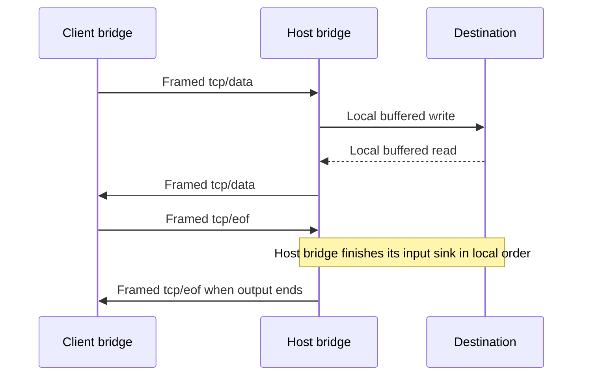

# TCP Forwarding Channel

<StabilityIndex level="1.0" />

A private `ahp-tcp:` channel forwards a bidirectional byte stream to a destination
on the host's network. It uses the same [windowed subscription delivery](./subscriptions.md#experimental-windowed-delivery)
as other channels. TCP does not add byte offsets, another sequence, another credit
mechanism, reduced resource state, or an exemption from ordinary framing.

This revision defines protocol types and generated wire models. It does not
implement socket adapters or SDK scheduling. Local bridges own their buffers,
socket backpressure, and mapping from logical stream events to native operations.

## Create, then subscribe

Presence of `InitializeResult.tcpConnections` advertises the
`createTcpConnection` command:

```json
{ "tcpConnections": {} }
```

Clients MUST require this marker before calling `createTcpConnection`. As with
`createSession`, creation targets the client-chosen URI for the new resource.
It does not subscribe or negotiate delivery. There is no session association.

The client first creates the connection:

```json
{
  "jsonrpc": "2.0",
  "id": 12,
  "method": "createTcpConnection",
  "params": {
    "channel": "ahp-tcp:/t1",
    "host": "localhost",
    "port": 3000
  }
}
```

The host authenticates the creating client and checks destination policy,
connection quotas, and the new URI before opening the connection. `host` is a
nonempty DNS name or IP literal, not a URL; `port` is an integer in `[1, 65535]`.
`channel` MUST be a
unique `ahp-tcp:` URI; a duplicate returns `AlreadyExists` and MUST NOT replace
an existing connection. Successful creation returns `null`, like `createSession`.

The host MUST NOT emit AHP data before subscription. It pauses its local socket
source or otherwise bounds pre-subscription buffering, and sets a bounded lease
for connections abandoned before subscription. The owner can use `unsubscribe`
to cancel and release a created connection even before its first subscription.

The client then subscribes to the known URI, using ordinary receive limits:

```json
{
  "jsonrpc": "2.0",
  "id": 13,
  "method": "subscribe",
  "params": {
    "channel": "ahp-tcp:/t1",
    "flowControl": {
      "receive": {
        "windowBytes": 262144,
        "maximumFrameBytes": 16384,
        "maximumMessageBytes": 4194304
      }
    }
  }
}
```

A TCP subscription MUST offer shared flow control. The host validates the
receive limits and MUST accept them or fail subscription; it MUST NOT fall back
to a non-windowed TCP channel.

```json
{
  "jsonrpc": "2.0",
  "id": 13,
  "result": {
    "flowControl": {
      "clientReceive": {
        "windowBytes": 262144,
        "maximumFrameBytes": 16384,
        "maximumMessageBytes": 4194304
      },
      "hostReceive": {
        "windowBytes": 131072,
        "maximumFrameBytes": 16384,
        "maximumMessageBytes": 1048576
      }
    }
  }
}
```

The result is an ordinary `SubscribeResult`: there are no TCP-specific fields.
The URI is already known, so the client can install its route before requesting
subscription. The host installs the private subscription atomically and sends
the response before any child frames. The client MUST activate the bounded
consumer while processing that response, not after an asynchronous continuation.

There is no TCP snapshot. Bootstrap ends with `channel/ready`. Each successful
creation opens a distinct connection. An uncertain creation reply does not
authorize recreating or replacing the same URI. Creation attempts and orphaned
connections have bounded lifetimes. Transport loss ends the connection; a fresh
subscription cannot restore an old stream.

## Two symmetric logical notifications

| Method | Direction | Meaning |
| --- | --- | --- |
| `tcp/data` | Both | Base64 bytes in the sender's stream direction |
| `tcp/eof` | Both | End of the sender's logical direction after preceding data |

Client-to-host data is input for the destination. Host-to-client data is output
from it. Direction comes from the sender; there is no direction field or separate
input/output message family.

For example, a complete logical notification is:

```json
{
  "jsonrpc": "2.0",
  "method": "tcp/data",
  "params": { "channel": "ahp-tcp:/t1", "data": "SGVsbG8=" }
}
```

It is serialized and sent through `channel/frame`, not emitted unframed. Data
MUST be nonempty canonical padded RFC 4648 base64 without whitespace. Chunk
boundaries have no TCP significance: receivers concatenate decoded bytes in
delivery order. Senders bound their outgoing queues using shared flow control;
they do not retain a TCP replay history.

`tcp/eof` contains only `channel`. It uses the same framed delivery and UTF-16
credit as `tcp/data`, with no bypass. It ends one logical direction; the opposite
direction may continue. Further data from that sender is a protocol error.



This is not a one-to-one translation of TCP primitives. Bridges independently
backpressure their local sources and sinks, decide their own chunk sizes, and
process end-of-stream after preceding data.

## One accounting mechanism

Every AHP frame limit, logical-message limit, and accepted/consumed position
uses UTF-16 bytes. Credit is **not** counted in decoded TCP bytes. Base64 is only
the payload encoding and introduces no second window or acknowledgment.

Credit returns when the ordinary bounded AHP consumer releases its message
allocation. A bridge may transfer decoded bytes into another independently bounded
local buffer; it MUST enforce that buffer's limits and pause its source when full.
Receipt, release, socket write completion, and destination-application processing
are distinct events. Shared credit does not promise application success.

TCP messages MUST NOT be silently dropped, truncated, or coalesced after admission
to the bounded delivery queue. A receiver MUST fail the channel explicitly on
delivery loss, invalid data, or an exceeded hard bound.

## Transport loss and termination

TCP forwarding is **non-resumable in this revision**. It uses shared framing and
credit while the AHP transport is alive, but it does not require replay queues,
cross-transport receive-progress reconciliation, or retaining destination sockets
for reconnect.

If the AHP transport closes or fails, the host closes every TCP connection created
on it, cancels in-progress creation, and releases their buffers. The client aborts
its corresponding local streams. Neither side retries old TCP messages on a
replacement AHP transport.

Clients MUST omit TCP channels from both `reconnect.subscriptions` and
`reconnect.windows.items`. A server MUST NOT return old TCP channels as resumed
subscriptions or restore them from snapshots. If requested anyway, TCP entries
are omitted from returned `windows.items` and appear in legacy `missing` when
applicable.

Application retry explicitly calls `createTcpConnection` for a new URI and then
subscribes again. It creates a new destination connection; old buffered application
requests MUST NOT be automatically replayed into it. Future TCP resume support
would need separate negotiation and is outside this revision.

`channel/reset` aborts the stream without a TCP-specific reset reason or close
handshake. Explicit `unsubscribe` releases the child and destination connection.
After both logical directions end, bridges drain their owned buffers and release
the subscription; graceful disposal MUST preserve accepted local writes. Early
unsubscribe or reset aborts instead. All creation leases and drain deadlines are bounded.

## Ownership, network authority, and errors

Only the creating authenticated logical client may observe or send to the
channel. It is absent from shared catalogues and is not associated with a session.
Ownership and destination authorization belong to the authenticated logical
client, while lifetime is tied to the creating AHP transport. Knowing a channel
URI or supplying its client's ID is not authorization.
Only the creating transport may subscribe to or use this connection; another
transport with the same logical client identity cannot take it over.

DNS, loopback, and routes belong to the host endpoint, not the client or
necessarily an agent's sandbox. Hosts MUST enforce destination policy, resolved
address restrictions, connection quotas, and timeouts.

Malformed creation requests use `InvalidParams`; denied access uses
`PermissionDenied`. Failure to establish a
connection uses `TcpConnectionOpenFailed` (`-32012`), without a family of recovery
reason variants. Hosts log detailed causes locally rather than exposing unsanitized
system errors. Errors after creation terminate the channel through shared reset
or transport failure.
